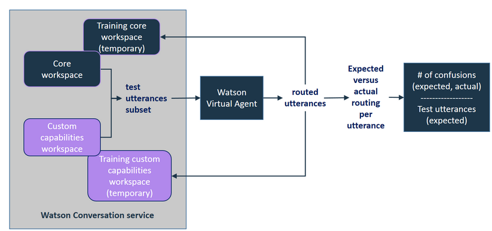

---

copyright:
  years: 2015, 2019
lastupdated: "2019-02-15"

---

{:shortdesc: .shortdesc}
{:new_window: target="_blank"}
{:tip: .tip}
{:pre: .pre}
{:codeblock: .codeblock}
{:screen: .screen}
{:javascript: .ph data-hd-programlang='javascript'}
{:java: .ph data-hd-programlang='java'}
{:python: .ph data-hd-programlang='python'}
{:swift: .ph data-hd-programlang='swift'}

# Adding your own capabilities
{: #add-custom-capabilities}

To expand on what the virtual agent can discuss with your customers, add your own capabilities.
{: shortdesc}

## Before you begin

When you use a workspace to provide a custom dialog for a core capability, you only need to provide a dialog in the workspace. The agent has already been trained to recognize utterances that map to the core capabilities, so you do not need to provide intents, entities, and training data. When you provide a workspace that defines your own capabilities, you must provide intents and entities in addition to the dialog. You also must provide a large number of sample utterances that the service can use to train the intents that you want to support. Use the documentation, demos, and tools that are provided with the {{site.data.keyword.conversationshort}} service to build a workspace with custom capabilities. See the [{{site.data.keyword.conversationshort}} documentation ](/docs/services/assistant/index.html){: new_window} for more information.

### About this task

You can create only one workspace to define custom capabilities. Each intent that you add and train in the workspace will be made available as a custom capability when you link the workspace to the agent. The workspace must contain all of the capabilities that you want to add to your agent. Do not add intents to the workspace that you do not want your agent to be able to handle.

### Procedure

1.  From your {{site.data.keyword.conversationshort}} service instance, create a dialog skill that defines your custom capabilities. See the [{{site.data.keyword.conversationshort}} service documentation ](/docs/services/assistant/skill-add.html){: new_window}.

    Follow these guidelines:
    - Add a branch for each capability that you want to support as a base node (which is referred to as an *alternative conversation* in the {{site.data.keyword.conversationshort}} tool user interface) in the dialog. For example, do not define a base node in your dialog that recognizes and responds to user greetings, and then add child nodes that match other custom capability intents beneath it.
    - Avoid handling user input mismatches with recursive loops. Only create dialog turns that have a definitive end.
    - Do not create a custom intent with the same name as an intent that is used by a core capability. See [Intent names](/docs/services/virtual-agent/intent_codenames.html) for a list of names to avoid.

1.  Return to your agent in [{{site.data.keyword.virtualagentfull}} ](https://virtual-agent.watson.ibm.com){: new_window}, and link the workspace to the agent. See [Linking workspaces](/docs/services/virtual-agent/link_workspace.html)
1.  From the **Capabilities** page, expand the **Custom** section.
1.  Click **Add Capabilities**.
1.  Select the workspace that you linked to the agent in Step 2, and then click **Save**.

    The intents that are defined in the linked workspace are now listed as enabled capabilities.

    > **Note:** You cannot disable individual capabilities. If you want to remove one custom capability, you can delete the intent from the workspace in the {{site.data.keyword.conversationshort}} service tool.

    You can remove all of the capabilities at once by opening the More menu  for the Custom section, and then selecting **Remove All Custom Capabilities**. Removing the capabilities does not delete the association between the agent and the workspace that the capabilities are defined in.

### Results

After you add custom capabilities, each user utterance that is evaluated by {{site.data.keyword.watson}} {{site.data.keyword.virtualagentshort}} is passed to both the core workspace and your custom capabilities workspace for evaluation. The capability that best matches the intent of the user's input is triggered and the dialog associated with it is used.

### What to do next

When you add your own capabilities, you can easily define one that is similar in behavior to an existing core capability. {{site.data.keyword.virtualagentshort}} does an initial validation run to check for capabilities that might overlap and informs you about them so that you can resolve them before publishing the agent.

## Resolving validation conflicts
{: #validate_custom_capabilities}

Avoid defining capabilities that are so similar to one another that they compete to respond to certain user queries. If you do, you cannot anticipate which capability will ultimately provide a response to users. That variation in responses can be perceived by users as inconsistent behavior on the part of the agent, which could be confusing or make it appear to users that the agent is not working properly.

There are some conflicts that you can ignore altogether. If you are adding to the training data of a core capability, for example, then the core capability you are augmenting will likely conflict with the custom capability that you add with the same name. For all other conflicts, review the conflict details to determine whether further action is required.

### About this task

The validation run compares example utterances from the training data for capabilities of each type to look for duplication. It takes a random sample of the utterances to compare. If it finds potential conflicts, it indicates the likelihood (as a percentage) that the two will conflict with one another.

**How is the percentage derived?** The service counts the number of utterances that are routed to the wrong workspace, which are the confusions. If the confusion ratio (the number of confusions divided by the number of test utterances per capability) is greater than 20%, then the conflict is reported, and the confusion ratio is displayed.

### Procedure

To resolve validation conflicts, complete the following steps:

1.  Click **Resolve** next to the conflict notification link to open the *Review and resolve conflicts* pane and see a list of conflicts.

   

1.  Address each conflict in one of the following ways:
    - **Disable the core capability**

        1.  Switch the toggle to **Off**, and then close the *Review and resolve conflicts* pane.
        1.  Click **Revalidate** .

    - **Disable the custom capability**
        1.  Click the **{{site.data.keyword.conversationshort}} service workspace** link to open the workspace that contains the custom capabilities within the {{site.data.keyword.conversationshort}} tool.

        1.  Find the intent on the **Intents** page, expand it, and then click the **Delete intent** icon to delete it from the workspace. See [Deleting intents](/docs/services/assistant/intents.html#intents-delete).
        1.  **Optional**: Normally, when you delete an intent, you remove all mention of it from the corresponding dialog. However, if you built a complex dialog node for this custom capability that you want to continue to use, then do not remove it from the dialog right away. Instead, configure the overlapping core capability to use it as a custom dialog response. (See [Configuring core capabilities](/docs/services/virtual-agent/configure.html).)
            1.  Update the trigger for the dialog node to use the core capability intent name as the condition.
            1.  You can do one of the following things:
              - If you are using one workspace for both custom capabilities and custom dialogs for core capabilities, then move the dialog node for this custom capability up in placement to be grouped with any other core capability dialog nodes that you are using. Custom dialogs for core capabilities are kept at the top of the tree to ensure that they can be found by the bot.
              - If you are using two separate workspaces, then recreate the dialog node in the workspace that defines your custom dialogs. After you successfully recreate the dialog node, you can remove it from your custom capabilities workspace.
        1.  After you make changes to the workspace, it is automatically retrained. When the training is complete, return to the **Custom Capabilities** tab of {{site.data.keyword.watson}} {{site.data.keyword.virtualagentshort}}.
        1.  Click **Revalidate** .

    - **Update the training data for the custom capability**

        If the custom capability addresses a similar customer goal but with clear differences from the core capability, you can update the training data for the custom capability to accentuate the differences between the two.
         >Note: You cannot access the workspace for the core capability to update its training data; you can only edit the workspace for the custom capability to affect changes.

        Edit the workspace that contains the custom capability by following these steps.
        1.  Click the **{{site.data.keyword.conversationshort}} service workspace** link to open the workspace that contains your custom capabilities from the {{site.data.keyword.conversationshort}} tool.

        1.  For each conflicting custom capability, review the intent sample utterances.
            - If there are example utterances that clearly overlap with the types of user utterances that the core capability is designed to address, then delete them. To do so, complete the following steps:
              1.  Find the intent on the **Intents** page. Expand the intent to see the list of sample utterances.
              1.  Select the box next to each overlapping sample utterance, and then click **Remove examples**.

            - Add more example utterances that represent user goals that emphasize the facets of the custom capability that make it noteably different from the core capability. Adding training data that accentuates the unique function of the custom capability helps to distingush it from the core capability.

            - Add counter examples that represent the types of utterances that you explicitly do not want the custom capability to address. To do so, complete the following steps:
              1.  In the **Try it out** pane, add test utterances that represent the types of distinct user goals that the core capability is designed to address.
              1.  When the custom capability intent is identified as the detected intent, click the down arrow next to the intent name, and select **Mark as irrelevant**.
              1.  Repeat the previous two steps for as many utterances as you can.

        1.  After you make changes to the workspace, it is automatically retrained. When the training is complete, return to the **Custom Capabilities** tab of {{site.data.keyword.watson}} {{site.data.keyword.virtualagentshort}}.
        1.  Click **Revalidate** .

    - **Take no action**

        If triggering varying agent behavior is acceptable for some capabilities, then you can leave the conflict unresolved.
        >Note: You will continue to be notified about the conflict after each validation run.

## Testing custom capabilities
{: #test_custom_capabilities}

After adding your own capabilities and resolving validation conflicts, do some testing to make sure the custom capabilities behave as expected.

### Procedure

1.  Use the Preview pane to ask questions or make the types of requests that you expect your customers to make.

    Below the response, the capability that was triggered to address the request is displayed. If the capability that is displayed is not what you expect, you can make changes to correct how the utterance is being routed to the capabilities. To fix issues, use the same techniques as those documented earlier for resolving validation conflicts.

1.  Repeat this process until the agent is configured to handle your custom capabilities properly.
