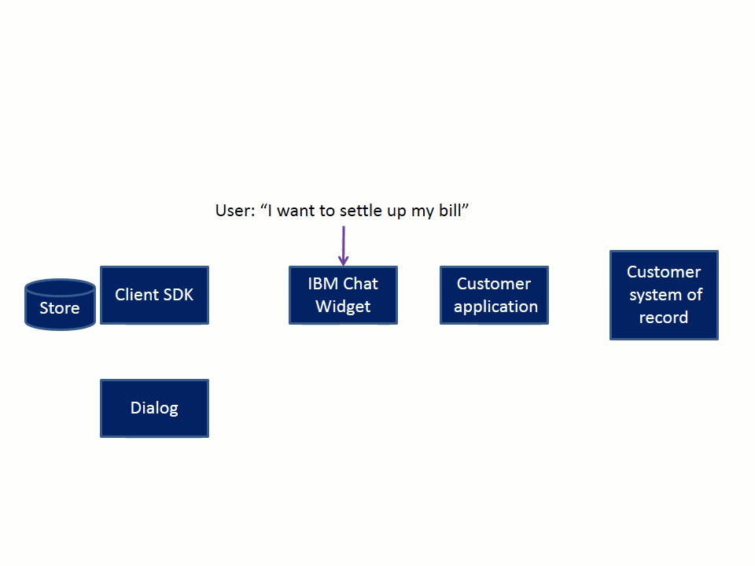

---

copyright:
  years: 2015, 2019
lastupdated: "2019-02-15"

---

{:shortdesc: .shortdesc}
{:new_window: target="_blank"}
{:tip: .tip}
{:pre: .pre}
{:codeblock: .codeblock}
{:screen: .screen}
{:javascript: .ph data-hd-programlang='javascript'}
{:java: .ph data-hd-programlang='java'}
{:python: .ph data-hd-programlang='python'}
{:swift: .ph data-hd-programlang='swift'}

# Make a payment conversation flow
{: #backend_payment_gif}

Learn about how information is exchanged between the user and the virtual agent during the built-in conversation that is provided for the Make a payment intent.
{: shortdesc}

The following graphic illustrates the conversation flow for one possible path that the built-in conversation that is provided with the application for the Make a payment intent can take.

**Related tasks**:

[Built-in dialogs](/docs/services/virtual-agent/configure.html#make-a-payment)
