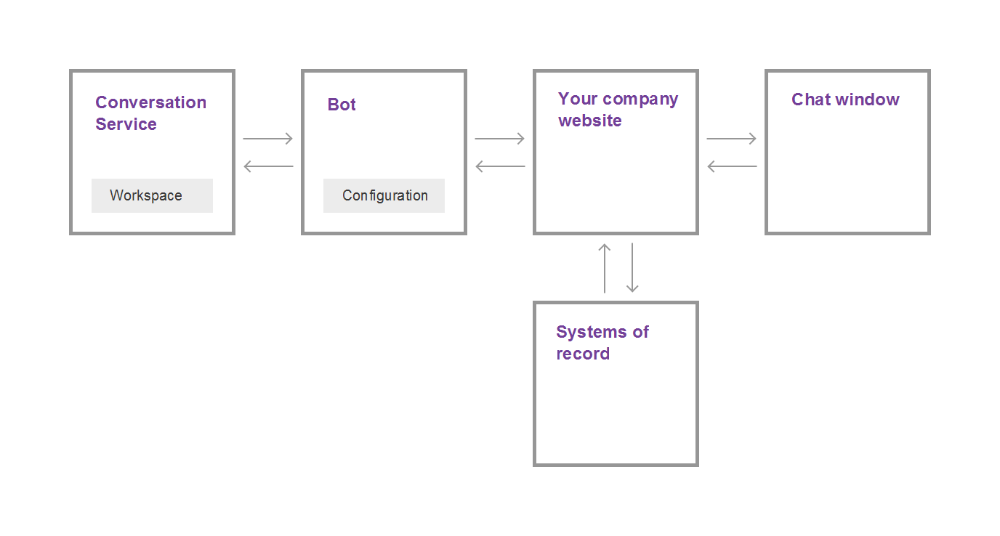

---

copyright:
  years: 2015, 2018
lastupdated: "2018-11-12"

---

{:shortdesc: .shortdesc}
{:new_window: target="_blank"}
{:tip: .tip}
{:pre: .pre}
{:codeblock: .codeblock}
{:screen: .screen}
{:javascript: .ph data-hd-programlang='javascript'}
{:java: .ph data-hd-programlang='java'}
{:python: .ph data-hd-programlang='python'}
{:swift: .ph data-hd-programlang='swift'}

# How it works
{: #how-it-works}

{{site.data.keyword.IBM_notm}} {{site.data.keyword.watson}} {{site.data.keyword.virtualagentshort}} adds the power of cognitive conversation to the customer satisfaction equation. Make the {{site.data.keyword.virtualagentshort}} chat bot the first point of contact for user questions and requests. The bot can process natural language to  understand what customers are asking about, and can classify the customer need. Depending on the need, it can respond and complete simple business transactions, or route more complicated requests to a human with subject matter expertise.

You choose which user goals you want the bot to handle by selecting the capabilities that you want the bot to have. Use the provided configuration tool to enable and customize capabilities.
{: shortdesc}

## Capabilities
{: #capabilities}

A *capability* is the ability of your {{site.data.keyword.virtualagentshort}} chat bot to recognize and satisfy a specific customer goal. For example, the **Find nearest store** capability uses natural language processing techniques to evaluate a customer utterance such as, *Where are you located?* and recognize from it the customer's goal. To satisfy that goal, it engages in a dialog with the customer to discover the customer's current location, and returns address information for the store nearest the customer.

For each capability, machine learning and linguistics experts at IBM have built training data and used it to iteratively train machine-learning classifiers that can recognize and respond to any user input that matches the goal satisfied by that capability.

To make the bot building process easier, IBM offers capability packs that bring together the most commonly requested capabilities for general customer support scenarios, plus specialized packs that address the most common support needs for key industries.

## Capability packs
{: #capability-packs}

A *capability pack* groups the most important capabilities for your industry together for you. With tens of thousands of example utterances and counter examples, the IBM team has designed groupings of capabilities that address similar customer goals, but that can seemlessly coexist without competing with one another to respond to user queries.

The following table summarizes the packs that are offered. Click the **details** links to see a list of capabilities and descriptions for each supported language.

| Language | Customer Service (General) | Energy  | Retail Banking | Telco   | Insurance |
|----------|----------------------------|---------|----------------|---------|-----------|
| English  | [details](/docs/services/virtual-agent/capabilities_list_general_en.html) | [details](/docs/services/virtual-agent/capabilities_list_energy_en.html) | [details](/docs/services/virtual-agent/capabilities_list_banking_en.html) | [details](/docs/services/virtual-agent/capabilities_list_telco_en.html) | [details](/docs/services/virtual-agent/capabilities_list_insurance_en.html) |
| French   | [details](/docs/services/virtual-agent/capabilities_list_general_fr.html) | [details](/docs/services/virtual-agent/capabilities_list_energy_fr.html) | [details](/docs/services/virtual-agent/capabilities_list_banking_fr.html) | [details](/docs/services/virtual-agent/capabilities_list_telco_fr.html) | n/a* |
| German   | [details](/docs/services/virtual-agent/capabilities_list_general_de.html) | [details](/docs/services/virtual-agent/capabilities_list_energy_de.html)  | [details](/docs/services/virtual-agent/capabilities_list_banking_de.html)  | [details](/docs/services/virtual-agent/capabilities_list_telco_de.html) | n/a* |
| Italian | [details](/docs/services/virtual-agent/capabilities_list_general_it.html) |[details](/docs/services/virtual-agent/capabilities_list_energy_it.html) | [details](/docs/services/virtual-agent/capabilities_list_banking_it.html) | [details](/docs/services/virtual-agent/capabilities_list_telco_it.html) | n/a* |
| Portuguese (Brazilian) | [details](/docs/services/virtual-agent/capabilities_list_general_pt-br.html) | [details](/docs/services/virtual-agent/capabilities_list_energy_pt-br.html) | [details](/docs/services/virtual-agent/capabilities_list_banking_pt-br.html) | [details](/docs/services/virtual-agent/capabilities_list_telco_pt-br.html) | n/a* |
| Spanish | [details](/docs/services/virtual-agent/capabilities_list_general_es.html) | [details](/docs/services/virtual-agent/capabilities_list_energy_es.html) | [details](/docs/services/virtual-agent/capabilities_list_banking_es.html) | [details](/docs/services/virtual-agent/capabilities_list_telco_es.html) | n/a* |

*n/a means currently not available

If the core capabilities do not address a common goal that your customers have, then you can add your own capabilities to supplement those provided in a pack. For example, if you own a bakery, your customers might often ask about the cupcake flavors that you offer. You can add a *Cupcake menu* capability to handle such questions. See [Adding your own capabilities](add-custom-capabilities.html) for more information.

## Architectural overview
{: #arch_overview}

The following diagram illustrates the architecture of a typical {{site.data.keyword.watson}} {{site.data.keyword.virtualagentshort}} implementation:

The implementation includes the following major components:

- **{{site.data.keyword.conversationshort}} service**

    An instance of the {{site.data.keyword.conversationshort}} service. The {{site.data.keyword.conversationshort}} service provides the artifacts for capabilities: the intents, entities, and dialog flow, along with the underlying cognitive processing that power the chat bot's capabilities. You interact directly with the {{site.data.keyword.conversationshort}} service when you want to implement a custom dialog or custom capability only.

    For more information about intents and dialogs, refer to the [{{site.data.keyword.conversationshort}} service documentation ](https://console.bluemix.net/docs/services/conversation/index.html#about){: new_window}.

- **Bot**

    A bot built on the {{site.data.keyword.conversationshort}} service, including a set of capabilities. The bot is trained to recognize user inquiries related to customer engagement, such as requests for basic company information and bill paying. The provided bot configuration tool enables you to configure company-specific information that can be provided in response to user queries, and to configure the response for each capability.

- **Your company website**

    Your customer-facing business application, which handles communication with the {{site.data.keyword.watson}} {{site.data.keyword.virtualagentshort}} bot and with your systems of record (such as customer databases or billing systems).

- **Chat window**

    The virtual agent chat interface, which customers use to converse with the bot. You can use the provided chat widget, with or without customization, or you can use the client SDK to implement your own chat widget.
