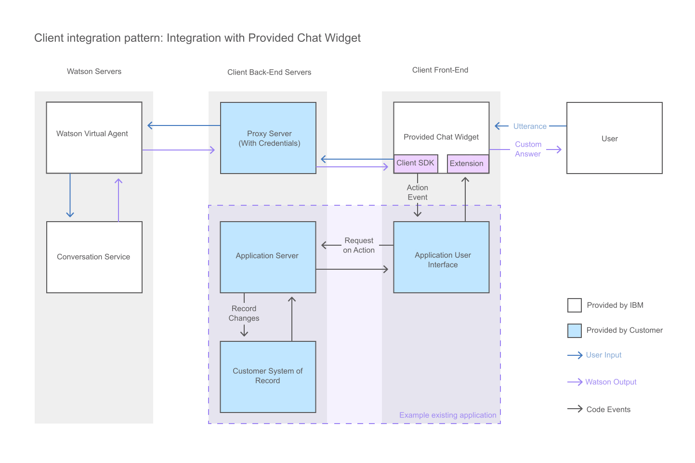

---

copyright:
  years: 2015, 2019
lastupdated: "2019-02-15"

---

{:shortdesc: .shortdesc}
{:deprecated: .deprecated}
{:new_window: target="_blank"}
{:tip: .tip}
{:pre: .pre}
{:codeblock: .codeblock}
{:screen: .screen}
{:javascript: .ph data-hd-programlang='javascript'}
{:java: .ph data-hd-programlang='java'}
{:python: .ph data-hd-programlang='python'}
{:swift: .ph data-hd-programlang='swift'}

# Adding the provided chat widget to your UI
{: #integrate_add-chat}

The {{site.data.keyword.watson}} {{site.data.keyword.virtualagentshort}} comes with a chat widget that you can use as-is in your user interface.
{: shortdesc}

This service is deprecated: All instances of this service are deprecated. Existing instances cannot be used after 19 March 2019.
{: deprecated}

This diagram illustrates how the conversation flows through the system when you use the chat widget that is provided by {{site.data.keyword.IBM_notm}}.



1.  To use the provided widget, open the [{{site.data.keyword.watson}} {{site.data.keyword.virtualagentshort}} Chat Widget ](https://github.com/watson-virtual-agents/chat-widget){: new_window} GitHub repository, and complete the steps in the `README.md` file.

    The provided chat widget is extensible. If it contains elements that you want to change, you can customize them. For example, to change a layout that is used by the provided chat widget, you can write a custom layout that overrides it. See the example here: [https://github.com/watson-virtual-agents/chat-widget/tree/1.2.12/examples/basic-custom-layout. ](https://github.com/watson-virtual-agents/chat-widget/tree/1.2.12/examples/basic-custom-layout){: new_window} Keep in mind that the layout might be used by more than one intent.

1.  For information about steps you must take to support chat widget transactions that can occur for capabilities that use the built-in conversation, see [Implementing logic to support built-in conversation](/docs/services/virtual-agent/impl_intents.html#backend_transaction).

1.  When you initialize the IBM-provided chat widget, you can include the following parameters to capture user information that is used by the service to capture metrics data about user chats and locations.

    - `userID`: Identifies the person chatting with the agent. This information is displayed in the **Interactions** page. Use only non-personally identifiable user IDs. For example, do not use an email address or anything else that fully or partially includes a user name. This information also feeds into other metrics, like the **Unique users** graph on the **User Metrics** tab.
    - `userLatLon`: Identifies the location (by latitude and longitude) of the person chatting with the agent. This information is used to populate the **Locations** map on the **User Metrics** tab.
    - `defaultCountry`: If provided, this information is passed with the zip code to the bot code, which calculates the user's exact location for the Find nearest store capability. Include this parameter when you initialize the agent if your users are located outside the US and Canada. The bot expects US and Canada postal code formats; by providing this additional country information, you can help the bot to calculate international locations properly.

    For more information about these parameters, see the [Chat Widget documentation on github.com](https://github.com/watson-virtual-agents/chat-widget/blob/master/docs/JSDOCS.md#IBMChat.init).

    For example, your application can collect information about the current user, and save it in variables like these:

    - `currentUserID`
    - `currentUserLocation`
    - `currentUserCountry`

    When you add the widget, you can pass these variables to the agent. For example:

    ``` Javascript
    <script src='https://unpkg.com/@watson-virtual-agent/chat-widget/1.6.4/dist/chat.min.js'/>
    <script>
      IBMChat.init({
        el: 'ibm_chat_root',
        baseURL: 'https://api.ibm.com/virtualagent/run/api/v1',
        botID: 'YOUR_BOT_ID',
        userID: currentUserID,
        userLatLon: currentUserLocation,
        defaultCountry: currentUserCountry,
        XIBMClientID: 'YOUR_IBM_CLIENT_ID',
        XIBMClientSecret: 'YOUR_IBM_CLIENT_SECRET'
      });
    </script>
    ```

If the extent of customizations that you want to make is so pervasive that it is impossible to implement your changes by making updates to the provided chat widget, then you can create your own chat interface. See [Building a custom chat interface](/docs/services/virtual-agent/integrate_custom-chat.html).
