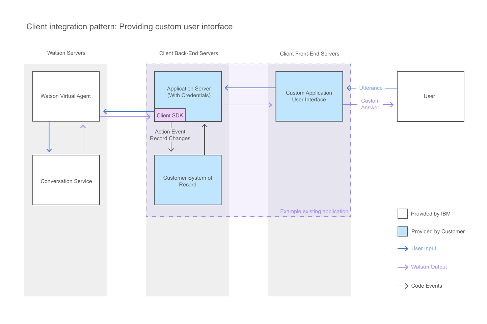

---

copyright:
  years: 2015, 2017
lastupdated: "2017-09-08"

---

{:shortdesc: .shortdesc}
{:new_window: target="_blank"}
{:tip: .tip}
{:pre: .pre}
{:codeblock: .codeblock}
{:screen: .screen}
{:javascript: .ph data-hd-programlang='javascript'}
{:java: .ph data-hd-programlang='java'}
{:python: .ph data-hd-programlang='python'}
{:swift: .ph data-hd-programlang='swift'}

# Building a custom chat interface
{: #integrate_custom-chat}

If the provided chat widget does not meet your needs, you can develop your own JavaScript chat interface to enable your users to interact with the virtual agent. This gives you complete control over the layout, appearance, and behavior of the chat interface.
{: shortdesc}

This diagram illustrates how the conversation flows through the system when you provide a custom chat interface.

To develop a custom chat interface with JavaScript, use the following resources:

- **{{site.data.keyword.watson}} {{site.data.keyword.virtualagentshort}} Client SDK**

    A JavaScript SDK for developing applications that interact with the {{site.data.keyword.watson}} {{site.data.keyword.virtualagentshort}}. The Client SDK is hosted on [GitHub ](https://github.com/watson-virtual-agents/client-sdk){: new_window}.

- **API Explorer**

    A portal providing access to the {{site.data.keyword.watson}} {{site.data.keyword.virtualagentshort}} REST APIs on {{site.data.keyword.Bluemix_notm}}. You can access the {{site.data.keyword.watson}} {{site.data.keyword.virtualagentshort}} APIs from [{{site.data.keyword.IBM_notm}} developerWorks API Explorer ](https://developer.ibm.com/api/view/id-339:title-Watson_Virtual_Agent){: new_window}.

If you want the **Metrics** page to show real user information, you must include the following parameters on calls that you make to the /dialogs endpoint:

- `user_id`: A unique user ID. Use only non-personally identifiable user IDs. For example, do not use an email address or anything else that fully or partially includes a user name. This information is displayed in the **Interactions** page and feeds into other metrics, like the **Unique users** graph on the **User Metrics** tab.
- `user_latlon`: Location coordinates specified in decimal degrees. This information is used to populate the **Locations** map on the **User Metrics** tab.
