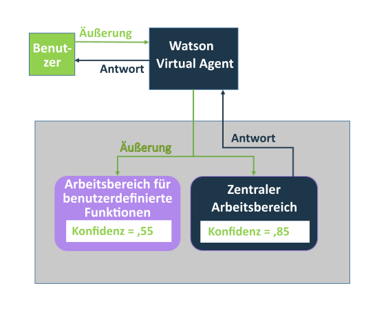
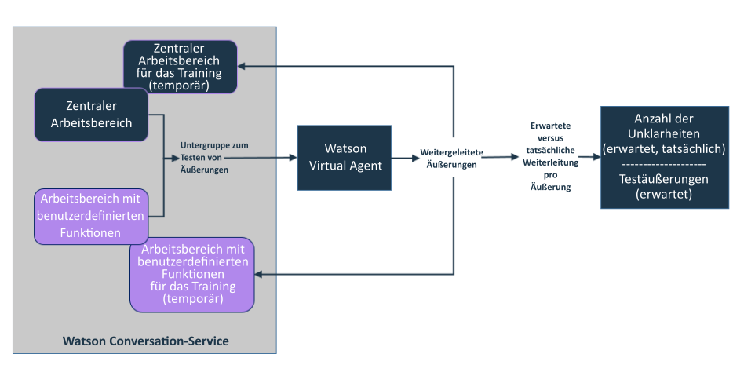

---

Copyright:
Jahre: 2015, 2017
lastupdated: "2017-08-10"

---

{:shortdesc: .shortdesc}
{:new_window: target="_blank"}
{:tip: .tip}
{:pre: .pre}
{:codeblock: .codeblock}
{:screen: .screen}
{:javascript: .ph data-hd-programlang='javascript'}
{:java: .ph data-hd-programlang='java'}
{:python: .ph data-hd-programlang='python'}
{:swift: .ph data-hd-programlang='swift'}

# Hinzufügen Ihrer eigenen Funktionen 
{: #add-custom-capabilities}

Fügen Sie Ihre eigenen Funktionen hinzu, um die Inhalte zu erweitern, die der virtuelle Agent mit Ihren Kunden besprechen kann.
{: shortdesc}

## Vorbereitung

Wenn Sie über einen Arbeitsbereich einen benutzerdefinierten Dialog für eine zentrale Funktion angeben, müssen Sie in dem Arbeitsbereich nur einen Dialog angeben. Der Agent wurde bereits so trainiert, dass er Äußerungen erkennen kann, die den zentralen Funktionen zugeordnet sind. Sie müssen daher keine Absichten, Entitäten und Trainingsdaten angeben. Wenn Sie einen Arbeitsbereich angeben, in dem Ihre eigenen Funktionen definiert sind, müssen Sie zusätzlich zu dem Dialog Absichten und Entitäten angeben. Zudem müssen Sie eine Vielzahl von beispielhaften Äußerungen angeben, die der Service zum Trainieren der Absichten verwenden kann, die Sie unterstützen möchten. Verwenden Sie die Dokumentation, Demos und Tools, die im Lieferumfang des {{site.data.keyword.IBM_notm}} {{site.data.keyword.watson}} {{site.data.keyword.conversationshort}}-Service enthalten sind, um einen Arbeitsbereich mit benutzerdefinierten Funktionen zu erstellen. Weitere Informationen finden Sie in der [ Dokumentation zu {{site.data.keyword.watson}} {{site.data.keyword.conversationshort}} ](https://console.bluemix.net/docs/services/conversation/index.html#about "External link icon"){: new_window}.

### Informationen zu dieser Aufgabe

Sie können nur einen Arbeitsbereich für die Definition benutzerdefinierter Funktionen erstellen. Jede Absicht, die Sie im Arbeitsbereich hinzufügen und trainieren, wird als benutzerdefinierte Funktion verfügbar gemacht, wenn Sie den Arbeitsbereich mit dem Agenten verknüpfen. Der Arbeitsbereich muss alle Funktionen enthalten, die Sie zu Ihrem Agenten hinzufügen möchten. Fügen Sie keine Absichten zum Arbeitsbereich hinzu, die Ihr Agent nicht behandeln soll.

### Verfahren

1.  Erstellen Sie über Ihre {{site.data.keyword.conversationshort}}-Serviceinstanz einen Arbeitsbereich, der Ihre benutzerdefinierten Funktionen definiert. Siehe die [Dokumentation zum {{site.data.keyword.conversationshort}}-Service ](https://console.bluemix.net/docs/services/conversation/configure-workspace.html#configuring-a-conversation-workspace "External link icon"){: new_window}.

    Beachten Sie folgende Richtlinien:
    - Fügen Sie für jede Funktion, die Sie im Dialog als Basisknoten unterstützen möchten (in der Benutzerschnittstelle des {{site.data.keyword.conversationshort}}-Tools auch als *alternative Konversation* bezeichnet), einen Zweig hinzu. Definieren Sie beispielsweise keinen Basisknoten in Ihrem Dialog, der Begrüßungsansagen für Benutzer erkennt und darauf reagiert, um anschließend untergeordnete Knoten hinzuzufügen, die mit anderen untergeordneten Absichten benutzerdefinierter Funktionen übereinstimmen.
    - Vermeiden Sie die Behandlung von Abweichungen von Benutzereingaben mit rekursiven Schleifen. Erstellen Sie nur Dialogwendungen, die ein definitives Ende haben.
    - Erstellen Sie keine benutzerdefinierte Absicht, deren Name mit dem Namen der Absicht identisch ist, die von einer zentralen Funktion verwendet wird. Eine Liste mit zu vermeidenden Namen finden Sie unter [Namen von Absichten](intent_codenames.html).

1.  Verlinken Sie den Arbeitsbereich mit dem Agenten. Siehe [Verlinken von Arbeitsbereichen](link_workspace.html)
1.  Öffnen Sie auf der Seite **Configure (Konfigurieren)** die Registerkarte **Custom Capabilities (Benutzerdefinierte Funktionen)**.
1.  Klicken Sie auf **Add Capabilities (Funktionen hinzufügen)**.
1.  Wählen Sie den Arbeitsbereich aus, den Sie in Schritt 2 mit dem Agenten verlinkt haben, und klicken Sie anschließend auf **Select Workspace (Arbeitsbereich auswählen)**.

    Die im verlinkten Arbeitsbereich definierten Absichten werden jetzt als aktivierte Funktionen aufgeführt.

    > **Hinweis:** Einzelne Funktionen können nicht inaktiviert werden. Wenn Sie eine benutzerdefinierte Funktion entfernen möchten, können Sie die Absicht im {{site.data.keyword.conversationshort}}-Service-Tool aus dem Arbeitsbereich löschen.

    Sie können alle Funktionen gleichzeitig entfernen, indem Sie auf **Remove Private Capabilities (Private Funktionen entfernen)** klicken. Durch das Löschen der Funktionen wird die Zuordnung zwischen dem Agenten und dem Arbeitsbereich, in dem die Funktionen definiert sind, nicht gelöscht.

### Ergebnisse

Nach dem Hinzufügen benutzerdefinierter Funktionen wird jede Äußerung, die von {{site.data.keyword.watson}} {{site.data.keyword.virtualagentshort}} bewertet wird, zur Bewertung an den zentralen Arbeitsbereich und an Ihren Arbeitsbereich mit den benutzerdefinierten Funktionen übergeben. Die Funktion, die am besten mit der Absicht der Benutzereingabe übereinstimmt, wird ausgelöst und der ihr zugeordnete Dialog wird verwendet.

### Weitere Schritte

Wenn Sie Ihre eigenen Funktionen hinzufügen, können Sie ohne großen Aufwand eine Funktion definieren, die in ihrer Verhaltensweise einer vorhandenen zentralen Funktion ähnelt. {{site.data.keyword.virtualagentshort}} führt eine erste Validierung durch, in der geprüft wird, ob sich Funktionen überschneiden, und informiert Sie darüber, sodass Sie diese Konflikte vor der Veröffentlichung des Agenten lösen können.

## Lösen von Validierungskonflikten
{: #validate_custom_capabilities}

Vermeiden Sie es, Funktionen zu definieren, die sich so ähnlich sind, dass sie um die Antwort auf bestimmte Benutzerabfragen konkurrieren. Wenn Sie dies machen, können Sie nicht vorhersehen, welche Funktion letztlich eine Antwort für Benutzer bereitstellt. Diese Variation in den Antworten kann von Benutzern als inkonsistentes Verhalten von Seiten des Agenten wahrgenommen werden. Dies könnte für Verwirrung sorgen oder den Benutzern den Eindruck vermitteln, dass der Agent nicht ordnungsgemäß funktioniert.

### Informationen zu dieser Aufgabe

Bei der Validierung werden beispielhafte Äußerungen aus den Trainingsdaten für Funktionen jedes Typs miteinander verglichen und Doppelungen gesucht. Für den Vergleich wird eine beliebige beispielhafte Äußerung ausgewählt. Wenn potenzielle Konflikte gefunden werden, wird die Wahrscheinlichkeit (in Prozent) angegeben, mit der die zwei Äußerungen in Konflikt miteinander stehen werden.

**Wie wird der Prozentsatz abgeleitet?** Der Service zählt die Anzahl der Äußerungen, die an den falschen Arbeitsbereich weitergeleitet werden und die Unklarheiten darstellen. Wenn das Verhältnis der Unklarheit (die Anzahl der Unklarheiten dividiert durch die Anzahl der Testäußerungen pro Funktion) größer als 20 % ist, wird der Konflikt gemeldet und das Verhältnis der Unklarheit angezeigt.

### Verfahren

Führen Sie die folgenden Schritte aus, um Validierungskonflikte zu lösen:

1.  Klicken Sie neben dem Link mit der Konfliktbenachrichtigung auf **Resolve (Lösen)**, um den Bereich *Review and resolve conflicts* (Konflikte überprüfen und lösen) zu öffnen und eine Liste der Konflikte anzuzeigen.

   

1.  Lösen Sie die einzelnen Konflikte auf eine der folgenden Weisen:
    - **Zentrale Funktion inaktivieren**

        1.  Schalten Sie den Switch auf **Off (Inaktiv)** um und schließen Sie anschließend den Bereich *Review and resolve conflicts* (Konflikte überprüfen und lösen).
        1.  Klicken Sie auf **Revalidate (Erneut überprüfen)** .

    - **Zentrale Funktion inaktivieren**
        1.  Klicken Sie auf den Link **Conversation service workspace** (Arbeitsbereich \"Conversation-Service\"), um den Arbeitsbereich zu öffnen, der die benutzerdefinierten Funktionen im {{site.data.keyword.conversationshort}}-Tool enthält.

        1.  Suchen Sie auf der Seite **Intents (Absichten)** nach der Absicht, blenden Sie sie ein und klicken Sie anschließend auf das Symbol für **Delete intent (Absicht löschen)**, um die Absicht aus dem Arbeitsbereich zu löschen. Siehe [Löschen von Absichten](https://console.bluemix.net/docs/services/conversation/intents.html#delete_intents).
        1.  **Optional**: Normalerweise werden beim Löschen einer Absicht alle Erwähnungen dieser Absicht aus dem entsprechenden Dialog entfernt. Wenn Sie jedoch für diese benutzerdefinierte Funktion, die Sie weiterhin verwenden möchten, einen komplexen Dialogknoten erstellt haben, sollten Sie diese nicht direkt aus dem Dialog entfernen. Konfigurieren Sie stattdessen die sich überschneidende zentrale Funktion so, dass sie als benutzerdefinierte Dialogantwort verwendet wird. (Siehe [Konfigurieren zentraler Funktionen](configure.html).)
            1.  Aktualisieren Sie den Auslöser für den Dialogknoten, damit der Absichtsname der zentralen Funktion als Bedingung verwendet wird.
            1.  Sie können eine der folgenden Aktionen ausführen:
              - Wenn Sie bei zentralen Funktionen einen Arbeitsbereich für benutzerdefinierte Funktionen und für benutzerdefinierte Dialoge verwenden, verschieben Sie den Dialogknoten für diese benutzerdefinierte Funktion nach oben, sodass er mit allen anderen von Ihnen verwendeten Dialogknoten für zentrale Funktionen gruppiert wird. Benutzerdefinierte Dialoge für zentrale Funktionen werden im oberen Bereich der Baumstruktur gehalten, damit sichergestellt wird, dass sie vom Bot gefunden werden können.
              - Wenn Sie zwei separate Arbeitsbereiche verwenden, erstellen Sie erneut den Dialogknoten in dem Arbeitsbereich, in dem Ihre benutzerdefinierten Dialoge definiert werden. Nachdem Sie den Dialogknoten erfolgreich erneut erstellt haben, können Sie ihn aus dem Arbeitsbereich für Ihre benutzerdefinierten Funktionen entfernen.
        1.  Nachdem Sie die Änderungen am Arbeitsbereich vorgenommen haben, wird dieser automatisch erneut trainiert. Kehren Sie nach Abschluss des Trainings zur Registerkarte **Custom Capabilities (Benutzerdefinierte Funktionen)** von {{site.data.keyword.watson}} {{site.data.keyword.virtualagentshort}} zurück.
        1.  Klicken Sie auf **Revalidate (Erneut überprüfen)** .

    - **Aktualisieren der Trainingsdaten für die benutzerdefinierte Funktion**

        Wenn sich die benutzerdefinierte Funktion mit einem ähnlichen Kundenziel befasst, jedoch mit deutlichen Unterschieden zur zentralen Funktion, können Sie die Trainingsdaten für die benutzerdefinierte Funktion aktualisieren, um die Unterschiede zwischen den zwei Funktionen hervorzuheben.
         >Hinweis: Sie können bei der zentralen Funktion nicht auf den Arbeitsbereich zugreifen, um die zugehörigen Trainingsdaten zu aktualisieren; Sie können den Arbeitsbereich nur bearbeiten, damit die Änderungen der benutzerdefinierten Funktion wirksam werden.
        Führen Sie die folgenden Schritte aus, um den Arbeitsbereich mit der benutzerdefinierten Funktion zu bearbeiten.
        1.  Klicken Sie auf den Link **Conversation service workspace** (Arbeitsbereich \"Conversation-Service\"), um den Arbeitsbereich zu öffnen, der Ihre benutzerdefinierten Funktionen im {{site.data.keyword.conversationshort}}-Tool enthält.

        1.  Überprüfen Sie bei jeder in Konflikt stehenden benutzerdefinierten Funktion die Beispieläußerungen der Absicht.
            - Wenn sich beispielhafte Äußerungen deutlich mit den Arten der Äußerungen von Benutzern überschneiden, mit denen sich die zentrale Funktion befassen soll, löschen Sie diese Äußerungen. Führen Sie hierzu die folgenden Schritte aus:
              1.  Suchen Sie auf der Seite **Intents (Absichten)** nach der Absicht. Blenden Sie die Absicht ein, um die Liste der beispielhaften Äußerungen anzuzeigen.
              1.  Aktivieren Sie das Kontrollkästchen neben jeder sich überschneidenden Beispieläußerung und klicken Sie anschließend auf **Remove examples (Beispiele entfernen)**.

            - Fügen Sie weitere beispielhafte Äußerungen hinzu, die Benutzerziele darstellen, welche die Facetten der benutzerdefinierten Funktion hervorheben, durch die sich die Funktion deutlich von der zentralen Funktion abhebt. Durch das Hinzufügen von Trainingsdaten, die die eindeutige Funktion der benutzerdefinierten Funktion hervorheben, kann diese besser von der zentralen Funktion unterschieden werden.

            - Fügen Sie Gegenbeispiele hinzu, die die Arten von Äußerungen darstellen, bei denen Sie ausdrücklich nicht möchten, dass sich die benutzerdefinierte Funktion damit befasst. Führen Sie hierzu die folgenden Schritte aus:
              1.  Fügen Sie im Bereich **Try it out (Ausprobieren)** Testäußerungen hinzu, die die Arten unterschiedlicher Benutzerziele darstellen, mit denen sich die zentrale Funktion befasst.
              1.  Wenn die Absicht der benutzerdefinierten Funktion als erkannte Absicht identifiziert wird, klicken Sie neben dem Absichtsnamen auf den Abwärtspfeil und wählen Sie **Mark as irrelevant (Als irrelevant markieren)** aus.
              1.  Wiederholen Sie die vorherigen zwei Schritte für so viele Äußerungen wie möglich.

        1.  Nachdem Sie die Änderungen am Arbeitsbereich vorgenommen haben, wird dieser automatisch erneut trainiert. Kehren Sie nach Abschluss des Trainings zur Registerkarte **Custom Capabilities (Benutzerdefinierte Funktionen)** von {{site.data.keyword.watson}} {{site.data.keyword.virtualagentshort}} zurück.
        1.  Klicken Sie auf **Revalidate (Erneut überprüfen)** .

    - **Keine Maßnahmen ergreifen**

        Wenn das Auslösen unterschiedlichen Agentenverhaltens bei einigen Funktionen zulässig ist, können Sie den Konflikt ungelöst lassen.
        >Hinweis: Sie werden nach jeder Validierung weiterhin über den Konflikt benachrichtigt.
## Testen benutzerdefinierter Funktionen 
{: #test_custom_capabilities}

Nachdem Sie Ihre eigenen Funktionen hinzugefügt und Validierungskonflikte gelöst haben, können Sie einige Tests durchführen, um sicherzustellen, dass sich die benutzerdefinierten Funktionen erwartungsgemäß verhalten.

### Verfahren

1.  Im Bereich \"Vorschau\" können Sie Fragen stellen oder die Art von Anforderungen, die Ihre Kunden erwartungsgemäß stellen.

    Unter der Antwort wird die Funktion angezeigt, die für die Anforderung ausgelöst wurde. Wenn die angezeigte Funktion nicht Ihren Erwartungen entspricht, können Sie Änderungen vornehmen und korrigieren, wie die Äußerung an die Funktionen weitergeleitet wird. Verwenden Sie zum Beheben von Problemen die gleichen Verfahren, die oben zum Lösen von Validierungskonflikten dokumentiert sind.

1.  Wiederholen Sie diesen Prozess, bis der Agent so konfiguriert ist, dass Ihre benutzerdefinierten Funktionen ordnungsgemäß bearbeitet werden.
