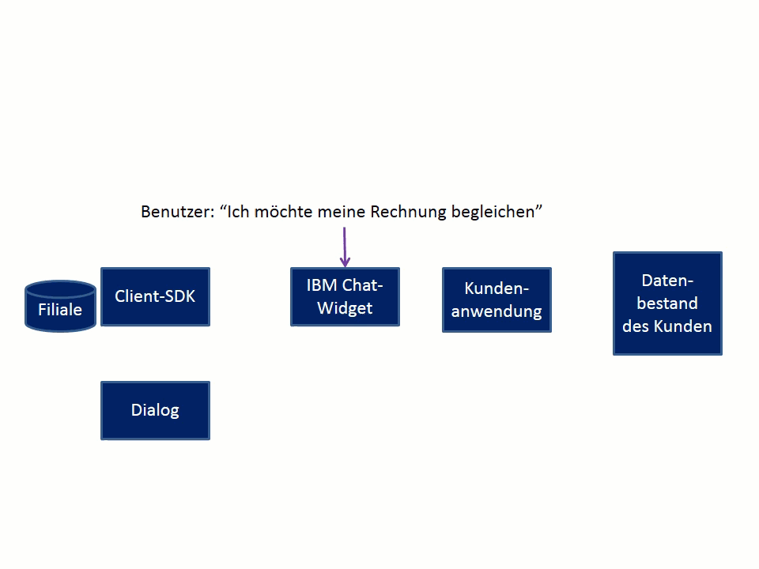

---

Copyright:
Jahre: 2015, 2017
lastupdated: "2017-08-10"

---

{:shortdesc: .shortdesc}
{:new_window: target="_blank"}
{:tip: .tip}
{:pre: .pre}
{:codeblock: .codeblock}
{:screen: .screen}
{:javascript: .ph data-hd-programlang='javascript'}
{:java: .ph data-hd-programlang='java'}
{:python: .ph data-hd-programlang='python'}
{:swift: .ph data-hd-programlang='swift'}

# Ablauf einer Konversation zum Leisten einer Zahlung 
{: #backend_payment_gif}

Hier erfahren Sie, wie in der für die Absicht \"Zahlung leisten\" bereitgestellten integrierten Konversation Informationen zwischen dem Benutzer und dem virtuellen Agenten ausgetauscht werden.
{: shortdesc}

Die folgende Grafik veranschaulicht den Konversationsfluss für einen möglichen Weg, den die für die Absicht \"Zahlung leisten\" mit der Anwendung bereitgestellte integrierte Konversation einschlagen kann.

**Zugehörige Aufgaben**:

[Integrierte Dialoge](configure.html#make-a-payment)
