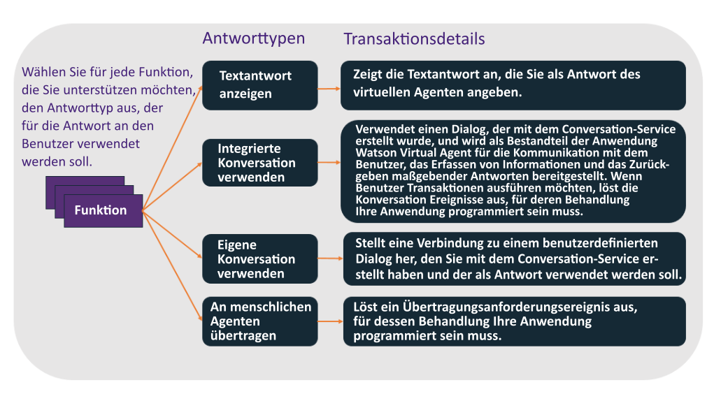
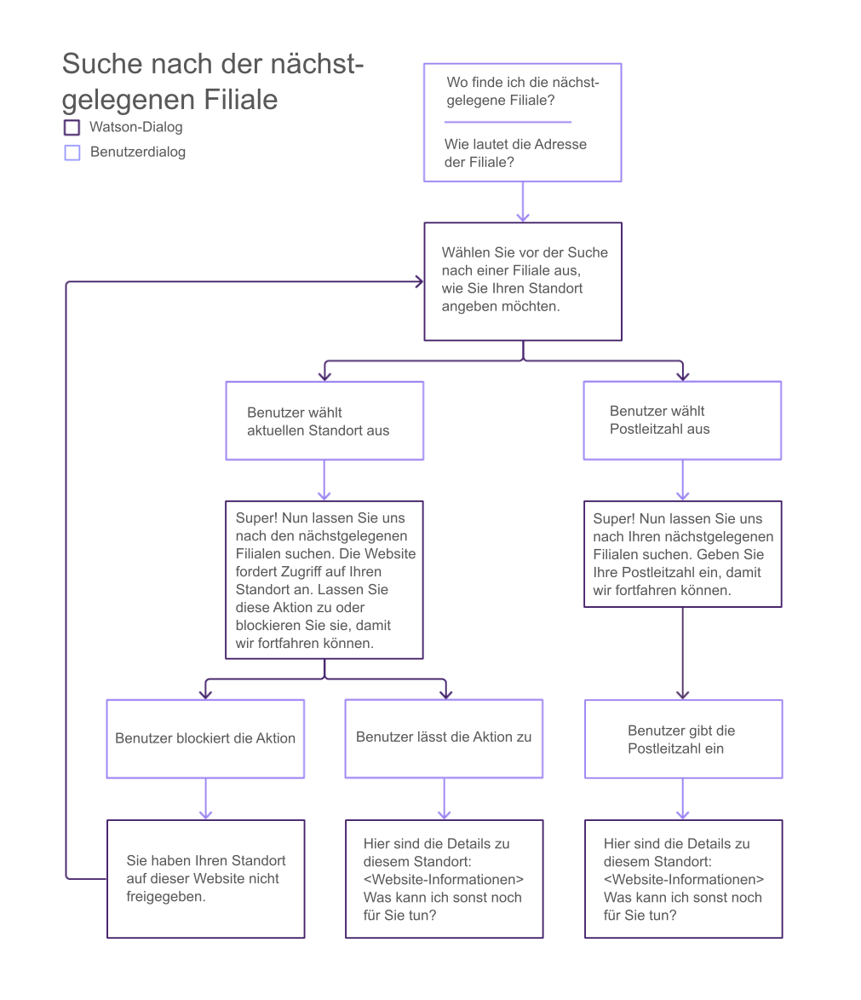
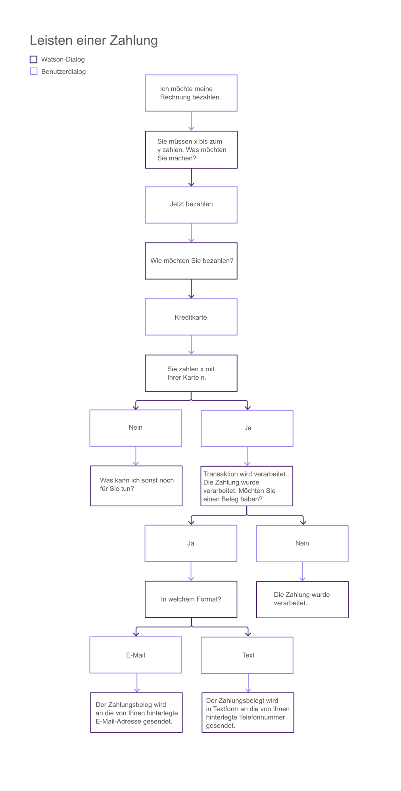
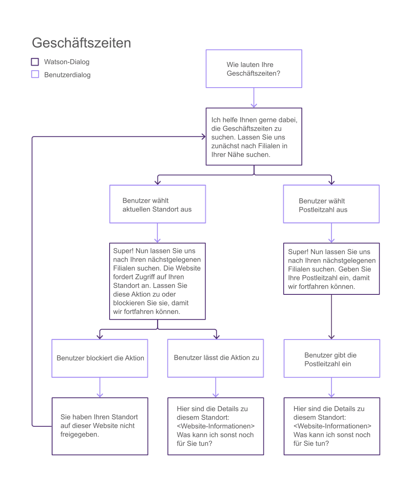
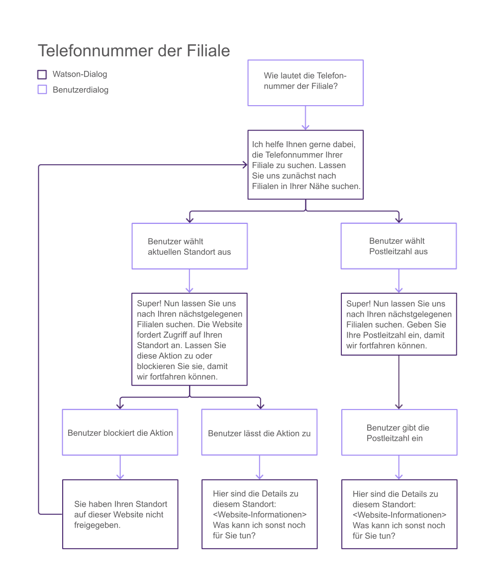
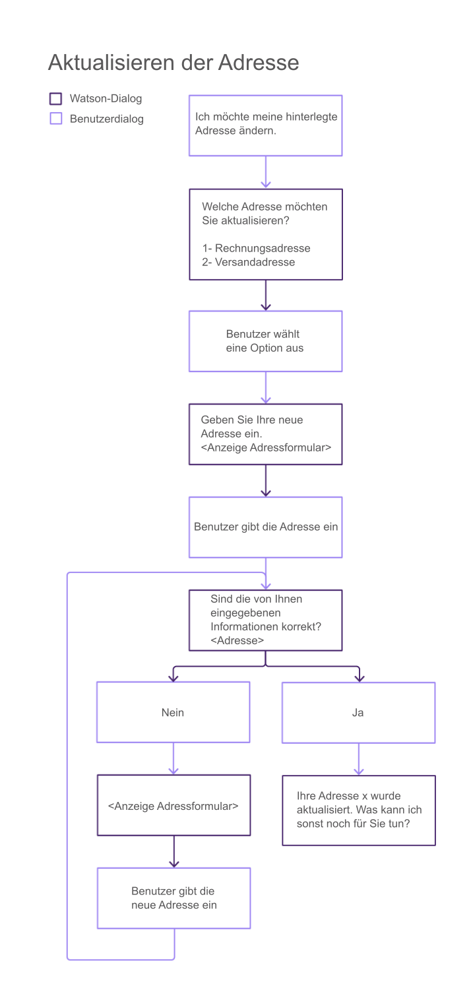
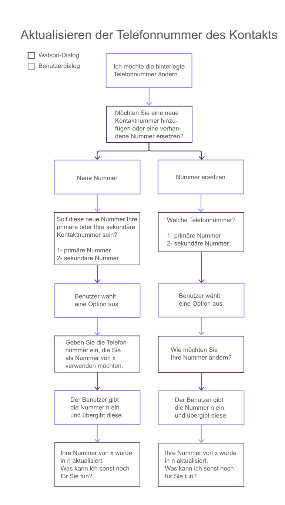

---

copyright:
  years: 2015, 2017
lastupdated: "2017-08-01"

---

{:shortdesc: .shortdesc}
{:new_window: target="_blank"}
{:tip: .tip}
{:pre: .pre}
{:codeblock: .codeblock}
{:screen: .screen}
{:javascript: .ph data-hd-programlang='javascript'}
{:java: .ph data-hd-programlang='java'}
{:python: .ph data-hd-programlang='python'}
{:swift: .ph data-hd-programlang='swift'}

# Konfigurieren zentraler Funktionen
{: #configure}

Zur Konfiguration Ihres Bots müssen Sie die Funktionen auswählen, die darin enthalten sein sollen.
{: shortdesc}

## Informationen zu dieser Aufgabe

Eine <cite class="cite">Funktion</cite> ist die Funktion Ihres virtuellen Agenten, mit der ein bestimmtes Kundenziel erkannt und erfüllt werden soll. Die Funktion <cite class="cite">Nächstgelegene Filiale suchen</cite> verwendet beispielsweise vordefinierte Artefakte und die Verarbeitung natürlicher Sprache, durch die die Äußerung eines Kunden (z. B. <cite class="cite">Wo ist der Standort Ihrer Filiale?</cite>) bewertet werden kann und das Ziel des Kunden erkannt wird. Zur Erreichung dieses Ziels erteilt die Funktion in einem Dialog mit dem Kunden den Auftrag, den Standort des Kunden festzustellen, und gibt Adressinformationen für die nächstgelegene Filiale des Kunden zurück.

Der Bot ist so trainiert, dass er eine Reihe von zentralen Funktionen erkennen und behandeln kann, die für Interaktionen des Kundendiensts relevant sind. Dazu zählen Anfragen zur Rechnungsstellung, Zahlungen, Informationen zur Filiale und Anforderungen, mit einem menschlichen Agenten zu sprechen. Eine Liste finden Sie unter [Zentrale Funktionen](/docs/services/virtual-agent/intent_list.html). Wenn die zentralen Funktionen keinem allgemeinen, für Ihre Kunden spezifischen Ziel entsprechen, können Sie Ihre eigenen Funktionen zu den bereitgestellten Funktionen hinzufügen. Wenn Sie beispielsweise eine Bäckerei besitzen, fragen Ihre Kunden möglicherweise häufig nach den Geschmacksrichtungen, in denen Sie Cupcakes anbieten. Zur Behandlung derartiger Fragen können Sie die Funktion <cite class="cite">Cupcake-Menü</cite> hinzufügen. Weitere Informationen finden Sie unter [Hinzufügen Ihrer eigenen Funktionen](/docs/services/virtual-agent/personalize.html#add_custom_capabilities).

Wenn Sie eine zentrale Funktion verwenden möchten, müssen Sie lediglich angeben, wie sich der Agent verhalten soll, wenn die Funktion ausgeführt wird. Bei einigen Funktionen reicht es möglicherweise aus, wenn für eine Benutzeranfrage eine vordefinierte Textantwort zurückgegeben wird. Bei anderen Funktionen ist möglicherweise ein komplexer Konversationsfluss erforderlich, damit Informationen gesammelt werden können, die zum Durchführen einer Transaktion erforderlich sind. In einem solchen Fall sammelt der Agent Informationen und übergibt diese an die Anwendung, die die erforderlichen Geschäftsprozesse implementieren muss.

Standardmäßig sind alle zentralen Funktionen aktiviert und weisen vorformulierte Antworten auf. Zunächst müssen Sie entscheiden, ob alle Funktionen inaktiviert werden sollen, die Ihr Agent nicht benötigt. Bei Funktionen, die Sie beibehalten möchten, müssen Sie die vorformulierten Antworten durch Antworten ersetzen, die Informationen zu Ihrem Geschäft widerspiegeln.

## Verfahren

Führen Sie die folgenden Schritte aus, um eine zentrale Funktion zu konfigurieren:

1. Überprüfen Sie auf der Seite **Konfigurieren** des Konfigurationstools von {{site.data.keyword.watson}} {{site.data.keyword.virtualagentshort}} die verfügbaren Funktionen.
1. Klicken Sie zum Konfigurieren einer Funktion auf die Funktionskachel.
1. Entscheiden Sie, ob Ihr Bot die Funktion unterstützen soll. Alle Funktionen sind aktiviert, es sei denn, sie inaktivieren sie.

    Klicken Sie zum Aktivieren oder Inaktivieren der Funktion oben auf der Detailseite der Funktion auf den Schalter.

    Bei einer Funktion, die Sie nicht unterstützen möchten, bei der Sie jedoch vermuten, dass ein Kunde danach fragen könnte, können Sie alternativ entscheiden, sie aktiviert zu lassen, und eine Textantwort bereitstellen, in der erklärt wird, dass Sie diese Funktion nicht unterstützen. Wenn Sie beispielsweise keine Versicherung anbieten, könnten Sie die Funktion **Versicherung hinzufügen** aktivieren, statt sie zu inaktivieren. Wählen Sie als Antworttyp **Textantwort anzeigen** aus. Fügen Sie im zugehörigen Feld **Nachricht** die Textantwort <cite class="cite">Wir bieten keine Versicherung für unsere Produkte an</cite> hinzu.

1. Entscheiden Sie bei jeder Funktion, die Sie unterstützen möchten, welchen Antworttyp Sie verwenden möchten. Folgende Optionen stehen zur Verfügung:

    

    - **Textantwort anzeigen**

        Bei einfachen Anfragen können Sie mit dem Konfigurationstool eine Standardtextantwort angeben, die dem Benutzer angezeigt werden soll. Dieser Antworttyp ist bei Anfragen hilfreich, die einfache Antworten aufweisen und bei denen das Sammeln zusätzlicher Informationen oder jegliche Interaktion mit anderen Systemen nicht erforderlich ist. Bei der Absicht \"Anfrage bzgl. der Zahlungsmethode\" könnten Sie die Textantwort `Wir akzeptieren Kreditkarten von allen großen Kreditkartenunternehmen` angeben.

        Wenn Sie den Antworttyp **Textantwort anzeigen** auswählen, müssen Sie auch den Text der Antwort angeben.

    - **Integrierte Konversation verwenden**

        Die vordefinierten Dialoge, in denen zusätzliche Informationen gesammelt werden oder in denen eine komplexe Handhabung implementiert wird, umfassen eine Reihe von Funktionen. Ein *Dialog* stellt die Struktur für eine Konversation mit dem Benutzer bereit. Weitere Informationen darüber, welche Funktionen diesen Antworttyp unterstützen und wie die Konversation bei einer Implementierung fließt, finden Sie unter [Integrierte Dialoge](/docs/services/virtual-agent/configure.html#builtin_dialog_ovw).

        Wenn Sie den Antworttyp **Integrierte Konversation verwenden** auswählen, müssen Sie möglicherweise auch zusätzliche Daten konfigurieren, die im Dialog zur Darstellung von Auswahlmöglichkeiten für den Benutzer verwendet werden (z. B. Filialstandorte oder Zahlungsmethoden). In vielen Fällen muss Ihre Anwendung für Ereignisse empfangsbereit sein, die durch den Dialog ausgelöst werden können und Aktionen in Ihren Datenbeständen implementieren. Weitere Einzelheiten finden Sie unter [Implementieren einer Logik zur Unterstützung einer integrierten Konversation](/docs/services/virtual-agent/impl_intents.html#backend_transaction).

    - **Eigene Konversation verwenden**

        Wenn Sie bei einer Funktion komplexe Kundeninteraktionen implementieren müssen, können Sie Ihren eigenen Dialog erstellen, in dem die Konversation mit dem Kunden gestaltet wird. Für diese Option sind zusätzliche Schritte erforderlich. Dazu zählt das Erstellen eines benutzerdefinierten Dialogs mit dem {{site.data.keyword.watson}} {{site.data.keyword.conversationshort}}-Service und das Verknüpfen des Dialogs mit dem Agenten. Entsprechende Einzelheiten finden Sie unter [Erstellen eines benutzerdefinierten Dialogs](/docs/services/virtual-agent/personalize.html#custom_dialog).

    - **An menschlichen Agenten übertragen**

        Sie können für jede Funktion, die Sie nicht mit dem virtuellen Agenten behandeln möchten, angeben, dass ein Ereignis ausgelöst werden soll, in dem ein menschlicher Agent angefordert wird. Ihre Anwendung kann anschließend über Ihre Prozesse zur Initialisierung einer Chatsitzung mit einem Kundendienstmitarbeiter auf dieses Ereignis antworten.

        Wenn Sie den Antworttyp **An menschlichen Agenten übertragen** auswählen, können Sie eine Nachricht angeben, die Kontext für die Kundenanfrage enthält, der auch an den menschlichen Agenten übergeben werden soll.

## Integrierte Dialoge
{: #builtin_dialog_ovw}

In den folgenden Abschnitten werden die zentralen Funktionen beschrieben, bei denen die integrierten Konversationsflüsse dafür trainiert wurden, diese zu erkennen und darauf zu reagieren.

### Nächstgelegene Filiale suchen
{: #builtin_dialog_ovw__findNearestStore}

Das folgende Diagramm zeigt die Knoten in der integrierten Konversation für die Funktion <cite class="cite">Nächstgelegene Filiale suchen</cite>. Für diese Funktion und die Funktion <cite class="cite">Filialstandort</cite> wird der gleiche Dialogfluss verwendet.

In dem einzigen zusätzlichen Schritt, der von Ihnen erforderlich ist, müssen Sie bei jeder Filiale Details zum Filialstandort hinzufügen. Sie können die Details zur Filiale über eine der folgenden Funktionen hinzufügen, auf die Sie über die Seite \"Konfigurieren\" Zugriff haben:

- Nächstgelegene Filiale suchen
- Filialstandort

### Zahlung leisten

Das folgende Diagramm zeigt die Knoten in der integrierten Konversation für die Funktion <cite class="cite">Zahlung leisten</cite>.

Klicken Sie auf [hier](/docs/services/virtual-agent/backend_payment_gif.html#backend_payment_gif), um zu sehen, wie die Benutzereingabe und die Antworten des virtuellen Agenten durch das System fließen.

Informationen zu zusätzlichen Schritten, die Sie ausführen müssen, damit diese Funktion vollständig unterstützt wird, finden Sie unter [Implementieren einer Logik zur Unterstützung einer integrierten Konversation](/docs/services/virtual-agent/impl_intents.html#makeapayment).

### Geschäftszeiten

Das folgende Diagramm zeigt die Knoten in der integrierten Konversation für die Funktion <cite class="cite">Geschäftszeiten</cite>.

Wenn Sie Geschäftszeiten angeben möchten, müssen Sie die Informationen zu den Geschäftszeiten beim Hinzufügen der Informationen zum Filialstandort über folgende Funktionen einschließen:

- Nächstgelegene Filiale suchen
- Filialstandort

### Filialstandort

Das oben stehende Diagramm zeigt die Knoten in der integrierten Konversation für die Funktion <cite class="cite">Filialstandort</cite>. Für diese Funktion und die Funktion [Nächstgelegene Filiale suchen](/docs/services/virtual-agent/configure.html#builtin_dialog_ovw__findNearestStore) wird der gleiche Dialogfluss verwendet.

In dem einzigen zusätzlichen Schritt, der von Ihnen erforderlich ist, müssen Sie bei jeder Filiale Details zum Filialstandort hinzufügen. Sie können die Details zur Filiale über eine der folgenden Funktionen hinzufügen, auf die Sie über die Seite \"Konfigurieren\" Zugriff haben:

- Nächstgelegene Filiale suchen
- Filialstandort

### Telefonnummer der Filiale

Das folgende Diagramm zeigt die Knoten in der integrierten Konversation für die Funktion <cite class="cite">Telefonnummer der Filiale</cite>.

Wenn Sie Telefonnummern einer Filiale angeben möchten, müssen Sie diese zu den Definitionen des Filialstandorts hinzufügen, die Sie über folgende Funktionen hinzufügen:

- Nächstgelegene Filiale suchen
- Filialstandort

### Adresse aktualisieren

Das folgende Diagramm zeigt die Knoten in der integrierten Konversation für die Funktion <cite class="cite">Adresse aktualisieren</cite>.

Informationen zu zusätzlichen Schritten, die Sie ausführen müssen, damit diese Funktion vollständig unterstützt wird, finden Sie unter [Implementieren einer Logik zur Unterstützung einer integrierten Konversation](/docs/services/virtual-agent/impl_intents.html#updateaddress).

### Aktualisieren der Telefonnummer des Kontakts

Das folgende Diagramm zeigt die Knoten in der integrierten Konversation für die Funktion <cite class="cite">Telefonnummer des Kontakts aktualisieren</cite>.

Informationen zu zusätzlichen Schritten, die Sie ausführen müssen, damit diese Funktion vollständig unterstützt wird, finden Sie unter [Implementieren einer Logik zur Unterstützung einer integrierten Konversation](/docs/services/virtual-agent/impl_intents.html#updatephone).

### Aktualisieren der E-Mail-Adresse

Das folgende Diagramm zeigt die Knoten in der integrierten Konversation für die Funktion <cite class="cite">E-Mail-Adresse aktualisieren</cite>.

Informationen zu zusätzlichen Schritten, die Sie ausführen müssen, damit diese Funktion vollständig unterstützt wird, finden Sie unter [Implementieren einer Logik zur Unterstützung einer integrierten Konversation](/docs/services/virtual-agent/impl_intents.html#updateemail).

