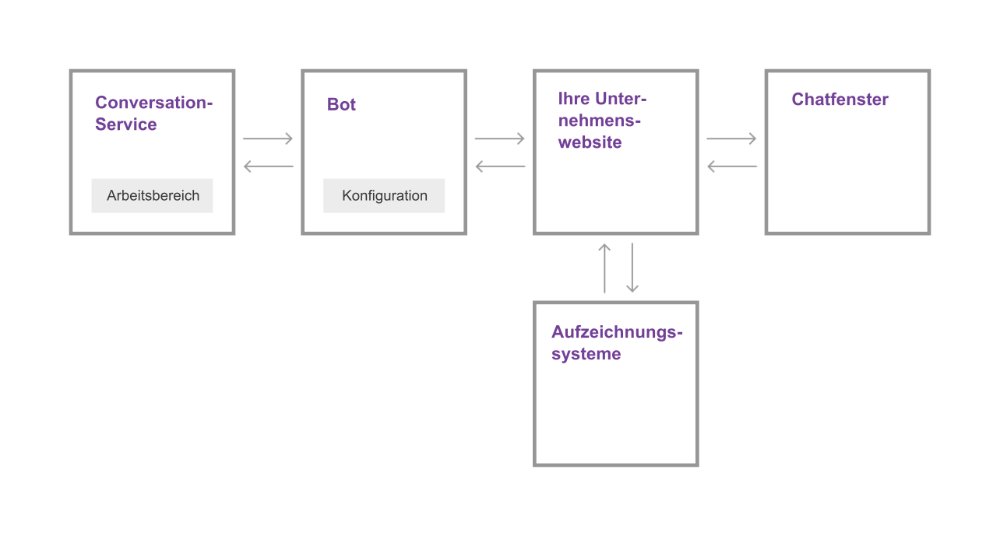

---

Copyright:
Jahre: 2015, 2017
lastupdated: "2017-08-10"

---

{:shortdesc: .shortdesc}
{:new_window: target="_blank"}
{:tip: .tip}
{:pre: .pre}
{:codeblock: .codeblock}
{:screen: .screen}
{:javascript: .ph data-hd-programlang='javascript'}
{:java: .ph data-hd-programlang='java'}
{:python: .ph data-hd-programlang='python'}
{:swift: .ph data-hd-programlang='swift'}

# Funktionsweise
{: #how-it-works}

{{site.data.keyword.IBM_notm}} {{site.data.keyword.watson}} {{site.data.keyword.virtualagentshort}} ergänzt die Gleichung für Kundenzufriedenheit durch kognitive Konversation. Machen Sie den Chat-Bot von {{site.data.keyword.virtualagentshort}} zum ersten Kontaktpunkt für Benutzerfragen und -anforderungen. Der Bot kann natürliche Sprache so verarbeiten, dass er die Fragen von Kunden versteht und die Kundenanforderungen klassifizieren kann. Abhängig von den Anforderungen kann er darauf reagieren und einfache Geschäftstransaktionen durchführen oder kompliziertere Anforderungen an einen Menschen mit Expertenwissen weiterleiten.

Sie entscheiden, welche Benutzerziele der Bot bearbeiten soll, indem Sie die Funktionen auswählen, die im Bot enthalten sein sollen. Verwenden Sie das bereitgestellte Konfigurationstool für die Aktivierung und Anpassung der Funktionen.
{: shortdesc}

## Funktionen

Eine *Funktion* ist die Fähigkeit Ihres Chat-Bots von {{site.data.keyword.virtualagentshort}}, ein bestimmtes Kundenziel zu erkennen und zu erfüllen. Beispiel: Die Funktion **Nächstgelegene Filiale suchen** verwendet Verarbeitungsverfahren natürlicher Sprache für die Auswertung einer Kundenäußerung wie *Wo ist der Standort Ihrer Filiale?* und das Ziel des Kunden erkannt wird. Zur Erreichung dieses Ziels erteilt die Funktion in einem Dialog mit dem Kunden den Auftrag, den aktuellen Standort des Kunden festzustellen, und gibt Adressinformationen für die nächstgelegene Filiale des Kunden zurück.

Bei IBM haben Experten für maschinelles Lernen und Linguistik für jede Funktion Trainingsdaten erstellt und mit diesen Daten Klassifikationsmerkmale für maschinelles Lernen iterativ trainiert. Diese Klassifikationsmerkmale können jede Benutzereingabe erkennen, die dem Ziel dieser Funktion entspricht, und darauf reagieren.

Zur Vereinfachung des Erstellungsprozesses von Bots bietet IBM Funktionspacks, in denen die am häufigsten angeforderten Funktionen für allgemeine Kundenunterstützungsszenarien vereint werden, sowie spezialisierte Packs für die gängigsten Unterstützungsanforderungen für Schlüsselindustrien.

## Funktionspacks

In einem *Funktionspack* werden die wichtigsten Funktionen für Ihre Branche für Sie gruppiert. Mit Zehntausenden von Beispielen von Äußerungen und Gegenbeispielen hat das IBM Team Gruppierungen von Funktionen erstellt, die ähnliche Kundenziele verfolgen, die jedoch koexistieren können, ohne um die Antwort von Benutzeranfragen miteinander zu konkurrieren.

Die folgende Tabelle enthält eine Zusammenfassung der angebotenen Packs. Klicken Sie auf die Links **Details**, um eine Liste der Funktionen und Beschreibungen für die einzelnen unterstützten Sprachen anzuzeigen.

| Sprache | Kundendienst (Allgemein) | Energie  | Retail Banking | Telekommunikationsunternehmen   |
|----------|----------------------------|---------|----------------|---------|
| Englisch  | [Details](capabilities_list_general.html)   | [Details](capabilities_list_energy.html) | [Details](capabilities_list_banking.html)        | [Details](capabilities_list_telco.html) |
| Französisch   | [Details](capabilities_list_general_fr.html)   | nicht zutreffend     | nicht zutreffend            | [Details](capabilities_list_telco_fr.html) |
| Deutsch   | [Details](capabilities_list_general_de.html) | nicht zutreffend     | nicht zutreffend            | [Details](capabilities_list_telco_de.html) |
| Italienisch | [Details](capabilities_list_general_it.html) | nicht zutreffend | nicht zutreffend | [Details](capabilities_list_telco_it.html) |
| Portugiesisch (Brasilianisch) | [Details](capabilities_list_general_pt-br.html)   | nicht zutreffend     | nicht zutreffend            | [Details](capabilities_list_telco_pt-br.html) |
| Spanisch | [Details](capabilities_list_general_es.html)   | nicht zutreffend     | nicht zutreffend            | [Details](capabilities_list_telco_es.html) |

*nicht zutreffend = derzeit nicht verfügbar.

Wenn die zentralen Funktionen kein gemeinsames Ziel Ihrer Kunden verfolgen, können Sie Ihre eigenen Funktionen hinzufügen, um die Ziele durch in einem Pack bereitgestellte Ziele zu ergänzen. Wenn Sie beispielsweise eine Bäckerei besitzen, fragen Ihre Kunden möglicherweise häufig nach den Geschmacksrichtungen, in denen Sie Cupcakes anbieten. Zur Behandlung derartiger Fragen können Sie die Funktion *Cupcake-Menü* hinzufügen. Weitere Informationen finden Sie unter [Hinzufügen Ihrer eigenen Funktionen](add-custom-capabilities.html).

### Unterschied zwischen {{site.data.keyword.watson}} {{site.data.keyword.virtualagentshort}} und {{site.data.keyword.watson}} {{site.data.keyword.conversationshort}}

{{site.data.keyword.IBM_notm}} {{site.data.keyword.watson}} {{site.data.keyword.conversationshort}} ist der Service, der im Mittelpunkt der Chat-Bot-Funktion steht. Er umfasst die Klassifikationsmerkmale für maschinelles Lernen, die natürliche Sprache verstehen und die Bedeutung einer Wortfolge oder eines Satzes erkennen können. Die Klassifikationsmerkmale können Wortfolgen oder Sätze nach den Klassen kategorisieren, die Sie als für Sie interessant identifiziert haben. IBM stellt Tools bereit, mit denen Sie die Trainingsdaten für die Klassifikationsmerkmale für maschinelles Lernen erstellen können. Mit den Tools können Sie zudem den Dialog erstellen, über den Ihr Bot mit Ihren Kunden kommuniziert.

Die {{site.data.keyword.conversationshort}}-Tools sind intuitiv und wurden so entworfen, dass jeder - selbst Personen ohne Erfahrungen im Bereich Entwicklung oder maschinelles Lernen - mit ihnen eine leistungsfähige, chatorientierte Anwendung erstellen kann. Es nimmt jedoch Zeit in Anspruch, die Trainingsdaten und einen Dialog zu erstellen. An dieser Stelle kommt {{site.data.keyword.watson}} {{site.data.keyword.virtualagentshort}} zum Einsatz.

{{site.data.keyword.watson}} {{site.data.keyword.virtualagentshort}} ist in {{site.data.keyword.watson}} {{site.data.keyword.conversationshort}} integriert. Mit {{site.data.keyword.virtualagentshort}} erhalten Sie jedoch den Bot-Service und zusätzlich ist der Bot vortrainiert: Er wurde von Experten und Forschern aus dem Bereich des maschinellen Lernens und der Linguistik trainiert. Sie können auswählen, welche Funktionen aktiviert werden sollen. Wenn Sie beispielsweise die Funktion **E-Mail-Adresse aktualisieren** aktivieren, kann Ihr Bot ganz einfach Anforderungen zu Änderungen von E-Mail-Adressen verstehen und darauf reagieren.

Das {{site.data.keyword.virtualagentshort}}-Konfigurationstool erleichtert die Auswahl der zu aktivierenden Funktionen und die Anpassung des Botverhaltens, wenn eine Funktion während einer Kundeninteraktion ausgelöst wird.

Sie haben immer die Möglichkeit, den Bot mehr und mehr anzupassen, denn Sie können jederzeit einen Arbeitsbereich des {{site.data.keyword.conversationshort}}-Service mit Ihrem Agenten verknüpfen, um die zugehörigen Möglichkeiten direkt zu erweitern.

## Architekturübersicht 
{: #arch_overview}

Das folgende Diagramm veranschaulicht die Architektur einer typischen {{site.data.keyword.watson}} {{site.data.keyword.virtualagentshort}}-Implementierung:

Die Implementierung umfasst folgende Hauptkomponenten:

- **{{site.data.keyword.conversationshort}}-Service**

    Eine Instanz des {{site.data.keyword.watson}} {{site.data.keyword.conversationshort}}-Service. Der {{site.data.keyword.conversationshort}}-Service stellt die Artefakte für Funktionen bereit: die Absichten, Entitäten und den Dialogfluss zusammen mit der zugrunde liegenden kognitiven Verarbeitung, über die die Funktionen des Chat-Bots angetrieben werden. Wenn Sie nur einen benutzerdefinierten Dialog oder eine benutzerdefinierte Funktion implementieren möchten, interagieren Sie direkt mit dem {{site.data.keyword.conversationshort}}-Service.

    Weitere Informationen zu Absichten und Dialogen finden Sie in der [Dokumentation zum {{site.data.keyword.conversationshort}}-Service ](https://console.bluemix.net/docs/services/conversation/index.html#about "External link icon"){: new_window}.

- **Bot**

    Ein auf dem {{site.data.keyword.conversationshort}}-Service basierender Bot, einschließlich einer Reihe von Funktionen. Der Bot ist so trainiert, dass er Benutzeranfragen zum Kundenprojekt erkennen kann, wie z. B. Anforderungen für grundlegende Unternehmensinformationen und die Zahlung von Rechnungen. Mit dem bereitgestellten Bot-Konfigurationstool können Sie unternehmensspezifische Informationen, die als Antwort auf Benutzeranfragen angegeben werden können, und die Antwort für die einzelnen Funktionen konfigurieren.

- **Ihre Unternehmenswebsite**

    Ihre kundenorientierte Geschäftsanwendung, die die Kommunikation mit dem {{site.data.keyword.watson}} {{site.data.keyword.virtualagentshort}}-Bot und Ihren Datenbeständen (z. B. Kundendatenbanken oder Abrechnungssysteme) handhabt.

- **Chatfenster**

    Die Chat-Schnittstelle des virtuellen Agenten, über die Kunden mit dem Bot kommunizieren. Sie können das bereitgestellte Chat-Widget verwenden (angepasst oder nicht angepasst) oder Sie können mithilfe des Client-SDK Ihr eigenes Chat-Widget implementieren.
