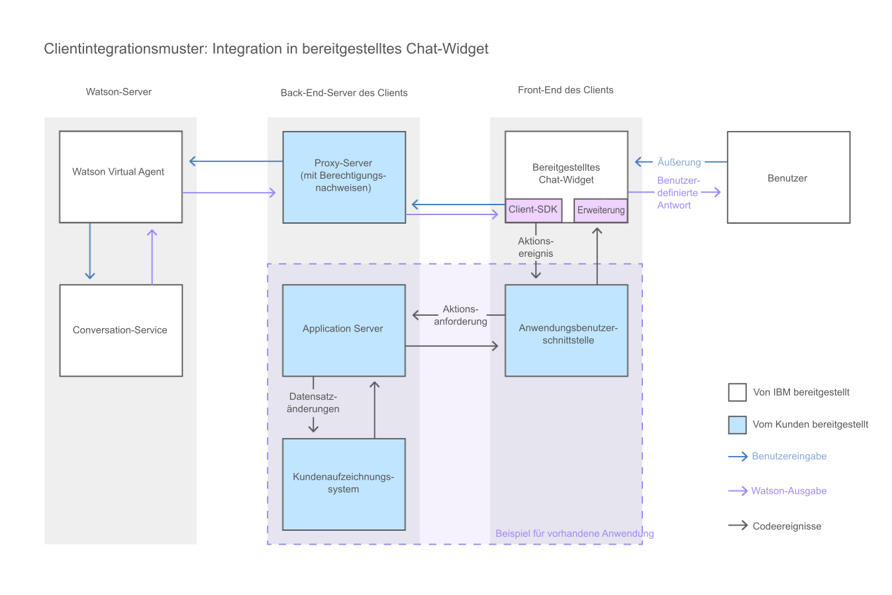

---

Copyright:
Jahre: 2015, 2017
lastupdated: "2017-08-10"

---

{:shortdesc: .shortdesc}
{:new_window: target="_blank"}
{:tip: .tip}
{:pre: .pre}
{:codeblock: .codeblock}
{:screen: .screen}
{:javascript: .ph data-hd-programlang='javascript'}
{:java: .ph data-hd-programlang='java'}
{:python: .ph data-hd-programlang='python'}
{:swift: .ph data-hd-programlang='swift'}

# Hinzufügen des bereitgestellten Chat-Widgets zu Ihrer Benutzerschnittstelle 
{: #integrate_add-chat}

Im Lieferumfang von {{site.data.keyword.watson}} {{site.data.keyword.virtualagentshort}} ist ein Chat-Widget enthalten, das Sie unverändert in Ihrer Benutzerschnittstelle verwenden können.
{: shortdesc}

Dieses Diagramm veranschaulicht, wie die Konversation durch das System fließt, wenn Sie das von {{site.data.keyword.IBM_notm}} bereitgestellte Chat-Widget verwenden.

1.  Öffnen Sie für die Verwendung des bereitgestellten Widgets das [Chat-Widget von {{site.data.keyword.watson}} {{site.data.keyword.virtualagentshort}}](https://github.com/watson-virtual-agents/chat-widget "Symbol für externen Link"){: new_window} GitHub-Repository, und führen Sie die Schritte in der Datei `README.md` aus.

    Das bereitgestellte Chat-Widget kann erweitert werden. Wenn es Elemente enthält, die Sie ändern möchten, können Sie diese anpassen. So können Sie beispielsweise zur Änderung eines Layouts, das im bereitgestellten Chat-Widget verwendet wird, ein benutzerdefiniertes Layout schreiben, mit dem das andere Layout überschrieben wird. Ein Beispiel finden Sie hier: [https://github.com/watson-virtual-agents/chat-widget/tree/1.2.12/examples/basic-custom-layout. ](https://github.com/watson-virtual-agents/chat-widget/tree/1.2.12/examples/basic-custom-layout "Symbol für externen Link"){: new_window} Beachten Sie, dass das Layout von mehreren Absichten verwendet werden könnte.

1.  Unter [Implementieren einer Logik zur Unterstützung einer integrierten Konversation](impl_intents.html#backend_transaction) finden Sie Informationen zu auszuführenden Schritten für die Unterstützung von Transaktionen im Chat-Widget, die bei Funktionen auftreten können, die die integrierte Konversation verwenden.

Wenn der Umfang der Anpassungen, die Sie vornehmen möchten, so umfassend ist, dass eine Implementierung Ihrer Änderungen durch das Durchführen von Aktualisierungen für das bereitgestellte Chat-Widget unmöglich ist, können Sie Ihre eigene Chat-Schnittstelle erstellen. Siehe [Erstellen einer benutzerdefinierten Chatschnittstelle](integrate_custom-chat.html).
