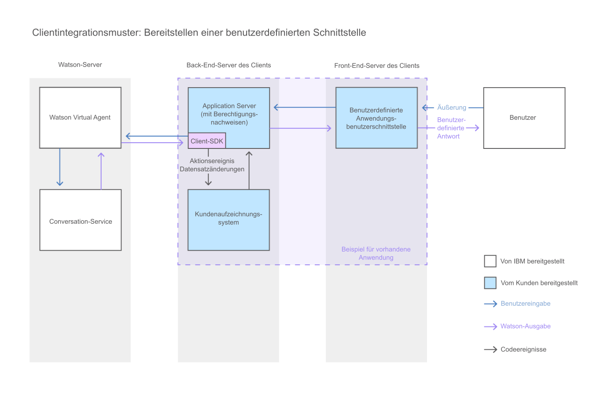

---

Copyright:
Jahre: 2015, 2017
lastupdated: "2017-08-10"

---

{:shortdesc: .shortdesc}
{:new_window: target="_blank"}
{:tip: .tip}
{:pre: .pre}
{:codeblock: .codeblock}
{:screen: .screen}
{:javascript: .ph data-hd-programlang='javascript'}
{:java: .ph data-hd-programlang='java'}
{:python: .ph data-hd-programlang='python'}
{:swift: .ph data-hd-programlang='swift'}

# Erstellen einer benutzerdefinierten Chat-Schnittstelle 
{: #integrate_custom-chat}

Wenn das bereitgestellte Chat-Widget Ihre Anforderungen nicht erfüllt, können Sie Ihre eigene JavaScript-Chat-Schnittstelle entwickeln, um Ihren Benutzern eine Interaktion mit dem virtuellen Agenten zu ermöglichen. Dadurch haben Sie die volle Kontrolle über das Layout, die Darstellung und das Verhalten der Chat-Schnittstelle.
{: shortdesc}

Dieses Diagramm veranschaulicht, wie die Konversation durch das System fließt, wenn Sie eine benutzerdefinierte Chat-Schnittstelle bereitstellen.

Verwenden Sie für die Entwicklung einer benutzerdefinierten Chat-Schnittstelle mit JavaScript folgende Ressourcen:

- **Client-SDK von {{site.data.keyword.watson}} {{site.data.keyword.virtualagentshort}}**

    Ein JavaScript-SDK zur Entwicklung von Anwendungen, die mit {{site.data.keyword.watson}} {{site.data.keyword.virtualagentshort}} interagieren. Das Client-SDK wird im [GitHub ](https://github.com/watson-virtual-agents/client-sdk "Symbol für externen Link"){: new_window} gehostet.

- **API-Explorer**

    Ein Portal, das den Zugriff auf die REST-APIs von {{site.data.keyword.watson}} {{site.data.keyword.virtualagentshort}} unter {{site.data.keyword.Bluemix_notm}} bereitstellt. Sie können über [{{site.data.keyword.IBM_notm}} developerWorks API Explorer ](https://developer.ibm.com/api/view/id-339:title-Watson_Virtual_Agent "Symbol für externen Link"){: new_window} auf die {{site.data.keyword.watson}} {{site.data.keyword.virtualagentshort}}-APIs zugreifen.
