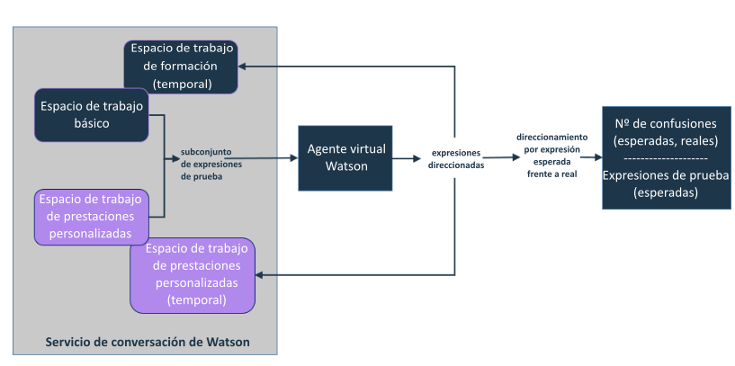

---

copyright:
  years: 2015, 2017
lastupdated: "2017-08-10"

---

{:shortdesc: .shortdesc}
{:new_window: target="_blank"}
{:tip: .tip}
{:pre: .pre}
{:codeblock: .codeblock}
{:screen: .screen}
{:javascript: .ph data-hd-programlang='javascript'}
{:java: .ph data-hd-programlang='java'}
{:python: .ph data-hd-programlang='python'}
{:swift: .ph data-hd-programlang='swift'}

# Adición de sus propias prestaciones
{: #add-custom-capabilities}

Para ampliar lo que el agente virtual puede tratar con los clientes, añada sus propias prestaciones.
{: shortdesc}

## Antes de empezar

Cuando utiliza un espacio de trabajo para proporcionar un diálogo personalizado para una prestación básica, sólo necesita proporcionar un diálogo en el espacio de trabajo. El agente ya se ha entrenado para reconocer las expresiones que se correlacionan con las prestaciones básicas, así que no es necesario proporcionar intenciones, entidades ni datos de entrenamiento. Cuando proporciona un espacio de trabajo que define sus propias prestaciones, además del diálogo debe proporcionar intenciones y entidades. También debe proporcionar un número considerable de expresiones de ejemplo que el servicio pueda utilizar para entrenar las intenciones a las que desea dar soporte. Utilice la documentación, las demos y las herramientas que se proporcionan con el servicio {{site.data.keyword.IBM_notm}} {{site.data.keyword.watson}} {{site.data.keyword.conversationshort}} para crear un espacio de trabajo con prestaciones personalizadas. Consulte la documentación de [{{site.data.keyword.watson}} {{site.data.keyword.conversationshort}} ](https://console.bluemix.net/docs/services/conversation/index.html#about "Icono de enlace externo"){: new_window} para obtener más información.

### Acerca de esta tarea

Sólo puede crear un único espacio de trabajo para definir prestaciones personalizadas. Cada intención que añada al espacio de trabajo pasará a estar disponible como una prestación personalizada cuando enlace el espacio de trabajo con el agente. El espacio de trabajo debe contener todas las prestaciones que desee añadir al agente. No añada intenciones al espacio de trabajo que no desee que pueda manejar el agente.

### Procedimiento

1.  En la instancia del servicio {{site.data.keyword.conversationshort}}, cree un espacio de trabajo que defina las prestaciones personalizadas. Consulte la documentación de servicio de [{{site.data.keyword.conversationshort}} ](https://console.bluemix.net/docs/services/conversation/configure-workspace.html#configuring-a-conversation-workspace "Icono de enlace externo"){: new_window}.

    Siga estas directrices:
    - Añada una rama para cada prestación a la que desee dar soporte como nodo base (a lo que se hace referencia como *conversación alternativa* en la interfaz de usuario de la herramienta {{site.data.keyword.conversationshort}}) en el diálogo. Por ejemplo, no defina un nodo base en el diálogo que reconozca y responda a mensajes de bienvenida de los usuarios y a continuación añada nodos hijo que coincidan con otros intenciones de prestación personalizada debajo de él.
    - Evite manejar discrepancias de entrada de usuario con bucles recursivos. Cree sólo giros de diálogo que tengan un final definitivo.
    - No cree una intención personalizada con el mismo nombre que una intención utilizada por una prestación básica. Consulte [Nombres de intención](intent_codenames.html) para ver una lista de los nombres que se deben evitar.

1.  Enlace el espacio de trabajo al agente. Consulte [Enlace de espacios de trabajo](link_workspace.html)
1.  En la página **Configure (Configurar)**, abra el separador **Custom capabilities (Prestaciones personalizadas)**.
1.  Pulse **Add Capabilities (Añadir prestaciones)**.
1.  Seleccione el espacio de trabajo que ha enlazado al agente en el Paso 2 y a continuación pulse
**Select Workspace (Seleccionar espacio de trabajo)**.

    Las intenciones definidas en el espacio de trabajo enlazado ahora se listan como prestaciones habilitadas.

    > **Nota:** no puede inhabilitar prestaciones individuales. Si desea eliminar una prestación personalizada, puede suprimir la intención del espacio de trabajo en la herramienta del servicio {{site.data.keyword.conversationshort}}.

    Puede eliminar todas las prestaciones a la vez pulsando **Remove Private Capabilities
(Eliminar prestaciones privadas)**. La eliminación de las prestaciones no suprime la asociación entre el agente y el espacio de trabajo en el que están definidas las prestaciones.

### Resultados

Después de añadir prestaciones personalizadas, cada expresión de usuario que evalúa {{site.data.keyword.watson}} {{site.data.keyword.virtualagentshort}} se pasa al espacio de trabajo básico y al espacio de trabajo de prestaciones personalizadas para su evaluación. Se desencadenará la prestación que coincida mejor con la intención de la entrada del usuario y se utilizará el diálogo asociado con ella.

### Cómo continuar

Cuando añade sus propias prestaciones, puede definir fácilmente una que sea similar en comportamiento a una prestación básica existente. {{site.data.keyword.virtualagentshort}} no ejecuta una validación inicial de las prestaciones que puedan solaparse y le notifica acerca de las mismas, para que pueda resolverlas antes de publicar el agente.

## Resolución de conflictos de validación
{: #validate_custom_capabilities}

Evite definir prestaciones que sean tan similares unas a otras que puedan competir en la respuesta a determinadas consultas de usuario. Si lo hace, no puede prever qué prestación proporcionará una respuesta a los usuarios finalmente. Es posible que algunos usuarios consideren esta variación en la respuesta como un comportamiento incoherente en la parte del agente, lo que puede crear confusión y que los usuarios piensen que el agente no funciona correctamente.

### Acerca de esta tarea

La ejecución de la validación compara las expresiones de ejemplo de los datos de entrenamiento para prestaciones de cada tipo, en busca de duplicaciones. Toma un muestreo aleatorio de las expresiones para la comparación. Si encuentra conflictos potenciales, indica la probabilidad (como un porcentaje) de que las dos entren en conflicto entre sí.

**¿Cómo se deriva el porcentaje?** El servicio realiza un recuento del número de expresiones que se direccionan al espacio de trabajo erróneo, las cuales son las confusiones. Si el índice de confusiones (el número de confusiones dividido por el número de expresiones de prueba por prestación) es mayor que 20%, se notifica el conflicto y se muestra el índice de confusiones.

### Procedimiento

Para resolver conflictos de validación, realice estos pasos:

1.  Pulse **Resolve (Resolver)** junto al enlace de notificación de conflicto para
abrir el
panel *Review and resolve conflicts (Revisar y resolver conflictos)* y ver una lista de conflictos.

   

1.  Trate cada conflicto de uno de los modos siguientes:
    - **Inhabilite la prestación básica**

        1.  Cambie el conmutador a **Off (Apagado)** y, a continuación, cierre el panel
*Review and resolve conflicts (Revisar y resolver conflictos)*.
        1.  Pulse **Revalidate (Revalidar)** .

    - **Inhabilitar la prestación personalizada**
        1.  Pulse el enlace **Conversation service workspace (Espacio de trabajo del servicio
de conservación)** para abrir el
espacio de trabajo que contiene las prestaciones personalizadas en la herramienta {{site.data.keyword.conversationshort}}.

        1.  Busque la intención en la página **Intents (Intenciones)**, expándala
y, a continuación, pulse el icono **Delete intent (Suprimir intención)** para suprimirla
del espacio de trabajo. Consulte [Suprimir intenciones](https://console.bluemix.net/docs/services/conversation/intents.html#delete_intents).
        1.  **Opcional**: Normalmente, cuando suprime una intención, elimina toda mención a la misma en el diálogo correspondiente. No obstante, si crea un nodo de diálogo complejo para esta prestación personalizada que desea continuar utilizando, no la elimine directamente del diálogo. En su lugar, configure la presión básica solapante para utilizarla como una respuesta de diálogo personalizada. (Consulte [Configuración de prestaciones básicas](configure.html).)
            1.  Actualice el desencadenante del nodo de diálogo, de modo que utilice el nombre de intención de la prestación básica como la condición.
            1.  Puede realizar una de las siguientes acciones:
              - Si está utilizando un espacio de trabajo para las prestaciones personalizadas y para los diálogos personalizados de prestaciones básicas, entonces suba la posición del nodo de diálogo de esta prestación personalizada para que esté agrupada con cualquier otro nodo de diálogo de prestación básica que utilice. Los diálogos personalizados para prestaciones básicas se mantienen en la parte superior del árbol, para garantizar que el bot las encuentre.
              - Si utiliza dos espacios de trabajo diferentes, vuelva a crear el nodo de diálogo en el espacio de trabajo que define sus diálogos personalizados. Cuando haya creado de nuevo el nodo de diálogo correctamente, puede eliminarlo de su espacio de trabajo de prestaciones personalizadas.
        1.  Cuando se han realizado cambios en el espacio de trabajo, este se vuelve a entrenar automáticamente. Cuando
se haya completado el entrenamiento, vuelva a la pestaña **Custom Capabilities (Prestaciones
personalizadas)** de {{site.data.keyword.watson}} {{site.data.keyword.virtualagentshort}}.
        1.  Pulse **Revalidate (Revalidar)** .

    - **Actualizar los datos de entrenamiento para la prestación personalizada**

        Si la prestación personalizada trata un objetivo de cliente similar con claras diferencias con respecto a la prestación básica, puede actualizar los datos de entrenamiento de la prestación personalizada para acentuar las diferencias entre ambas.
         >Nota: No puede acceder al espacio de trabajo para la prestación básica para actualizar sus datos de entrenamiento; sólo puede editar el espacio de trabajo para la prestación personalizada para realizar cambios.

        Edite el espacio de trabajo que contiene la prestación personalizada siguiendo estos pasos.
        1.  Pulse el enlace **Conversation service workspace (Espacio de trabajo del servicio de conservación)** para abrir el espacio de trabajo que contiene sus prestaciones personalizadas en la herramienta {{site.data.keyword.conversationshort}}.

        1.  Para cada prestación personalizada en conflicto, revise las expresiones de ejemplo de intenciones.
            - Si hay expresiones de ejemplo que se solapen claramente con los tipos de expresiones de usuario que cubre la prestación básica según su diseño, suprímalas. Para ello, complete los pasos siguientes:
              1.  Busque la intención en la página **Intents (Intenciones)**. Expanda la intención para ver la lista de expresiones de ejemplo.
              1.  Seleccione el recuadro junto a cada expresión de ejemplo que se solapa y, a continuación, pulse **Remove examples (Eliminar ejemplos)**.

            - Añada más expresiones de ejemplo que representen los objetivos del usuario para enfatizar las facetas de la prestación personalizada que remarcan su diferencia con la prestación básica. Añadir datos de entrenamiento que acentúen la función exclusiva de la prestación personalizada ayuda a diferenciarla de la prestación básica.

            - Añada ejemplos de contador que representen tipos de expresiones que no desea que cubra de forma explícita la prestación personalizada. Para ello, complete los pasos siguientes:
              1.  En el panel **Try it out (Pruébelo)**, añada expresiones de prueba que representen los tipos de objetivos de usuario diferentes que la prestación básica está diseñada para cubrir.
              1.  Cuando se identifica la intención de la prestación personalizada como la intención detectada, pulse la flecha abajo junto al nombre de intención y seleccione **Mark as irrelevant (Marcar como irrelevante)**.
              1.  Repta los dos pasos anteriores para todas las expresiones que pueda.

        1.  Cuando se han realizado cambios en el espacio de trabajo, este se vuelve a entrenar automáticamente. Cuando se haya completado el entrenamiento, vuelva a la pestaña **Custom Capabilities (Prestaciones personalizadas)** de {{site.data.keyword.watson}} {{site.data.keyword.virtualagentshort}}.
        1.  Pulse **Revalidate (Revalidar)** .

    - **No realizar ninguna acción**

        Si resulta aceptable la activación de un comportamiento variable del agente para algunas prestaciones, puede dejar el conflicto sin resolver.
        >Nota: Se le continuará notificando el conflicto después de que se ejecute cada validación.

## Probar prestaciones personalizadas
{: #test_custom_capabilities}

Después de añadir sus propias prestaciones y resolver los conflictos de validación, realice algunas pruebas para asegurarse de que las prestaciones personalizadas se comportan del modo previsto.

### Procedimiento

1.  Utilice el panel Vista previa para formular preguntas o realizar los tipos de solicitudes que espera que hagan los clientes.

    Debajo de la respuesta se muestra la prestación que se ha desencadenado para abordar la solicitud. Si la prestación que se muestra no es la que espera, puede realizar cambios para corregir cómo se direccionan las expresiones a las prestaciones. Para solucionar los problemas, utilice las mismas técnicas descritas anteriormente para resolver conflictos de validación.

1.  Repita este proceso hasta que se haya configurado el agente para manejar las prestaciones personalizada correctamente.
