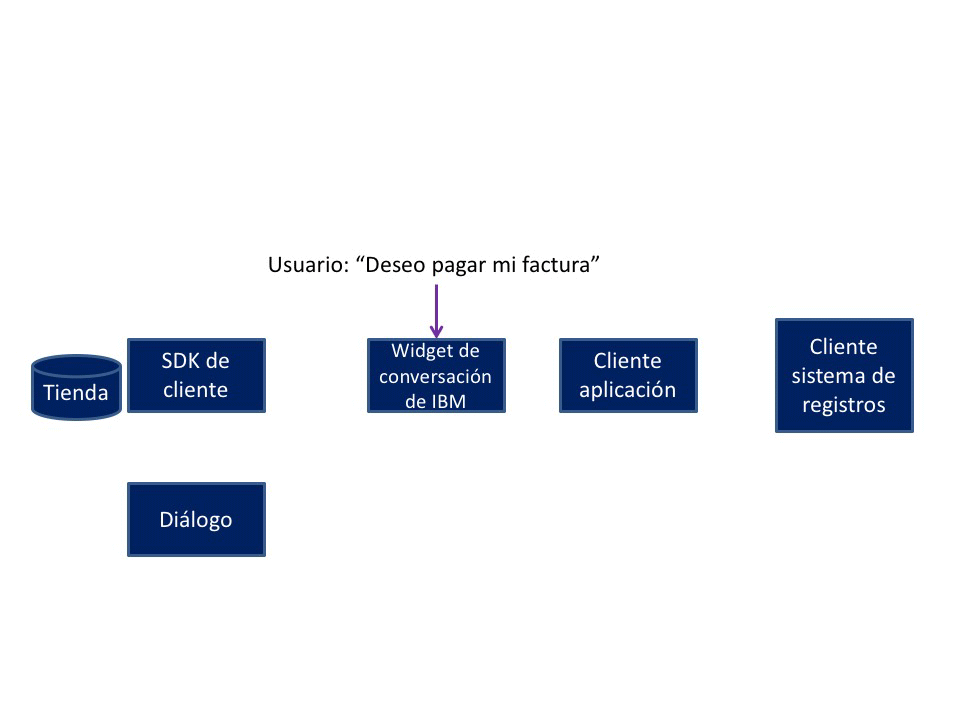

---

copyright:
  years: 2015, 2017
lastupdated: "2017-08-01"

---

{:shortdesc: .shortdesc}
{:new_window: target="_blank"}
{:tip: .tip}
{:pre: .pre}
{:codeblock: .codeblock}
{:screen: .screen}
{:javascript: .ph data-hd-programlang='javascript'}
{:java: .ph data-hd-programlang='java'}
{:python: .ph data-hd-programlang='python'}
{:swift: .ph data-hd-programlang='swift'}

# Flujo de conversación Realizar un pago
{: #backend_payment_gif}

Descubra cómo se realiza el intercambio de información entre el usuario y el agente virtual durante la conversación incorporada que se proporciona para la intención Realizar un pago.
{: shortdesc}

El gráfico siguiente muestra el flujo de conversación de una posible ruta que puede seguir la conversación incorporada que se proporciona con la aplicación para la intención Realizar un pago.

**Tareas relacionadas**: 

[Diálogos incorporados](/docs/services/virtual-agent/configure.html#make-a-payment)
