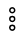
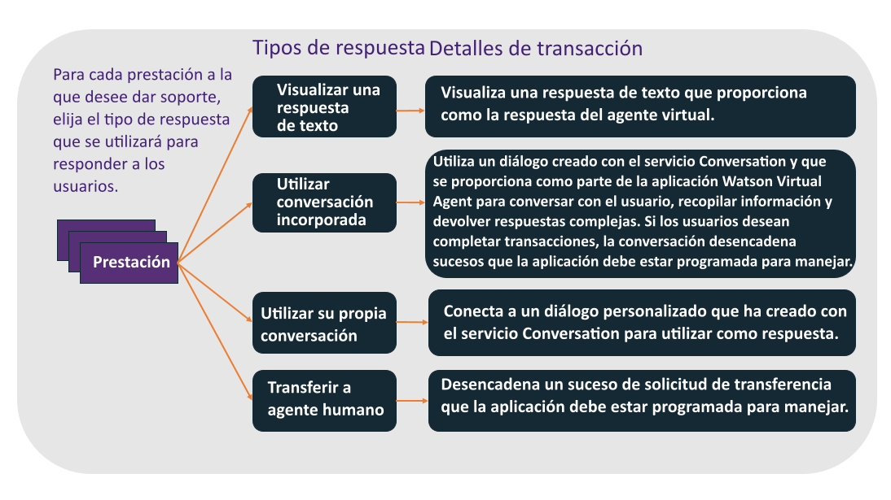

---

copyright:
  years: 2015, 2017
lastupdated: "2017-08-10"

---

{:shortdesc: .shortdesc}
{:new_window: target="_blank"}
{:tip: .tip}
{:pre: .pre}
{:codeblock: .codeblock}
{:screen: .screen}
{:javascript: .ph data-hd-programlang='javascript'}
{:java: .ph data-hd-programlang='java'}
{:python: .ph data-hd-programlang='python'}
{:swift: .ph data-hd-programlang='swift'}

# Configuración de las prestaciones básicas
{: #configure}

Para configurar el bot, debe seleccionar las prestaciones que desee que este tenga.
{: shortdesc}

Una prestación es la capacidad del agente virtual de reconocer y satisfacer un objetivo específico del cliente. Consulte la sección [Prestaciones](how-it-works.html#capabilities) para obtener más detalles.

Para utilizar una prestación básica, simplemente especifique cómo desea que se comporte el agente cuando lleve a cabo la prestación. Para algunas prestaciones es posible que sea suficiente devolver una respuesta de texto predefinida a una consulta del usuario. Es posible que otras requieran un flujo de conversación complejo para recopilar la información necesaria para realizar una transacción, en cuyo caso el agente recopila y pasa la información a la aplicación, que debe implementar el proceso empresarial necesario.

De forma predeterminada todas las prestaciones básicas están habilitadas y tienen respuestas preparadas. Primero debe decidir si desea inhabilitar alguna prestación que el agente no necesite. En el caso de las prestaciones que desee mantener, debe sustituir las respuestas preparadas por respuestas que reflejen la información sobre su negocio.

Para configurar una prestación básica, realice los pasos siguientes:

1.  Abra la página **Capabilities (Prestaciones)** para ver una lista de las prestaciones,agrupadas por categorías, que admite el agente actual.

1.  Revise las prestaciones y decida cuáles desea que soporte su bot. Todas las prestaciones están habilitadas a menos que las desactive.

    Pulse el conmutador para activar o desactivar una prestación. Para inhabilitar todas las prestaciones de una categoría, pulse el menú **More (Más)**   en el archivo de categoría y, a continuación, seleccione **Turn All Off (Desactivar todo)**.

    Como alternativa, en el caso de una prestación a la que no tenga intención de dar soporte, pero sobre la que sospecha que un cliente pueda preguntar, puede optar por mantener la prestación habilitada y proporcionar una respuesta de texto para ella que explique el motivo por el que no se le da soporte. Por ejemplo, si no ofrece seguro, en lugar de inhabilitar la prestación **Add insurance (Añadir seguro)**, podría habilitarla. 
Para un tipo de respuesta, elija **Text (Texto)**. En el campo **Message (Mensaje)** asociado, añada *No ofrecemos seguro para nuestros productos*.

1.  Para configurar una prestación, pulse el nombre de la prestación.

1.  Elija el tipo de respuesta que se ha de mostrar al usuario cuando se active esta prestación. Las opciones son las siguientes:

    

    - **Text (Texto)**

        Para consultas simples, puede utilizar la herramienta de configuración para especificar una respuesta de texto estándar que se mostrará al usuario. Este tipo de respuesta es útil en el caso de consultas que tienen respuestas simples y que no requieren la recopilación de información adicional o la interacción con otros sistemas. Por ejemplo, para la intención Consulta de método de pago, podría especificar la respuesta de texto `Aceptamos todas las principales tarjetas de crédito`.

        Si selecciona el tipo de respuesta **Text (Texto)**, también debe especificar el texto de la respuesta.

    - **Built-in (Incorporado)**

        Un conjunto de prestaciones que se proporcionan con diálogos ya existentes que recopilan información adicional o implementan manejo complejo. Un *diálogo* proporciona la estructura de una conversación con el usuario. Consulte [Diálogos incorporados](configure.html#builtin_dialog_ovw) para obtener más información sobre las prestaciones que dan soporte a este tipo de respuesta, y cómo fluye la conversación cuando se implementa.

        Si selecciona el tipo de respuesta **Built-in (Incorporado)**, es posible que también necesite configurar datos adicionales que utiliza el diálogo para presentar opciones al usuario (por ejemplo, ubicaciones de tiendas o métodos de pago). En muchos casos, la aplicación debe estar a la escucha de sucesos que puede desencadenar el diálogo e implementar acciones en los sistemas de registros. Consulte [Implementación de lógica para dar soporte a conversación incorporada](impl_intents.html#backend_transaction) para obtener más detalles.

    - **Use your own conversation (Utilizar su propia conversación)**

        Si necesita implementar interacciones complejas con los clientes para una prestación, puede crear su propio diálogo que dé forma a la conversación del agente con el cliente. Esta opción requiere pasos adicionales que implican la creación de un diálogo personalizado con el servicio {{site.data.keyword.watson}} {{site.data.keyword.conversationshort}} y su enlace al agente. Consulte [Creación de un diálogo personalizado](add-custom-dialog.html) para obtener más detalles.

    - **Transfer to human agent (Transferir a agente humano)**

        En el caso de cualquier prestación que no desee manejar utilizando el agente virtual, puede especificar que desea que se desencadene un suceso que solicite un agente humano. A continuación, la aplicación puede responder a este suceso utilizando los procesos para iniciar una sesión de conversación con un representante de servicio al cliente humano.

        Si selecciona el tipo de respuesta **Transfer to human agent (Transferir a agente humano)**, también puede especificar un mensaje que proporcione contexto para la solicitud de cliente que se pasará al agente humano.

1.  Pulse **Save (Guardar)** para guardar su selección. Realice cualquier cambio adicional que sea necesario basado en el tipo de respuesta y guárdelo.

    Puede pulsar la flecha atrás junto al nombre de prestación para volver a la página principal de Prestaciones.

## Diálogos incorporados
{: #builtin_dialog_ovw}

En las secciones siguientes se describen las prestaciones básicas que los flujos de conversación incorporada se han entrenado para reconocer y para reaccionar a ellas.

### Buscar tienda más cercana
{: #builtin_dialog_ovw__findNearestStore}

El diagrama siguiente muestra los nodos de la conversación incorporada para la prestación *Buscar tienda más cercana*. Se utiliza el mismo flujo de diálogo para esta prestación y para la prestación *Ubicación de tienda*.

El único paso adicional necesario es que añada la información de ubicación de tienda para cada una de las tiendas. Puede añadir los detalles de cada tienda desde una de las prestaciones siguientes a las que puede acceder desde la página Configurar:

- Buscar tienda más cercana
- Ubicación de la tienda

### Realizar un pago

El diagrama siguiente muestra los nodos de la conversación incorporada para la prestación *Realizar un pago*.

Pulse [aquí](backend_payment_gif.html#backend_payment_gif) para ver cómo la entrada del usuario y las respuestas del agente virtual fluyen a través del sistema.

Consulte [Implementación de lógica para dar soporte a conversación incorporada](impl_intents.html#makeapayment) para obtener información sobre los pasos adicionales que debe realizar para dar soporte completo a esta prestación.

### Horario de la tienda

El diagrama siguiente muestra los nodos de la conversación incorporada para la prestación *Horario de la tienda*.

Si desea proporcionar el horario de la tienda, debe incluir la información de horario comercial cuando añada la información de ubicación de tienda mediante las prestaciones siguientes:

- Buscar tienda más cercana
- Ubicación de la tienda

### Ubicación de la tienda

Consulte el diagrama anterior para ver los nodos de la conversación incorporada para la prestación *Ubicación de la tienda*. Se utiliza el mismo flujo de diálogo para esta prestación y para la prestación [Buscar tienda más cercana](configure.html#builtin_dialog_ovw__findNearestStore).

El único paso adicional necesario es que añada la información de ubicación de tienda para cada una de las tiendas. Puede añadir los detalles de cada tienda desde una de las prestaciones siguientes a las que puede acceder desde la página Configurar:

- Buscar tienda más cercana
- Ubicación de la tienda

### Número de teléfono de la tienda

El diagrama siguiente muestra los nodos de la conversación incorporada para la prestación *Número de teléfono de la tienda*.

Si desea proporcionar números de teléfono de las tiendas, debe añadirlos a las definiciones de ubicación de tienda que añade mediante las prestaciones siguientes:

- Buscar tienda más cercana
- Ubicación de la tienda

### Actualizar dirección

El diagrama siguiente muestra los nodos de la conversación incorporada para la prestación *Actualizar dirección*.

Consulte [Implementación de lógica para dar soporte a conversación incorporada](impl_intents.html#updateaddress) para obtener información sobre los pasos adicionales que debe realizar para dar soporte completo a esta prestación.

### Actualizar número de teléfono de contacto

El diagrama siguiente muestra los nodos de la conversación incorporada para la prestación *Actualizar número de teléfono de contacto*.

Consulte [Implementación de lógica para dar soporte a conversación incorporada](impl_intents.html#updatephone) para obtener información sobre los pasos adicionales que debe realizar para dar soporte completo a esta prestación.

### Actualizar correo electrónico

El diagrama siguiente muestra los nodos de la conversación incorporada para la prestación *Actualizar correo electrónico*.

Consulte [Implementación de lógica para dar soporte a conversación incorporada](impl_intents.html#updateemail) para obtener información sobre los pasos adicionales que debe realizar para dar soporte completo a esta prestación.
