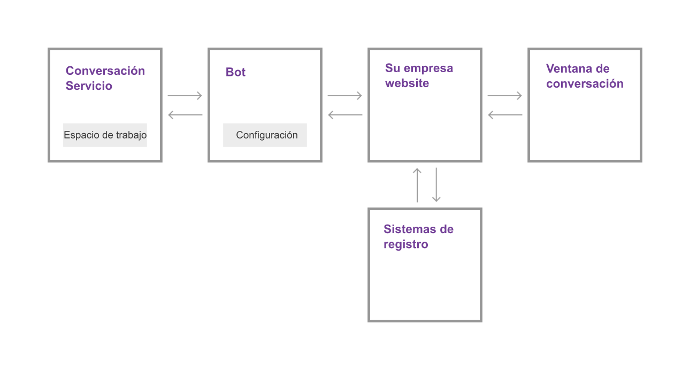

---

copyright:
  years: 2015, 2017
lastupdated: "2017-08-24"

---

{:shortdesc: .shortdesc}
{:new_window: target="_blank"}
{:tip: .tip}
{:pre: .pre}
{:codeblock: .codeblock}
{:screen: .screen}
{:javascript: .ph data-hd-programlang='javascript'}
{:java: .ph data-hd-programlang='java'}
{:python: .ph data-hd-programlang='python'}
{:swift: .ph data-hd-programlang='swift'}

# Cómo funciona
{: #how-it-works}

{{site.data.keyword.IBM_notm}} {{site.data.keyword.watson}} {{site.data.keyword.virtualagentshort}} añade la capacidad de conversación cognitiva a la ecuación de satisfacción del cliente. Haga que el bot de conversación de {{site.data.keyword.virtualagentshort}} sea el primer punto de contacto para preguntas y solicitudes de usuarios. El bot puede procesar el lenguaje natural para comprender las preguntas de los clientes y puede clasificar lo que necesitan los clientes. En función de la necesidad, puede responder y completar transacciones empresariales sencillas o direccionar las solicitudes más complicadas a una persona con experiencia en el tema en cuestión.

Seleccione los objetivos de usuario que desea que maneje el bot seleccionando las prestaciones que desea que tenga el bot. Utilice la herramienta de configuración proporcionada para habilitar y personalizar las prestaciones.
{: shortdesc}

## Prestaciones

Una *prestación* es la capacidad del bot de conversación del {{site.data.keyword.virtualagentshort}} de reconocer y satisfacer un objetivo específico del cliente. Por ejemplo, la prestación **Buscar tienda más cercana** utiliza técnicas de proceso de lenguaje natural para evaluar una expresión de cliente, tal como *¿Dónde estáis ubicados)* y reconocerla desde el objetivo del cliente. Para satisfacer este objetivo, interactúa en un diálogo con el cliente para descubrir la ubicación actual del cliente y devuelve la información de dirección de la tienda más próxima al cliente.

Para cada prestación, expertos en aprendizaje por máquinas y lingüistas de IBM han creado datos de entrenamiento y los han utilizado para entrenar de forma iterativa a los clasificadores de aprendizaje por máquinas que pueden reconocer y responder a cualquier entrada de usuario que coincida con el objetivo que cumple dicha prestación.

Para facilitar el proceso de creación del bot, IBM ofrece paquetes de prestaciones que combinan las prestaciones más solicitadas comúnmente para los escenarios de soporte de cliente generales, junto con paquetes especializados que cubren las necesidades de soporte más comunes para los sectores clave.

## Paquetes de prestaciones

Un *paquete de prestaciones* agrupa las prestaciones más importantes de su sector para usted. Con decenas de miles de expresiones de ejemplo y ejemplos de contador, el equipo de IBM ha diseñado agrupaciones de prestaciones que cubren objetivos de clientes similares, pero que pueden coexistir sin competir entre ellas para responder a las consultas de los usuarios.

La siguiente tabla resume los paquetes que se ofrecen. Pulse los enlaces de **detalles** para ver una lista de prestaciones y descripciones de cada idioma soportado.

| Idioma | Servicio al cliente (General) | Energía  | Banca a particulares | Telco   |
|----------|----------------------------|---------|----------------|---------|
| Inglés  | [detalles](/docs/services/virtual-agent/capabilities_list_general_en.html) | [detalles](/docs/services/virtual-agent/capabilities_list_energy_en.html) | [detalles](/docs/services/virtual-agent/capabilities_list_banking_en.html)        | [detalles](/docs/services/virtual-agent/capabilities_list_telco_en.html) |
| Francés   | [detalles](/docs/services/virtual-agent/capabilities_list_general_fr.html) | n/d | n/d | [detalles](/docs/services/virtual-agent/capabilities_list_telco_fr.html) |
| Alemán   | [detalles](/docs/services/virtual-agent/capabilities_list_general_de.html) | n/d | n/d | [detalles](/docs/services/virtual-agent/capabilities_list_telco_de.html) |
| Italiano | [detalles](/docs/services/virtual-agent/capabilities_list_general_it.html) | n/d | n/d | [detalles](/docs/services/virtual-agent/capabilities_list_telco_it.html) |
| Portugués (Brasil) | [detalles](/docs/services/virtual-agent/capabilities_list_general_pt-br.html) | n/d | n/d | [detalles](/docs/services/virtual-agent/capabilities_list_telco_pt-br.html) |
| Español | [detalles](/docs/services/virtual-agent/capabilities_list_general.html) | n/d | n/d | [detalles](/docs/services/virtual-agent/capabilities_list_telco.html) |

*n/d significa que no está disponible en este momento

Si las prestaciones básicas no cubren un objetivo común específico de sus clientes, puede añadir sus propias prestaciones para suplementar las que ya se proporcionan. Por ejemplo, si es propietario de una panadería, es posible que sus clientes con frecuencia pregunten sobre los sabores de magdalena que ofrece. Puede añadir una prestación *Menú de magdalenas* para gestionar este tipo de preguntas. Consulte [Adición de sus propias prestaciones](add-custom-capabilities.html) para obtener más información.

### En qué se diferencia {{site.data.keyword.watson}} {{site.data.keyword.virtualagentshort}} de {{site.data.keyword.watson}} {{site.data.keyword.conversationshort}}

{{site.data.keyword.IBM_notm}} {{site.data.keyword.watson}} {{site.data.keyword.conversationshort}} es el servicio en el corazón de las funciones del bot de conversación. Contiene clasificadores de aprendizaje por máquina que pueden comprender el lenguaje natural y, en el caso de una frase o un texto, percibir su significado y categorizarlo según las clases que haya identificado como de interés para usted. IBM proporciona herramientas que puede utilizar para crear datos de entrenamiento que educan al clasificador de aprendizaje por máquina. Las herramientas también le permiten crear el diálogo que utiliza el bot para conversar con los clientes.

Las herramientas de {{site.data.keyword.conversationshort}} son intuitivas y se han diseñado de modo que cualquiera, incluso las personas sin experiencia en desarrollo o aprendizaje por máquina, puedan utilizarlas para crear una potente aplicación controlada por conversación. No obstante, se necesita tiempo para crear los datos de aprendizaje y crear un diálogo. Es ahí donde entra {{site.data.keyword.watson}} {{site.data.keyword.virtualagentshort}}.

{{site.data.keyword.watson}} {{site.data.keyword.virtualagentshort}} está basado en {{site.data.keyword.watson}} {{site.data.keyword.conversationshort}}. Pero con {{site.data.keyword.virtualagentshort}}, obtiene el propio servicio de bot y además el bot está entrenado previamente. Su entrenamiento lo han realizado expertos e investigadores en los campos de aprendizaje por máquina y lingüística. Simplemente elija las prestaciones que desee habilitar. Por ejemplo, habilite la prestación **Actualizar dirección de correo electrónico** e inmediatamente, su bot comprenderá y reaccionar a las solicitudes relacionadas con los cambios de dirección de correo electrónico.

La herramienta de configuración de {{site.data.keyword.virtualagentshort}} facilita la elección de las prestaciones que se han de habilitar y la personalización del comportamiento del bot cuando se activa una prestación durante una interacción del cliente.

Siempre tendrá la flexibilidad de añadir más y más personalizaciones al bot, ya que en cualquier momento puede enlazar un espacio de trabajo de servicio de {{site.data.keyword.conversationshort}} con su agente para expandir de forma inmediata sus prestaciones.

## Descripción general de la arquitectura
{: #arch_overview}

El diagrama siguiente muestra la arquitectura de una implementación típica de {{site.data.keyword.watson}} {{site.data.keyword.virtualagentshort}}:

La implementación incluye los siguientes componentes principales:

- **Servicio {{site.data.keyword.conversationshort}}**

    Una instancia del servicio {{site.data.keyword.watson}} {{site.data.keyword.conversationshort}}. El servicio {{site.data.keyword.conversationshort}} proporciona los artefactos para las prestaciones: las intenciones, las entidades y el flujo de diálogo, junto con el proceso cognitivo subyacente que capacita las prestaciones del bot de conversación. Cuando desea implementar sólo un diálogo personalizado o una prestación personalizada, interactúa directamente con el servicio de {{site.data.keyword.conversationshort}}.

    Para obtener más información sobre las intenciones y los diálogos, consulte la documentación del
servicio de
[{{site.data.keyword.conversationshort}}
](https://console.bluemix.net/docs/services/conversation/index.html#about "Icono de enlace externo"){: new_window}.

- **Bot**

    Un bot creado en el servicio {{site.data.keyword.conversationshort}}, incluido un conjunto de prestaciones. El bot está entrenado para reconocer consultas de los usuarios relacionadas con la interacción con los clientes como, por ejemplo, solicitudes de información básica sobre la empresa y sobre pagos de facturas. La herramienta de configuración de bot proporcionada le permite configurar la información específica de la empresa que se puede proporcionar en respuesta a las consultas de los usuarios, así como configurar la respuesta para cada prestación.

- **El sitio web de la empresa**

    Su aplicación empresarial orientada a los clientes, que maneja la comunicación con el bot de {{site.data.keyword.watson}} {{site.data.keyword.virtualagentshort}} y con los sistemas de registros (por ejemplo, sistemas de facturación y bases de datos de clientes).

- **Ventana de conversación**

    La interfaz de conversación del agente virtual, que utilizan los clientes para conversar con el bot. Puede utilizar el widget de conversación proporcionado, con o sin personalización, o bien puede utilizar el SDK de cliente para implementar su propio widget de conversación.
