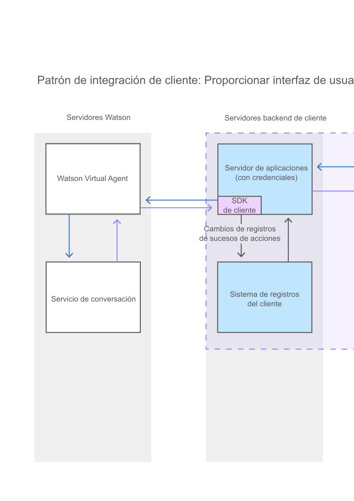

---

copyright:
  years: 2015, 2017
lastupdated: "2017-08-01"

---

{:shortdesc: .shortdesc}
{:new_window: target="_blank"}
{:tip: .tip}
{:pre: .pre}
{:codeblock: .codeblock}
{:screen: .screen}
{:javascript: .ph data-hd-programlang='javascript'}
{:java: .ph data-hd-programlang='java'}
{:python: .ph data-hd-programlang='python'}
{:swift: .ph data-hd-programlang='swift'}

# Integración del agente con la interfaz de usuario de la aplicación
{: #integrate}

Para integrar el cliente de front-end de {{site.data.keyword.watson}} {{site.data.keyword.virtualagentshort}} con la aplicación, puede añadir la interfaz de conversación proporcionada por {{site.data.keyword.IBM_notm}} al sitio web orientado a los clientes, ampliar la ventana de conversación proporcionada para personalizarla para sus necesidades o crear su propia interfaz de conversación.
{: shortdesc}

[Adición del widget de conversación proporcionado a la interfaz de usuario](/docs/services/virtual-agent/integrate.html#add_chat)

[Creación de una interfaz de conversación personalizada](/docs/services/virtual-agent/integrate.html#custom_chat)

## Adición del widget de conversación proporcionado a la interfaz de usuario
{: #add_chat}

{{site.data.keyword.watson}} {{site.data.keyword.virtualagentshort}} se proporciona con un widget de conversación que se puede utilizar tal cual en la interfaz de usuario.

### Acerca de esta tarea

Este diagrama muestra cómo fluye la conversación a través del sistema cuando se utiliza el widget de conversación que proporciona {{site.data.keyword.IBM_notm}}.

### Procedimiento

1. Para utilizar el widget proporcionado, abra el repositorio GitHub del [widget de conversación de {{site.data.keyword.watson}} {{site.data.keyword.virtualagentshort}} ](https://github.com/watson-virtual-agents/chat-widget){: new_window} y realice los pasos del archivo `README.md`.

    El widget de conversación proporcionado es extensible. Si contiene elementos que desee cambiar, puede personalizarlos. Por ejemplo, para cambiar un diseño utilizado por el widget de conversación proporcionado, puede escribir un diseño personalizado que lo altere temporalmente. Consulte el ejemplo siguiente: [https://github.com/watson-virtual-agents/chat-widget/tree/1.2.12/examples/basic-custom-layout. ](https://github.com/watson-virtual-agents/chat-widget/tree/1.2.12/examples/basic-custom-layout){: new_window} Tenga en cuenta que varias intenciones podrían utilizar el diseño.

1. Para obtener información sobre los pasos que debe realizar para dar soporte a transacciones de widget de conversación que se pueden producir para prestaciones que utilicen la conversación incorporada, consulte [Implementación de lógica para dar soporte a conversación incorporada](/docs/services/virtual-agent/impl_intents.html#backend_transaction).

### Cómo continuar

Si el alcance de las personalizaciones que desea realizar es tan generalizado que es imposible implementar los cambios realizando actualizaciones en el widget de conversación proporcionado, puede crear su propia interfaz de conversación.

## Creación de una interfaz de conversación personalizada
{: #custom_chat}

Si el widget de conversación proporcionado no satisface sus necesidades, puede desarrollar su propia interfaz de conversación JavaScript para permitir que los usuarios interactúen con el agente virtual. Esto le proporciona un control completo sobre el diseño, el aspecto y el comportamiento de la interfaz de conversación.

### Acerca de esta tarea

Este diagrama muestra cómo fluye la conversación a través del sistema cuando proporciona una interfaz de conversación personalizada.

### Procedimiento

Para desarrollar una interfaz de conversación personalizada con JavaScript, utilice los recursos siguientes:

- **SDK de cliente de {{site.data.keyword.watson}} {{site.data.keyword.virtualagentshort}}**

    Un SDK JavaScript para desarrollar aplicaciones que interactúen con {{site.data.keyword.watson}} {{site.data.keyword.virtualagentshort}}. El SDK de cliente se aloja en [GitHub ](https://github.com/watson-virtual-agents/client-sdk){: new_window}.

- **Explorador de la API**

    Un portal que proporciona acceso a las API REST de {{site.data.keyword.watson}} {{site.data.keyword.virtualagentshort}} en {{site.data.keyword.IBM_notm}} {{site.data.keyword.Bluemix_notm}}. Puede acceder a las API de {{site.data.keyword.watson}} {{site.data.keyword.virtualagentshort}} desde el [explorador de API de {{site.data.keyword.IBM_notm}} developerWorks ](https://developer.ibm.com/api/view/id-339:title-Watson_Virtual_Agent){: new_window}.

