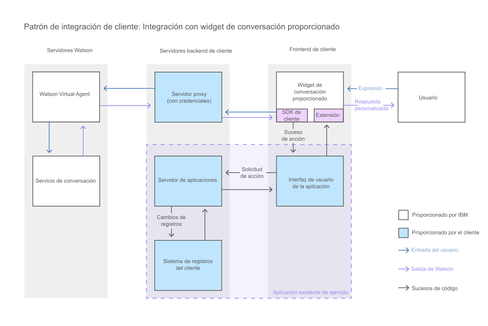

---

copyright:
  years: 2015, 2017
lastupdated: "2017-08-10"

---

{:shortdesc: .shortdesc}
{:new_window: target="_blank"}
{:tip: .tip}
{:pre: .pre}
{:codeblock: .codeblock}
{:screen: .screen}
{:javascript: .ph data-hd-programlang='javascript'}
{:java: .ph data-hd-programlang='java'}
{:python: .ph data-hd-programlang='python'}
{:swift: .ph data-hd-programlang='swift'}

# Adición del widget de conversación proporcionado a la interfaz de usuario 
{: #integrate_add-chat}

{{site.data.keyword.watson}} {{site.data.keyword.virtualagentshort}} se proporciona con un widget de conversación que se puede utilizar tal cual en la interfaz de usuario.
{: shortdesc}

Este diagrama muestra cómo fluye la conversación a través del sistema cuando se utiliza el widget de conversación que proporciona {{site.data.keyword.IBM_notm}}.

1.  Para utilizar el widget proporcionado, abra el repositorio GitHub del [Widget de conversación de {{site.data.keyword.watson}} {{site.data.keyword.virtualagentshort}} ](https://github.com/watson-virtual-agents/chat-widget "Icono de enlace externo"){: new_window} y realice los pasos descritos en el archivo `README.md`. 

    El widget de conversación proporcionado es extensible. Si contiene elementos que desee cambiar, puede personalizarlos. Por ejemplo, para cambiar un diseño utilizado por el widget de conversación proporcionado, puede escribir un diseño personalizado que lo altere temporalmente. Consulte aquí el ejemplo: [https://github.com/watson-virtual-agents/chat-widget/tree/1.2.12/examples/basic-custom-layout. ](https://github.com/watson-virtual-agents/chat-widget/tree/1.2.12/examples/basic-custom-layout "Icono de enlace externo"){: new_window} Tenga en cuenta que varias intenciones podrían utilizar el diseño.

1.  Para obtener información sobre los pasos que debe realizar para dar soporte a transacciones de widget de conversación que se pueden producir para prestaciones que utilicen la conversación incorporada, consulte [Implementación de lógica para dar soporte a conversación incorporada](impl_intents.html#backend_transaction).

Si el alcance de las personalizaciones que desea realizar es tan generalizado que es imposible implementar los cambios realizando actualizaciones en el widget de conversación proporcionado, puede crear su propia interfaz de conversación. Consulte [Creación de una interfaz de conversación personalizada](integrate_custom-chat.html).
