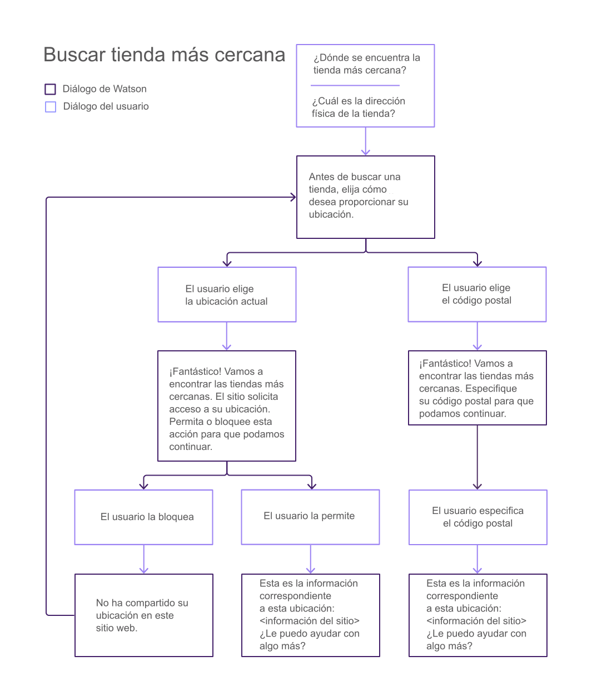
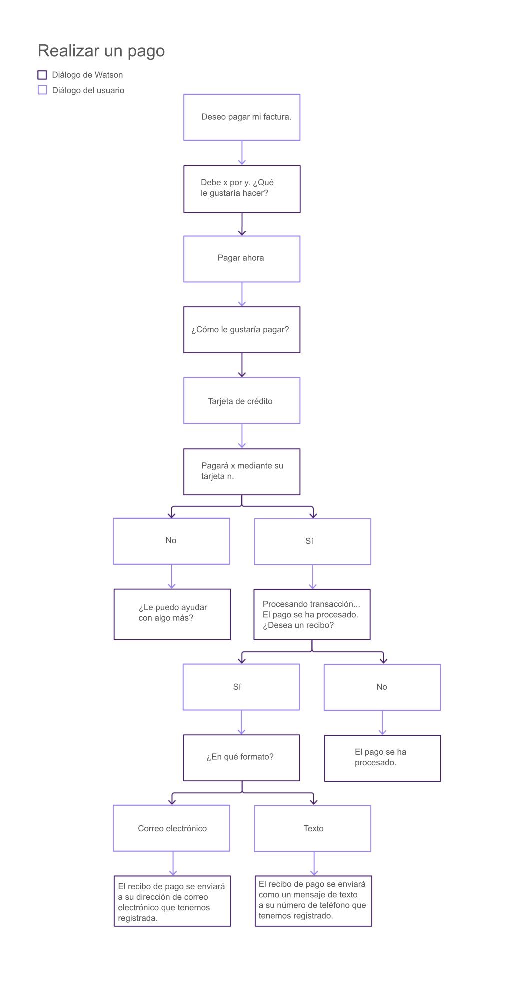
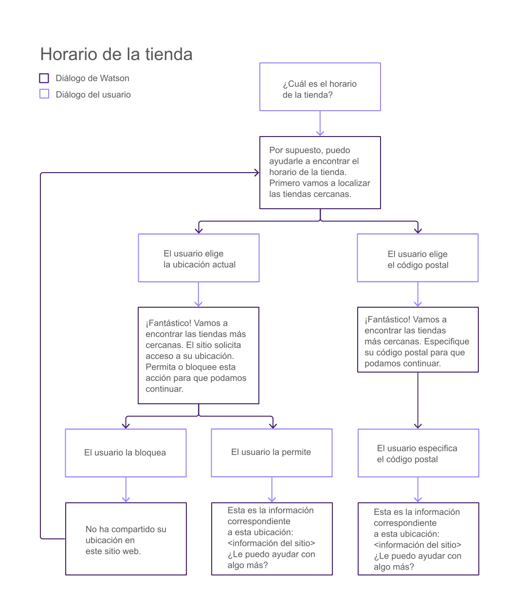
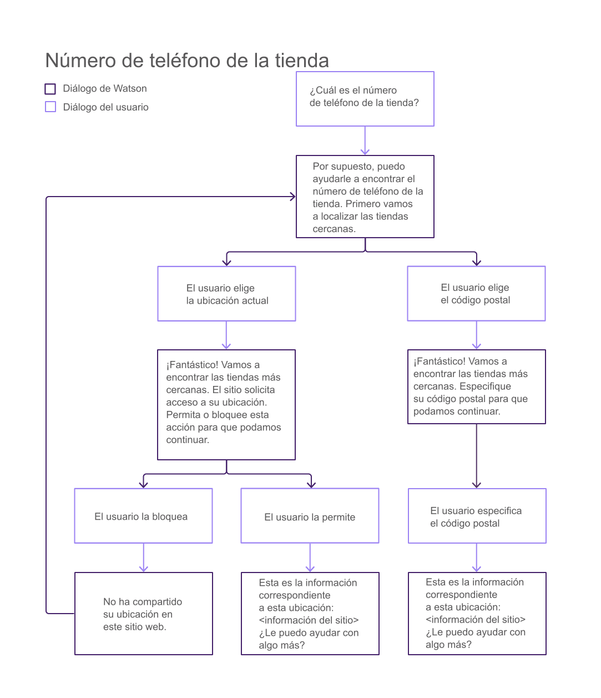
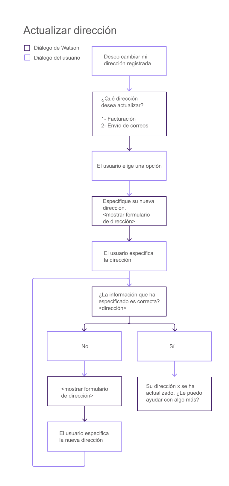
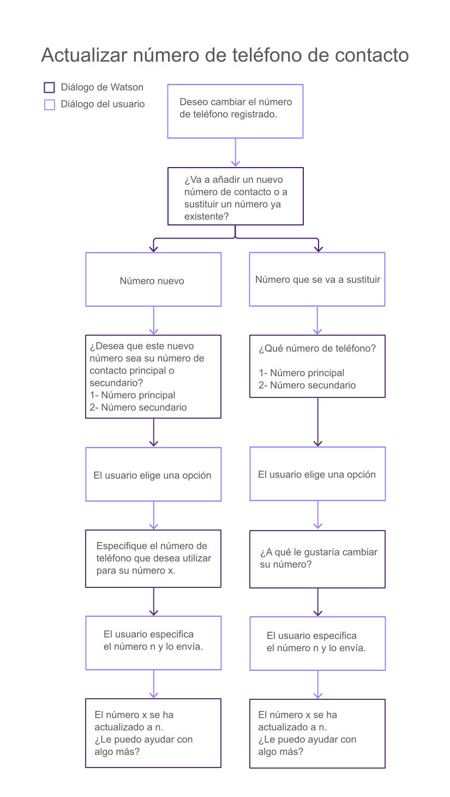
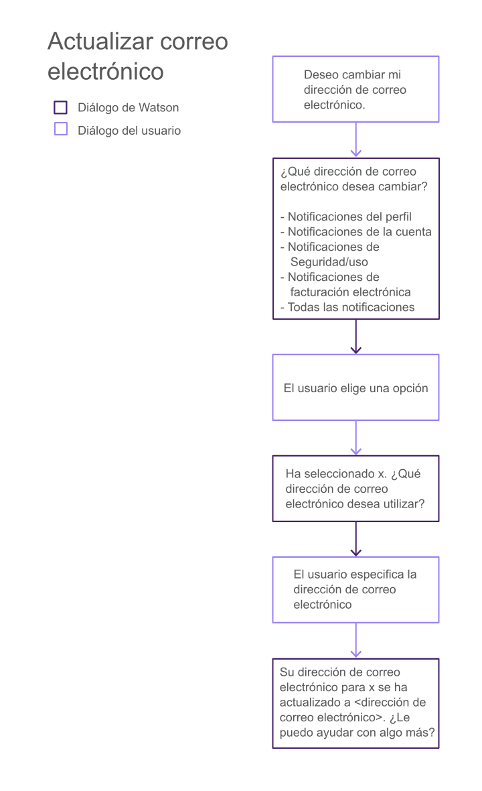

---

copyright:
  years: 2015, 2017
lastupdated: "2017-08-01"

---

{:shortdesc: .shortdesc}
{:new_window: target="_blank"}
{:tip: .tip}
{:pre: .pre}
{:codeblock: .codeblock}
{:screen: .screen}
{:javascript: .ph data-hd-programlang='javascript'}
{:java: .ph data-hd-programlang='java'}
{:python: .ph data-hd-programlang='python'}
{:swift: .ph data-hd-programlang='swift'}

# Personalización de respuestas del agente
{: #integrate_backend}

Determine cómo desea que el agente responda a los clientes. Puede utilizar la conversación incorporada o proporcionar una conversación personalizada para personalizar las respuestas.
{: shortdesc}

[Utilización de conversación incorporada](/docs/services/virtual-agent/integrate_backend.html#use_builtin)

[Utilización de su propia conversación](/docs/services/virtual-agent/integrate_backend.html#use_custom)

## Utilización de conversación incorporada
{: #use_builtin}

Para un conjunto de tareas comunes, {{site.data.keyword.watson}} {{site.data.keyword.virtualagentshort}} proporciona flujos de conversación incorporada que puede utilizar tal cual para simplificar el proceso de obtención de información de los usuarios a fin de realizar una tarea.

### Diálogos incorporados
{: #builtin_dialog_ovw}

En las secciones siguientes se describen las intenciones que los flujos de conversación incorporada se han entrenado para reconocer y para reaccionar a ellas.

#### Buscar tienda más cercana
{: #builtin_dialog_ovw__findNearestStore}

El diagrama siguiente muestra los nodos de la conversación incorporada para la intención *Buscar tienda más cercana*. Se utiliza el mismo flujo de diálogo para esta intención y para la intención *Ubicación de tienda*.



El único paso adicional necesario es que añada la información de ubicación de tienda para cada una de las tiendas. Puede añadir los detalles de cada tienda desde una de las intenciones siguientes a las que puede acceder desde la página Configurar:

- Buscar tienda más cercana
- Ubicación de la tienda

#### Realizar un pago

El diagrama siguiente muestra los nodos de la conversación incorporada para la intención *Realizar un pago*.



Pulse [aquí](/docs/services/virtual-agent/backend_payment_gif.html) para ver cómo la entrada del usuario y las respuestas del agente virtual fluyen a través del sistema.

Consulte [Implementación de lógica para dar soporte a conversación incorporada](/docs/services/virtual-agent/integrate_backend.html#backend_transaction) para obtener información sobre los pasos adicionales que debe realizar para dar soporte completo a esta intención.

#### Horario de la tienda

El diagrama siguiente muestra los nodos de la conversación incorporada para la intención *Horario de la tienda*.



Si desea proporcionar el horario de la tienda, debe incluir la información de horario comercial cuando añada la información de ubicación de tienda mediante las intenciones siguientes:

- Buscar tienda más cercana
- Ubicación de la tienda

#### Ubicación de la tienda

Consulte el diagrama anterior para ver los nodos de la conversación incorporada para la intención *Ubicación de la tienda*. Se utiliza el mismo flujo de diálogo para esta intención y para la intención [Buscar tienda más cercana](/docs/services/virtual-agent/integrate_backend.html#builtin_dialog_ovw__findNearestStore).

El único paso adicional necesario es que añada la información de ubicación de tienda para cada una de las tiendas. Puede añadir los detalles de cada tienda desde una de las intenciones siguientes a las que puede acceder desde la página Configurar:

- Buscar tienda más cercana
- Ubicación de la tienda

#### Número de teléfono de la tienda

El diagrama siguiente muestra los nodos de la conversación incorporada para la intención *Número de teléfono de la tienda*.



Si desea proporcionar números de teléfono de las tiendas, debe añadirlos a las definiciones de ubicación de tienda que añade mediante las intenciones siguientes:

- Buscar tienda más cercana
- Ubicación de la tienda

#### Actualizar dirección

El diagrama siguiente muestra los nodos de la conversación incorporada para la intención *Actualizar dirección*.



Consulte [Implementación de lógica para dar soporte a conversación incorporada](/docs/services/virtual-agent/integrate_backend.html#backend_transaction) para obtener información sobre los pasos adicionales que debe realizar para dar soporte completo a esta intención.

#### Actualizar número de teléfono de contacto

El diagrama siguiente muestra los nodos de la conversación incorporada para la intención *Actualizar número de teléfono de contacto*.



Consulte [Implementación de lógica para dar soporte a conversación incorporada](/docs/services/virtual-agent/integrate_backend.html#backend_transaction) para obtener información sobre los pasos adicionales que debe realizar para dar soporte completo a esta intención.

#### Actualizar correo electrónico

El diagrama siguiente muestra los nodos de la conversación incorporada para la intención *Actualizar correo electrónico*.



Consulte [Implementación de lógica para dar soporte a conversación incorporada](/docs/services/virtual-agent/integrate_backend.html#backend_transaction) para obtener información sobre los pasos adicionales que debe realizar para dar soporte completo a esta intención.

### Implementación de lógica para dar soporte a la conversación incorporada
{: #backend_transaction}

Obtenga información sobre cómo intercambiar información y completar procesos empresariales que tramita el widget de conversación proporcionado cuando los usuarios interactúan con intenciones configuradas para utilizar conversación incorporada.

#### Acerca de esta tarea

Algunas de las intenciones configuradas para utilizar el tipo de respuesta de conversación incorporada de forma predeterminada pueden tramitar procesos empresariales. La aplicación debe poder registrar la transacción con los sistemas backend de registros.

- Si implementa el widget de conversación de {{site.data.keyword.IBM_notm}} proporcionado, este reconoce sucesos que desencadenan determinadas respuestas de usuario. Sin embargo, debe realizar pasos adicionales para estar a la escucha de estos sucesos en la aplicación, de forma que pueda completar las transacciones iniciadas en los sistemas backend.
- Si no utiliza el widget de conversación proporcionado, debe asegurarse de que la interfaz de usuario personalizada puede reconocer los sucesos que desencadenan los flujos de conversación incorporada y que los maneja de la forma adecuada.

Por ejemplo, con la intención **Actualizar dirección**, un usuario puede cambiar la dirección de facturación de su cuenta. Debe escribir código que obtenga la nueva dirección del agente virtual y actualice la cuenta del usuario en el sistema de registros con la nueva información.

Es importante que tenga en cuenta que la finalidad de un diálogo sólo es recopilar información del usuario. La información proporcionada por el usuario se almacena de una de las dos maneras siguientes:

- La información que no es confidencial o privada se almacena en el contexto del diálogo, que es un objeto de datos disponible para el bot y para la aplicación.
- La información confidencial o privada (por ejemplo, números de tarjeta de crédito) se almacena en variables privadas, que están disponibles solo para la aplicación y no se pasan al bot.

#### Procedimiento

Para implementar completamente transacciones empresariales desencadenadas desde intenciones con respuestas de conversación incorporada para el widget de conversación de {{site.data.keyword.IBM_notm}}, realice los pasos siguientes:

1. Añada lógica a la aplicación que obtenga información de perfil del usuario actual desde el sistema backend para mostrar en la ventana de conversación antes de que se modifique la información. Por ejemplo, mostrar a los usuarios un saldo de cuenta antes de que lo paguen.

    Utilice la acción `getUserProfileVariables`. Esta acción obtiene las variables y las establece en el perfil.

    ```
    IBMChat.subscribe('action:getUserProfileVariables', function(data) {
     var variables = data.message.action.args.variables; // especifique las variables que desee obtener en esta matriz
       for (var i = 0; i < variables.length; i++) {
           var value = something(variables[i])
           /*acción para obtener el valor de variables[i]. Podría ser una llamada ajax u obtener
           datos de cookies locales. Depende de dónde ha almacenado la información.*/
           window.IBMChat.profile.set(variables[i], value);
       }
       IBMChat.sendSilently('éxito'); // o cancelar o error
    });
    ```
    {: screen}

    Este ejemplo utiliza una llamada REST para obtener información sobre un saldo de factura y una fecha de vencimiento.

    ```
    var xmlHttp = new XMLHttpRequest();
      xmlHttp.onreadystatechange = function() {
        if (xmlHttp.readyState == 4 && xmlHttp.status == 200)
          callback(xmlHttp.responseText);
      }
      xmlHttp.open("GET", url, true);
      xmlHttp.send(null);
    }
    /* Obtenga información sobre la base de datos backend y añádala al
    perfil con IBMChat.profile.set(). */
    IBMChat.subscribe('action:getUserProfileVariables', function(data) {
     /*
     data = {
       message: {
          text: ['algún texto'],
                action: {
                     name: 'getUserProfileVariables',
                     args: {
                         variables: [
                    "bill_amount",
                    "payment_due_date"
                ]
                     }
                }
       }
    
     }
     */
    
     httpGetAsync('http://sudominio.com/userprofile', function(user) {
       /* El registro en el sistema backend podría devolver información como esta.
       user = {
         "bill_amount": 42.01,
         "payment_due_date": "11/24/2008"
       }
       */
       var variables = data.message.action.args.variables;
       for (var i = 0; i < variables.length; i++) {
         var value = user[variables[i]]);
         window.IBMChat.profile.set(variables[i], value);
       /* Ahora el widget de conversación puede utilizar los valores que ha recuperado del servicio backend. */ }
       IBMChat.sendSilently('éxito'); // o cancelar o error
     });
    });
    ```
    {: screen}

1. Añada lógica a la aplicación que primero está a la escucha de la acción que inicia el proceso empresarial y a continuación realiza el proceso empresarial.

    Para ver una lista de las acciones asociadas con intenciones que tienen tipos de respuesta de conversación incorporada, consulte [https://github.com/watson-virtual-agents/virtual-agent-dialog/blob/master/dialog-contract.md#action ](https://github.com/watson-virtual-agents/virtual-agent-dialog/blob/master/dialog-contract.md#action){: new_window}.
    - **Realizar un pago** {: #makeapayment}

        Realice los pasos siguientes para implementar código que dé soporte a esta transacción.
        1. La aplicación debe obtener el saldo actual del usuario y la fecha de vencimiento del sistema backend. Utilice el método `action:getUserProfileVariables` para obtener y establecer las variables `bill_amount` y `payment_due_date` en el almacén del perfil.
        1. La aplicación debe estar a la escucha del suceso `payBill` y definir la lógica que se realizará cuando se desencadene el suceso.
        1. La aplicación también debe estar a la escucha del suceso `sendPaymentReceipt` y definir la lógica que se realizará cuando se desencadene el suceso.

    - **Actualizar dirección** {: #updateaddress}

        1. El widget de conversación utiliza un diseño de formulario para solicitar la información de nueva dirección del usuario y la almacena en el perfil automáticamente. Almacena estas variables de perfil:

            ```
            user_street_address1
            user_street_address2
            user_locality
            user_state_or_province
            user_zipcode
            ```
            {: screen}

        1. La aplicación debe estar a la escucha del suceso `updateAddress`.

            ```
            IBMChat.subscribe('action:updateAddress', function(data) {<your-code>}
            ```
            {: screen}

            Defina una función que obtenga y envíe la nueva dirección y el tipo de dirección (`address_type`) al sistema backend cuando se desencadene la acción `updateAddress`.

            Para recopilar datos con muchos valores, por ejemplo, una dirección de calle, puede utilizar el diseño de formulario incorporado en el widget de conversación. Los usuarios especifican valores en varios campos y a continuación envían todo el formulario. Por ejemplo, para enviar la nueva dirección a su sitio mediante una llamada REST POST, puede utilizar lógica como la siguiente.

            ```
            /* Cuando un usuario especifica información en un formulario, este se añade automáticamente
            al perfil del usuario. Por lo tanto un flujo típico sería incluir un diseño de formulario
            en la ventana de conversación y a continuación llamar a esta acción después del envío del
            formulario */
            IBMChat.subscribe('action:updateAddress', function(data) {
              var record = {
                "first_name": IBMChat.profile.get('first_name'),
                "last_name": IBMChat.profile.get('last_name'),
                "user_street_address1": IBMChat.profile.get('user_street_address1'),
                "user_street_address2": IBMChat.profile.get('user_street_address2'),
                "user_locality": IBMChat.profile.get('user_locality'),
                "user_state_or_province": IBMChat.profile.get('user_state_or_province'),
                "user_zipcode": IBMChat.profile.get('user_zipcode')
              };
              httpPostAsync('/updateRecord/', record, function(err, response) {
                if (err) IBMChat.receive('Se ha producido un error al actualizar la dirección.');
              });
            });
            ```
            {: screen}

            Para obtener más información sobre los diseños incorporados, consulte [https://github.com/watson-virtual-agents/virtual-agent-dialog/blob/master/dialog-contract.md#layout ](https://github.com/watson-virtual-agents/virtual-agent-dialog/blob/master/dialog-contract.md#layout){: new_window}.

    - **Actualizar número de teléfono de contacto** {: #updatephone}

        1. El widget de conversación utiliza un diseño de formulario para solicitar el nuevo número de teléfono del usuario y lo almacena en el perfil automáticamente. Almacena estas variables de perfil:

            ```
            user_phone_number
            phone_number_type
            ```
            {: screen}

        1. La aplicación debe estar a la escucha del suceso `updatePhoneNumber` y definir la lógica para obtener y enviar el nuevo número de teléfono y tipo al sistema backend cuando se desencadene el suceso.

    - **Actualizar correo electrónico** {: #updateemail}

        1. El widget de conversación utiliza un diseño de formulario para solicitar la nueva dirección de correo electrónico del usuario y la almacena en el perfil automáticamente. Almacena estas variables de perfil:

            ```
            user_email_address
            email_type
            ```
            {: screen}

        1. La aplicación debe estar a la escucha del suceso `updateEmail` y definir la lógica para obtener y enviar la nueva dirección de correo electrónico al sistema backend cuando se desencadene el suceso. También envía información sobre qué tipos de notificación utilizan la nueva dirección para (`email_type`).

## Utilización de su propia conversación
{: #use_custom}

En cualquier intención, puede optar por utilizar su propia conversación para interactuar con el usuario a fin de satisfacer la intención.

### Creación de un diálogo personalizado
{: #custom_dialog}

Si algunas de las intenciones soportadas requieren el manejo por parte de un diálogo personalizado, puede utilizar el servicio {{site.data.keyword.IBM_notm}} {{site.data.keyword.watson}} {{site.data.keyword.conversationshort}} para crear el diálogo y a continuación enlazarlo al agente virtual.

#### Acerca de esta tarea

El servicio {{site.data.keyword.watson}} {{site.data.keyword.conversationshort}} es un conjunto de herramientas y APIs que puede utilizar para crear aplicaciones que utilizan interfaces de lenguaje natural para automatizar las interacciones con los clientes. {{site.data.keyword.watson}} {{site.data.keyword.virtualagentshort}} utiliza el servicio {{site.data.keyword.conversationshort}} para definir las intenciones entrenadas y el flujo de diálogo utilizado por el bot. Si el diálogo proporcionado no permite la flexibilidad que necesita o actualmente no maneja una intención a la que se requiere dar soporte, puede crear su propio diálogo mediante las herramientas de servicio de {{site.data.keyword.conversationshort}}.

> **Nota:** el diálogo sólo procesará las intenciones para las que ha seleccionado el tipo de respuesta **Utilizar su propia conversación**.
Por razones de compatibilidad con el agente virtual, cualquier diálogo que cree debe cumplir las directrices de diseño de [https://github.com/watson-virtual-agents/virtual-agent-dialog/blob/master/dialog-contract.md ](https://github.com/watson-virtual-agents/virtual-agent-dialog/blob/master/dialog-contract.md){: new_window}. Estas directrices especifican cómo interactúa el diálogo con la interfaz de conversación del agente virtual, incluido cómo se visualizan los indicadores de solicitud a los usuarios y dónde se almacenará la información que proporcionen los usuarios de forma que sea accesible desde la interfaz de la ventana de conversación.

El repositorio de {{site.data.keyword.virtualagentshort}} {{site.data.keyword.dialogshort}} también proporciona ejemplos que muestran cómo funcionan las interacciones del diálogo. Puede utilizar el ejemplo como modelo para su propio diálogo. Consulte el [archivo JSON de flujos de diálogo de ejemplo ](https://github.com/watson-virtual-agents/virtual-agent-dialog/blob/master/sample_dialog_flows.json){: new_window}.

#### Procedimiento

Para crear un diálogo personalizado:

1. Si no lo ha hecho ya, regístrese en el servicio {{site.data.keyword.watson}} {{site.data.keyword.conversationshort}}. Para obtener más información, consulte la documentación [Servicio {{site.data.keyword.conversationshort}}: Cómo empezar ](http://www.ibm.com/watson/developercloud/doc/conversation/getting-started.html){: new_window}.
1. Cree un espacio de trabajo para contener el diálogo.Para obtener información sobre los espacios de trabajo, consulte la documentación [Servicio {{site.data.keyword.conversationshort}}: Creación de un espacio de trabajo  ](http://www.ibm.com/watson/developercloud/doc/conversation/create-workspace.html){: new_window}.
1. Vaya al separador {{site.data.keyword.dialogshort}}. (No es necesario crear intenciones o entidades.)
1. Cree un nodo de diálogo que detecte una intención para la que ha seleccionado el tipo de respuesta **Utilizar su propia conversación**. Por ejemplo, para la intención "Añadir seguro", el diálogo probaría #Service_Management-Add_Insurance. Para descubrir el nombre de código de las intenciones, consulte [Nombres de código de intención](/docs/services/virtual-agent/intent_codenames.html).
1. Añada nodos según se requiera para crear el flujo de diálogo necesario. Asegúrese de que el diálogo cumple las directrices de diseño de diálogos de {{site.data.keyword.virtualagentshort}} en [https://github.com/watson-virtual-agents/virtual-agent-dialog/blob/master/dialog-contract.md ](https://github.com/watson-virtual-agents/virtual-agent-dialog/blob/master/dialog-contract.md){: new_window}.

#### Cómo continuar

Si el diálogo personalizado da soporte a interacciones o transacciones de usuario para las que no se puede personalizar la interfaz de conversación proporcionada para su manejo, puede proporcionar también una interfaz de conversación personalizada. Consulte [Creación de una interfaz de conversación personalizada](/docs/services/virtual-agent/integrate.html#custom_chat) para obtener más detalles.

