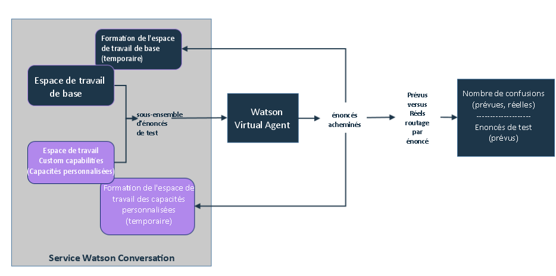

---

copyright:
  years: 2015, 2017
lastupdated: "2017-08-10"

---

{:shortdesc: .shortdesc}
{:new_window: target="_blank"}
{:tip: .tip}
{:pre: .pre}
{:codeblock: .codeblock}
{:screen: .screen}
{:javascript: .ph data-hd-programlang='javascript'}
{:java: .ph data-hd-programlang='java'}
{:python: .ph data-hd-programlang='python'}
{:swift: .ph data-hd-programlang='swift'}

# Ajout de vos propres capacités 
{: #add-custom-capabilities}

Pour étendre les possibilités de discussion de Virtual Agent avec vos clients, ajoutez vos propres capacités.
{: shortdesc}

## Avant de commencer

Si vous utilisez un espace de travail afin de fournir un dialogue personnalisé pour une capacité de base, il vous suffit de fournir un dialogue dans l'espace de travail. L'agent ayant déjà été formé pour reconnaître les énoncés mappés aux capacités de base, vous n'avez pas besoin de fournir d'intentions, d'entités et de données de formation. Si vous fournissez un espace de travail qui définit vos propres capacités, vous devez fournir des intentions et des entités en plus du dialogue. Vous devez également fournir un grand nombre d'exemples d'énoncé que le service peut utiliser pour former les intentions que vous souhaitez prendre en charge. Utilisez la documentation, les démonstrations et les outils fournis avec le service {{site.data.keyword.IBM_notm}} {{site.data.keyword.watson}} {{site.data.keyword.conversationshort}} pour créer un espace de travail avec des capacités personnalisées. Pour plus d'informations, reportez-vous à la documentation [{{site.data.keyword.watson}} {{site.data.keyword.conversationshort}} ](https://console.bluemix.net/docs/services/conversation/index.html#about "icône Lien externe"){: new_window}.

### A propos de cette tâche

Vous ne pouvez créer qu'un seul espace de travail pour définir des capacités personnalisées. Chaque intention que vous ajoutez et entraînez dans l'espace de travail est mise à disposition comme capacité personnalisée lorsque vous associez l'espace de travail à l'agent. L'espace de travail doit contenir toutes les capacités que vous souhaitez ajouter à votre agent. N'ajoutez pas à l'espace de travail des intentions que vous ne souhaitez pas que l'agent puisse traiter.

### Procédure

1.  A partir de votre instance de service {{site.data.keyword.conversationshort}}, créez un espace de travail qui définit vos capacités personnalisées. Reportez-vous à la [documentation du service {{site.data.keyword.conversationshort}} ](https://console.bluemix.net/docs/services/conversation/configure-workspace.html#configuring-a-conversation-workspace "icône Lien externe"){: new_window}.

    Respectez les consignes suivantes :
    - Ajoutez une branche pour chaque capacité à prendre en charge comme noeud de base (appelé *conversation de remplacement* dans l'interface utilisateur de l'outil {{site.data.keyword.conversationshort}}) dans le dialogue. Par exemple, vous ne devez pas définir dans votre dialogue un noeud de base qui reconnaît les messages d'accueils des utilisateurs et y répond, puis ajouter dessous des noeuds enfant qui correspondent à d'autres intentions de capacité personnalisée.
    - Evitez de traiter les non-concordances d'entrées utilisateur avec des boucles récursives. Ne créez que des tournures de dialogue comportant une fin définitive.
    - Ne créez pas une intention personnalisée de même nom qu'une intention utilisée par une capacité de base. Pour une liste de noms à éviter, voir [Noms d'intention](intent_codenames.html).

1.  Associez l'espace de travail à l'agent. Voir [Association d'espaces de travail](link_workspace.html)
1.  Dans la page **Configure (Configuration)**, ouvrez l'onglet **Custom capabilities (Capacités personnalisées)**.
1.  Cliquez sur **Add Capabilities (Ajouter des capacités)**.
1.  Sélectionnez l'espace de travail que vous avez associé à l'agent à l'étape 2, puis cliquez sur **Select Workspace (Sélectionner un espace de travail)**.

    Les intentions définies dans l'espace de travail associé sont maintenant répertoriées comme capacités activées.

    > **Remarque :** vous ne pouvez pas désactiver des capacités individuelles. Si vous souhaitez supprimer une capacité personnalisée, vous pouvez supprimer l'intention de l'espace de travail dans l'outil du service {{site.data.keyword.conversationshort}}.

    Vous pouvez supprimer simultanément toutes les capacités en cliquant sur **Remove Private Capabilities (Supprimer les capacités privées)**. La suppression des capacités ne supprime pas l'association entre l'agent et l'espace de travail dans lequel les capacités sont définies.

### Résultats

Une fois que vous avez ajouté des capacités personnalisées, chaque énoncé utilisateur évalué par {{site.data.keyword.watson}} {{site.data.keyword.virtualagentshort}} est transmis à l'espace de travail de base et à votre espace de travail personnalisé pour évaluation. La capacité qui correspond le mieux à l'intention de l'entrée de l'utilisateur est déclenchée et le dialogue associé est utilisé.

![Illustre un utilisateur transmettant un énoncé à Watson Virtual Agent. Il le transmet aux espaces de travail Built-in (Intégré) et Linked capabilities (Capacités associées) pour évaluation. L'espace de travail Built-in (Intégré) possède un niveau de fiabilité de 0,85, tandis que l'espace de travail Linked capabilities (Capacités associées) possède un niveau de confiance de 0,55. L'espace de travail Built-in (Intégré) transmet une réponse en retour à Watson Virtual Agent, à transmettre à l'utilisateur.](images/workspace-confidences.png)

### Etape suivante

Si vous ajoutez vos propres capacités, vous pouvez facilement en définir une dont le comportement est similaire à celui d'une capacité de base existante. {{site.data.keyword.virtualagentshort}} procède à une validation initiale pour rechercher les capacités qui risquent de se chevaucher et vous en informe pour que vous puissiez les résoudre avant de publier l'agent.

## Résolution des conflits de validation
{: #validate_custom_capabilities}

Evitez de définir des capacités similaires entre elles afin qu'elles n'entrent pas en concurrence pour répondre à certaines requêtes utilisateur. Si vous ne respectez pas cette consigne, vous ne pourrez pas anticiper quelle capacité fournit une réponse aux utilisateurs. Cette variation dans les réponses peut être perçue par les utilisateurs comme un comportement incohérent de la part de l'agent, ce qui peut prêter à confusion ou laisser penser à tord que l'agent ne fonctionne pas correctement.

### A propos de cette tâche

La validation compare les exemples d'énoncé des données de formation des capacités de chaque type pour rechercher les éventuels doublons. Elle utilise un échantillon aléatoire des énoncés à comparer. Si elle détecte des conflits potentiels, elle en indique la probabilité (en pourcentage).

**Comment est déduit le pourcentage ?** Le service compte le nombre d'énoncés acheminés vers l'espace de travail incorrect, qui correspondent aux confusions. Si le ratio de confusion (nombre de confusions divisé par le nombre d'énoncés de test par capacité) est supérieur à 20 %, le conflit est signalé et le ratio de confusion est affiché.

### Procédure

Pour résoudre les conflits de validation, procédez comme suit :

1.  Cliquez sur **Resolve (Résoudre)** en regard du lien de notification de conflit pour ouvrir la sous-fenêtre *Review and resolve conflicts (Examiner et résoudre les conflits)* et afficher une liste des conflits.

   

1.  Résolvez chaque conflit de l'une des manières suivantes :
    - **Désactivation de la capacité de base**

        1.  Basculez le commutateur sur **Off (Désactivé)**, puis fermez la sous-fenêtre *Review and resolve conflicts (Examiner et résoudre les conflits)*.
        1.  Cliquez sur **Revalidate (Revalider)** .

    - **Désactivation de la capacité personnalisée**
        1.  Cliquez sur le lien **Conversation service workspace (Espace de travail du service Conversation)** pour ouvrir l'espace de travail contenant les capacités personnalisées dans l'outil {{site.data.keyword.conversationshort}}.

        1.  Recherchez l'intention dans la page **Intents (Intentions)**, développez-la, puis cliquez sur l'icône **Delete intent (Supprimer l'intention)** pour la supprimer de l'espace de travail. Voir [Suppression d'intentions](https://console.bluemix.net/docs/services/conversation/intents.html#delete_intents).
        1.  **Facultatif** : normalement, lorsque vous supprimez une intention, vous en supprimez toutes les mentions dans le dialogue correspondant. Toutefois, si vous avez développé un noeud de dialogue complexe pour cette capacité personnalisée que vous souhaitez continuer d'utiliser, ne la supprimez pas immédiatement du dialogue. Au lieu de cela, configurez la capacité de base qui en chevauche une autre pour l'utiliser comme réponse de dialogue personnalisé. (Voir [Configuration des capacités de base](configure.html).)
            1.  Mettez à jour le déclencheur du noeud de dialogue pour utiliser le nom d'intention de la capacité de base comme condition.
            1.  Vous pouvez effectuer l'une des opérations suivantes :
              - Si vous utilisez un espace de travail pour les capacités personnalisées et les dialogues personnalisés des capacités de base, déplacez le noeud de dialogue de cette capacité personnalisée vers le haut pour le regrouper avec les autres noeuds de dialogue de capacité de base que vous utilisez. Les dialogues personnalisés des capacités de base sont conservés au début de l'arborescence afin de s'assurer qu'ils soient bien détectés par le bot.
              - Si vous utilisez deux espaces de travail distincts, recréez le noeud de dialogue dans l'espace de travail qui définit vos dialogues personnalisés. Une fois que vous avez recréé le noeud de dialogue, vous pouvez le supprimer de l'espace de travail de vos capacités personnalisées.
        1.  Une fois que vous avez modifié l'espace de travail, ce dernier est automatiquement formé à nouveau. Une fois que la formation est terminée, retournez à l'onglet **Custom Capabilities (Capacités personnalisées)** de {{site.data.keyword.watson}} {{site.data.keyword.virtualagentshort}}.
        1.  Cliquez sur **Revalidate (Revalider)** .

    - **Mise à jour des données de formation pour la capacité personnalisée**

        Si la capacité personnalisée répond à un objectif client similaire, mais avec de nettes différences par rapport à la capacité de base, vous pouvez mettre à jour les données de formation de la capacité personnalisée pour en accentuer les différences.
         >Remarque : vous ne pouvez pas accéder à l'espace de travail de la capacité de base pour mettre à jour ses données de formation ; vous ne pouvez qu'éditer l'espace de travail de la capacité personnalisée pour affecter les modifications.

        Editez l'espace de travail qui contient la capacité personnalisée de la manière suivante :
        1.  Cliquez sur le lien **Conversation service workspace (Espace de travail du service Conversation)** pour ouvrir l'espace de travail contenant vos capacités personnalisées dans l'outil {{site.data.keyword.conversationshort}}.

        1.  Pour chaque capacité personnalisée en conflit, examinez les exemples d'énoncé d'intention.
            - Si des exemples d'énoncé se chevauchent clairement avec les types d'énoncé utilisateur que la capacité de base est conçue pour traiter, supprimez-les. Pour ce faire, procédez comme suit :
              1.  Recherchez l'intention dans la page **Intents (Intentions)**. Développez l'intention pour afficher la liste des exemples d'énoncé.
              1.  Cochez la case en regard de chaque exemple d'énoncé se chevauchant, puis cliquez sur **Remove examples (Supprimer les exemples)**.

            - Ajoutez davantage d'exemples d'énoncé qui représentent des objectifs utilisateur mettant l'accent sur les facettes de la capacité personnalisée qui la rendent particulièrement différente de la capacité de base. L'ajout de données de formation qui accentuent la fonction unique de la capacité personnalisée permet de distinguer cette dernière de la capacité de base.

            - Ajoutez des contre-exemples qui représentent les types d'énoncé que vous ne souhaitez explicitement pas que la capacité personnalisée traite. Pour ce faire, procédez comme suit :
              1.  Dans la sous-fenêtre **Try it out (Tester)**, ajoutez des énoncés de test qui représentent les types des objectifs utilisateurs distincts que la capacité de base est conçue pour traiter.
              1.  Si l'intention de la capacité personnalisée est identifiée comme l'intention détectée, cliquez sur la flèche vers le bas en regard du nom d'intention, puis sélectionnez **Mark as irrelevant (Marquer comme non pertinente)**.
              1.  Répétez les deux étapes précédentes pour autant d'énoncés que vous le pouvez.

        1.  Une fois que vous avez modifié l'espace de travail, ce dernier est automatiquement formé à nouveau. Une fois que la formation est terminée, retournez à l'onglet **Custom Capabilities (Capacités personnalisées)** de {{site.data.keyword.watson}} {{site.data.keyword.virtualagentshort}}.
        1.  Cliquez sur **Revalidate (Revalider)** .

    - **N'exécuter aucune action**

        Si le déclenchement de comportements d'agent différents est acceptable pour certaines capacités, vous pouvez laisser le conflit non résolu.
        >Remarque : vous continuerez d'être averti du conflit après chaque validation.

## Test des capacités personnalisées 
{: #test_custom_capabilities}

Une fois que vous avez ajouté vos propres capacité et résolu les conflits de validation, effectuez des tests pour vous assurer que les capacités personnalisées se comportent comme prévu.

### Procédure

1.  Utilisez la sous-fenêtre Preview (Aperçu) pour poser des questions ou créer les types de demande que vos clients sont susceptibles d'envoyer.

    Sous la réponse, la capacité déclenchée pour répondre à la demande est affichée. Si la capacité affichée ne correspond pas à celle prévue, vous pouvez effectuer des modifications pour corriger le routage de l'énoncé aux capacités. Pour résoudre les problèmes, utilisez les techniques décrites précédemment pour résoudre les conflits de validation.

1.  Répétez cette procédure jusqu'à ce que l'agent soit configuré pour traiter correctement vos capacités personnalisées.
