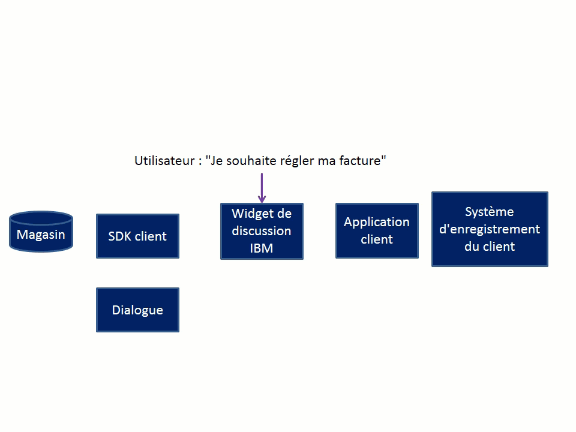

---

copyright:
  years: 2015, 2017
lastupdated: "2017-08-10"

---

{:shortdesc: .shortdesc}
{:new_window: target="_blank"}
{:tip: .tip}
{:pre: .pre}
{:codeblock: .codeblock}
{:screen: .screen}
{:javascript: .ph data-hd-programlang='javascript'}
{:java: .ph data-hd-programlang='java'}
{:python: .ph data-hd-programlang='python'}
{:swift: .ph data-hd-programlang='swift'}

# Flux de conversation Make a payment (Effectuer un paiement) 
{: #backend_payment_gif}

Découvrez comment les informations sont échangées entre l'utilisateur et l'agent virtuel pendant la conversation intégrée fournie pour l'intention Make a payment (Effectuer un paiement).
{: shortdesc}

Le graphique suivant illustre le flux de conversation pour un chemin possible que la conversation intégrée fournie avec l'application pour l'intention Make a payment (Effectuer un paiement) peut suivre.

**Tâches connexes**:

[Dialogue intégrés](configure.html#make-a-payment)
