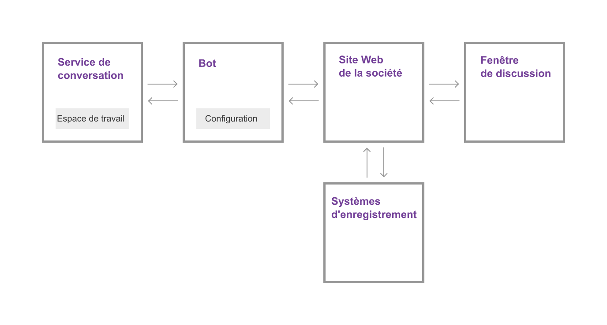

---

copyright:
  years: 2015, 2017
lastupdated: "2017-08-10"

---

{:shortdesc: .shortdesc}
{:new_window: target="_blank"}
{:tip: .tip}
{:pre: .pre}
{:codeblock: .codeblock}
{:screen: .screen}
{:javascript: .ph data-hd-programlang='javascript'}
{:java: .ph data-hd-programlang='java'}
{:python: .ph data-hd-programlang='python'}
{:swift: .ph data-hd-programlang='swift'}

# Fonctionnement
{: #how-it-works}

{{site.data.keyword.IBM_notm}} {{site.data.keyword.watson}} {{site.data.keyword.virtualagentshort}} ajoute la puissance des conversations cognitives à l'équation de la satisfaction du client. Faites du bot de discussion {{site.data.keyword.virtualagentshort}} le premier point de contact pour les questions et demandes des utilisateurs. Le bot peut traiter le langage naturel pour comprendre ce que les clients demandent et classer leurs besoins. En fonction de ces besoins, il peut répondre et effectuer de simples transactions commerciales ou acheminer les demandes plus complexes vers des spécialistes.

Vous choisissez les objectifs utilisateur à traiter par le bot en sélectionnant les capacités que ce dernier doit posséder. Utilisez l'outil de configuration fourni pour activer et personnaliser des capacités.
{: shortdesc}

## Capacités

Une *capacité* représente la faculté de votre bot de discussion {{site.data.keyword.virtualagentshort}} à reconnaître et satisfaire un objectif client. Par exemple, la capacité **Find nearest store (Rechercher le magasin le plus proche)** utilise les techniques de traitement du langage naturel pour évaluer l'énoncé d'un client, par exemple, *Où vous trouvez-vous ?*, et reconnaître l'objectif du client à partir de la réponse. Pour remplir cet objectif, elle dialogue avec le client afin de découvrir son adresse actuelle et renvoie l'adresse du magasin le plus proche.

Pour chaque capacité, des spécialistes IBM en apprentissage automatique et
linguistique ont créé des données de formation et les ont utilisées pour entraîner de
manière interactive des discriminants d'apprentissage automatique qui peuvent reconnaître
toute entrée utilisateur correspondant à l'objectif satisfait par cette capacité et y
répondre.

Pour faciliter le processus de création du bot, IBM offre des packs de capacités qui regroupent les capacités les plus couramment demandées pour les scénarios de service clients généraux, ainsi que des packs spécialisés qui répondent aux besoins d'assistance les plus courants pour les principaux secteurs d'activité.

## Packs de capacités

Un *pack de capacités* regroupe pour vous les capacités les plus importantes de votre secteur d'activité. Avec des dizaines d'exemples d'énoncé et de contre-exemples, l'équipe IBM a conçu des
regroupements de capacités qui satisfont des objectifs client similaires, mais qui peuvent coexister sans faille sans se concurrencer pour répondre
aux requêtes des utilisateurs.

Le tableau ci-après récapitule les packs offerts. Cliquez sur les liens **détails** pour afficher une liste des capacités et descriptions pour chaque langue prise en charge.

| Langue | Service clients (Général) | Energie  | Banque de détail | Télécommunications   |
|----------|----------------------------|---------|----------------|---------|
| Anglais  | [détails](/docs/services/virtual-agent/capabilities_list_general.html?locale=en)   | [détails](/docs/services/virtual-agent/capabilities_list_energy.html?locale=en) | [détails](/docs/services/virtual-agent/capabilities_list_banking.html?locale=en)        | [détails](/docs/services/virtual-agent/capabilities_list_telco.html?locale=en) |
| Français   | [détails](/docs/services/virtual-agent/capabilities_list_general.html?locale=fr)   | n/a     | n/a            | [détails](/docs/services/virtual-agent/capabilities_list_telco.html?locale=fr) |
| Allemand   | [détails](/docs/services/virtual-agent/capabilities_list_general.html?locale=de) | n/a     | n/a            | [détails](/docs/services/virtual-agent/capabilities_list_telco.html?locale=de) |
| Italien | [détails](/docs/services/virtual-agent/capabilities_list_general.html?locale=it) | n/a | n/a | [détails](/docs/services/virtual-agent/capabilities_list_telco.html?locale=it) |
| Portugais (Brésil) | [détails](/docs/services/virtual-agent/capabilities_list_general.html?locale=pt-br)   | n/a     | n/a            | [détails](/docs/services/virtual-agent/capabilities_list_telco.html?locale=pt-br) |
| Espagnol | [détails](/docs/services/virtual-agent/capabilities_list_general.html?locale=es)   | n/a     | n/a            | [détails](/docs/services/virtual-agent/capabilities_list_telco.html?locale=es) |

*n/a signifie non disponible actuellement.

Si les capacités de base ne satisfont pas à un objectif courant de vos clients, vous pouvez ajouter vos propres capacités afin de compléter celles fournies dans un pack. Par exemple, si vous possédez une boulangerie, vos clients risquent de vous demander souvent les saveurs de pâtisserie que vous proposez. Vous pouvez ajouter une capacité *Menu de pâtisseries* pour traiter de telles questions. Pour plus d'informations, voir [Ajout de vos propres capacités](add-custom-capabilities.html).

### En quoi {{site.data.keyword.watson}} {{site.data.keyword.virtualagentshort}} diffère de {{site.data.keyword.watson}} {{site.data.keyword.conversationshort}}

{{site.data.keyword.IBM_notm}} {{site.data.keyword.watson}} {{site.data.keyword.conversationshort}} est le service au coeur de la fonctionnalité de bot de discussion. Il contient des discriminants d'apprentissage automatique qui peuvent comprendre le langage naturel et,
pour une phrase donnée, percevoir sa signification et la classer en fonction de classes
que vous avez identifiées comme présentant un intérêt à vos yeux. IBM fournit des outils
que vous pouvez utiliser pour générer les données de formation qui entraînent le
discriminant d'apprentissage machine. Ces outils vous permettent également de développer le dialogue utilisé par votre bot pour converser avec vos clients.

Les outils {{site.data.keyword.conversationshort}} sont intuitifs et conçus
de sorte que toute personne, possédant ou non des connaissances en développement ou
apprentissage automatique, puisse les utiliser pour construire une application puissante pilotée par les discussions. Toutefois, la création des données de formation et la construction d'un dialogue prennent du temps. C'est là qu'intervient {{site.data.keyword.watson}} {{site.data.keyword.virtualagentshort}}.

{{site.data.keyword.watson}} {{site.data.keyword.virtualagentshort}} repose sur {{site.data.keyword.watson}} {{site.data.keyword.conversationshort}}. Toutefois, avec {{site.data.keyword.virtualagentshort}}, vous obtenez le service de bot lui-même et le bot est déjà formé (par des spécialistes
et chercheurs en apprentissage automatique et linguistique). Vous n'avez qu'à sélectionner les capacités à activer. Par exemple, activez la capacité **Update email (Mettre à jour l'adresse électronique)** pour que votre
bot puisse immédiatement comprendre les demandes liées aux changements d'adresse électronique et réagir en conséquence).

L'outil de configuration de {{site.data.keyword.virtualagentshort}} facilite le choix des capacités à activer et la personnalisation du comportement du bot lors du déclenchement d'une capacité au cours d'une interaction avec le client.

Vous avez toujours la possibilité de personnaliser de plus en plus le bot car vous pouvez, à tout moment, associer un espace de travail de service {{site.data.keyword.conversationshort}} à votre agent pour étendre immédiatement ses possibilités.

## Présentation de l'architecture 
{: #arch_overview}

Le diagramme suivant illustre l'architecture d'une implémentation type de {{site.data.keyword.watson}} {{site.data.keyword.virtualagentshort}} :

L'implémentation inclut les principaux composants suivants :

- **Service {{site.data.keyword.conversationshort}}**

    Instance du service {{site.data.keyword.watson}} {{site.data.keyword.conversationshort}}. Le service {{site.data.keyword.conversationshort}} fournit les artefacts des capacités : les intentions, les entités et le flux de dialogues, avec le traitement cognitif sous-jacent qui alimente les capacités du bot de discussion. Vous n'interagissez directement avec le service {{site.data.keyword.conversationshort}} que lorsque vous souhaitez implémenter un dialogue personnalisé ou une capacité personnalisée.

    Pour plus d'informations sur les intentions et les dialogues, reportez-vous à la [documentation du service {{site.data.keyword.conversationshort}} ](https://console.bluemix.net/docs/services/conversation/index.html#about "icône Lien externe"){: new_window}.

- **Bot**

    Un bot développé sur le service {{site.data.keyword.conversationshort}}, avec un ensemble de capacités. Ce bot est entraîné à reconnaître les demandes des utilisateurs liées à l'engagement des clients, telles que les demandes d'informations de base sur la société et de paiement des factures. L'outil de configuration de bot fourni permet de configurer les informations spécifiques de la société qui peuvent être fournies en réponse aux requêtes utilisateur et de configurer la réponse pour chaque capacité.

- **Site Web de votre société**

    Application métier présentées à vos clients, qui gère les communications avec le bot {{site.data.keyword.watson}} {{site.data.keyword.virtualagentshort}} et vos systèmes d'enregistrement (tels que les bases de données client ou les systèmes de facturation).

- **Fenêtre de discussion**

    Interface de discussion de l'agent virtuel utilisée par les clients pour converser avec le bot. Vous pouvez utiliser le widget de discussion fourni, personnalisé ou non, ou le SDK client pour implémenter votre propre widget de discussion.
