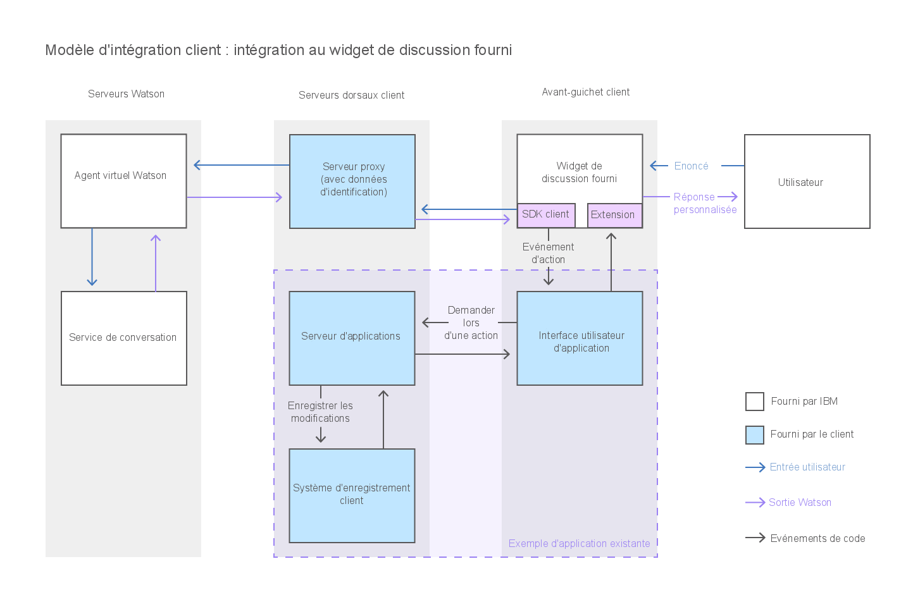

---

copyright:
  years: 2015, 2017
lastupdated: "2017-08-01"

---

{:shortdesc: .shortdesc}
{:new_window: target="_blank"}
{:tip: .tip}
{:pre: .pre}
{:codeblock: .codeblock}
{:screen: .screen}
{:javascript: .ph data-hd-programlang='javascript'}
{:java: .ph data-hd-programlang='java'}
{:python: .ph data-hd-programlang='python'}
{:swift: .ph data-hd-programlang='swift'}

# Intégration de l'agent à votre interface utilisateur d'application
{: #integrate}

Pour intégrer le client front-end {{site.data.keyword.watson}} {{site.data.keyword.virtualagentshort}} à votre application, vous pouvez ajouter l'interface de discussion fournie par {{site.data.keyword.IBM_notm}} telle quelle au site Web présenté à vos clients, étendre la fenêtre de discussion fournie pour la personnaliser en fonction de vos besoins ou développer votre propre interface de discussion.
{: shortdesc}

[Ajout du widget de discussion fourni à votre interface utilisateur](/docs/services/virtual-agent/integrate.html#add_chat)

[Création d'une interface de discussion personnalisée](/docs/services/virtual-agent/integrate.html#custom_chat)

## Ajout du widget de discussion fourni à votre interface utilisateur
{: #add_chat}

{{site.data.keyword.watson}} {{site.data.keyword.virtualagentshort}} est fourni avec un widget de discussion que vous pouvez utiliser tel quel dans votre interface utilisateur. 

### A propos de cette tâche

Ce diagramme illustre la circulation de la conversation à travers le système lorsque vous utilisez le widget de discussion fourni par {{site.data.keyword.IBM_notm}}.

### Procédure

1. Pour utiliser le widget fourni, ouvrez le référentiel GitHub du [widget de discussion {{site.data.keyword.watson}} {{site.data.keyword.virtualagentshort}} ](https://github.com/watson-virtual-agents/chat-widget){: new_window}, puis suivez les étapes du fichier `README.md`.

    Le widget de discussion fourni est extensible. S'il contient des éléments que vous souhaitez modifier, vous pouvez les personnaliser. Par exemple, pour modifier une présentation utilisée par le widget de discussion fourni, vous pouvez écrire une présentation personnalisée qui la remplace. Voir l'exemple à l'adresse suivante : [https://github.com/watson-virtual-agents/chat-widget/tree/1.2.12/examples/basic-custom-layout. ](https://github.com/watson-virtual-agents/chat-widget/tree/1.2.12/examples/basic-custom-layout){: new_window} Gardez à l'esprit que la présentation peut être utilisée par plusieurs intentions. 

1. Pour plus d'informations sur les étapes à suivre pour prendre en charge les transactions du widget de discussion qui peuvent avoir lieu pour les capacités qui utilisent la conversation intégrée, voir [Implémentation de la logique de prise en charge de la conversation intégrée](/docs/services/virtual-agent/impl_intents.html#backend_transaction).

### Etape suivante

Si les personnalisations que vous souhaitez effectuer sont tellement répandues qu'il est impossible d'implémenter vos modifications en mettant à jour le widget de discussion fourni, vous pouvez créer votre propre interface de discussion.

## Création d'une interface de discussion personnalisée
{: #custom_chat}

Si le widget de discussion fourni ne répond pas à vos besoins, vous pouvez développer votre propre interface de discussion en JavaScript pour permettre à vos utilisateurs d'interagir avec l'agent virtuel. Vous bénéficiez ainsi du contrôle intégral de la présentation, de l'apparence et du comportement de l'interface de discussion. 

### A propos de cette tâche

Ce diagramme illustre la circulation de la conversation à travers le système lorsque vous fournissez une interface de discussion personnalisée. 

### Procédure

Pour développer une interface de discussion personnalisée en JavaScript, utilisez les ressources suivantes : 

- **SDK du client {{site.data.keyword.watson}} {{site.data.keyword.virtualagentshort}}**

    Un SDK JavaScript pour développer des applications qui interagissent avec {{site.data.keyword.watson}} {{site.data.keyword.virtualagentshort}}. Le SDK du client est hébergé sur [GitHub ](https://github.com/watson-virtual-agents/client-sdk){: new_window}.

- **Explorateur d'API**

    Portail permettant d'accéder aux API REST de {{site.data.keyword.watson}} {{site.data.keyword.virtualagentshort}} sur {{site.data.keyword.IBM_notm}} {{site.data.keyword.Bluemix_notm}}. Vous pouvez accéder aux API {{site.data.keyword.watson}} {{site.data.keyword.virtualagentshort}} à partir de l'[explorateur d'API d'{{site.data.keyword.IBM_notm}} developerWorks ](https://developer.ibm.com/api/view/id-339:title-Watson_Virtual_Agent){: new_window}.

