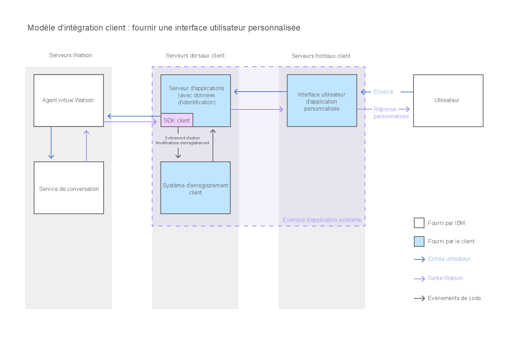

---

copyright:
  years: 2015, 2017
lastupdated: "2017-08-10"

---

{:shortdesc: .shortdesc}
{:new_window: target="_blank"}
{:tip: .tip}
{:pre: .pre}
{:codeblock: .codeblock}
{:screen: .screen}
{:javascript: .ph data-hd-programlang='javascript'}
{:java: .ph data-hd-programlang='java'}
{:python: .ph data-hd-programlang='python'}
{:swift: .ph data-hd-programlang='swift'}

# Création d'une interface de discussion personnalisée 
{: #integrate_custom-chat}

Si le widget de discussion fourni ne répond pas à vos besoins, vous pouvez développer votre propre interface de discussion en JavaScript pour permettre à vos utilisateurs d'interagir avec l'agent virtuel. Vous bénéficiez ainsi du contrôle intégral de la présentation, de l'apparence et du comportement de l'interface de discussion.
{: shortdesc}

Ce diagramme illustre la circulation de la conversation à travers le système lorsque vous fournissez une interface de discussion personnalisée.

Pour développer une interface de discussion personnalisée en JavaScript, utilisez les ressources suivantes :

- **SDK du client {{site.data.keyword.watson}} {{site.data.keyword.virtualagentshort}}**

    Un SDK JavaScript pour développer des applications qui interagissent avec {{site.data.keyword.watson}} {{site.data.keyword.virtualagentshort}}. Le SDK du client est hébergé sur [GitHub ](https://github.com/watson-virtual-agents/client-sdk "icône Lien externe"){: new_window}.

- **Explorateur d'API**

    Portail permettant d'accéder aux API REST de {{site.data.keyword.watson}} {{site.data.keyword.virtualagentshort}} sur {{site.data.keyword.Bluemix_notm}}. Vous pouvez accéder aux API {{site.data.keyword.watson}} {{site.data.keyword.virtualagentshort}} à partir de l'[explorateur d'API d'{{site.data.keyword.IBM_notm}} developerWorks ](https://developer.ibm.com/api/view/id-339:title-Watson_Virtual_Agent "icône Lien externe"){: new_window}.
