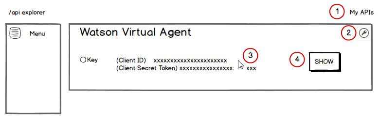

---

copyright:
  years: 2015, 2017
lastupdated: "2017-08-10"

---

{:shortdesc: .shortdesc}
{:new_window: target="_blank"}
{:tip: .tip}
{:pre: .pre}
{:codeblock: .codeblock}
{:screen: .screen}
{:javascript: .ph data-hd-programlang='javascript'}
{:java: .ph data-hd-programlang='java'}
{:python: .ph data-hd-programlang='python'}
{:swift: .ph data-hd-programlang='swift'}

# Publication de l'agent à des fins de démonstration
{: #publish}

En moins de 10 minutes, vous pouvez publier l'agent sur un site de test pour le partager avec des collègues et évaluer ensemble s'il répond aux besoins de votre organisation.
{: shortdesc}

Pour publier l'agent sur un site de test, procédez comme suit :

1.  Déterminez où afficher la fenêtre de discussion du bot sur la page. Sur l'élément HTML `<div>` qui définit la zone cible, ajoutez un attribut ID si aucun n'a été défini. Vous l'utiliserez ultérieurement pour faire référence à l'élément. Par exemple, `<div id="ibm-chat-root"></div>`.

1.  Suivez les instructions de la rubrique [Obtention des clés d'API](publish.html#api-keys) pour extraire les clés suivantes :
    - ID client
    - Jeton du secret client

1.  Dans le menu principal , cliquez sur **Documentation**, puis accédez à la section **Publish (Publication)**. 

1.  Si vous avez plusieurs agents, cliquez sur la flèche vers le bas pour obtenir l'ID bot de l'agent à publier. 

    Cet ID bot correspond à l'ID généré par le service et affecté à votre bot.

    Un bloc de script est généré et affiché sur la page. Ce script peut être copié et placé dans une page HTML pour présenter l'agent sur la page. Vous devez remplacer certaines des valeurs du script par des valeurs apporpriées pour votre instance. 

1.  Copiez le bloc de script et collez-le dans un éditeur de texte ou HTML.

    ``` Javascript
    <script src='https://unpkg.com/@watson-virtual-agent/chat-widget@1.6.0/dist/chat.min.js'>
    </script>
    <script>
      IBMChat.init({
        el: 'racine_discussion_ibm',
        baseURL: 'https://api.ibm.com/virtualagent/run/api/v1',
        botID: 'VOTRE_ID_BOT',
        XIBMClientID: 'VOTRE_ID_CLIENT_IBM',
        XIBMClientSecret: 'VOTRE_SECRET_CLIENT_IBM'
      });
    </script>
    ```

1.  Remplacez les valeurs d'attribut suivantes :
    - **el** : spécifiez l'ID de l'élément que vous avez choisi d'utiliser à l'étape 1.
    - **XIBMClientID** : ajoutez la valeur de l'ID client que vous avez copiée précédemment.
    - **XIBMClientSecret** : ajoutez la valeur du jeton du secret client que vous avez copiée précédemment.

   Utilisez les valeurs baseURL et botID spécifiées dans le script ; elles sont générées par le service.

   **Important :** conservez les valeurs de XIBMClientID et XIBMClientSecret aussi privées que possible.

1.  Imbriquez et initialisez le widget de discussion Watson Virtual Agent en collant le script révisé dans votre page Web.

   Ajoutez le script aussi près de la balise de fin `</body>` que possible pour empêcher le script de bloquer l'affichage du reste de la page. Ce positionnement garantit également que l'élément associé au script, quel qu'il soit, sera entièrement affiché avant la fin de l'exécution du script.

1.  Actualisez la page Web et testez l'agent !

   Le widget de discussion est associé à l'élément HTML que vous avez désigné à l'étape 1 et affiché dans cet élément. Vous pouvez masquer ou afficher et positionner cet élément. Le widget prend toute la hauteur et la largeur de l'élément. La largeur maximale est de 768 pixels et la hauteur minimale, de 300 pixels.

Une fois que vous êtes prêt à utiliser l'agent pour aider directement vos clients, vous devez effectuer quelques étapes supplémentaires. Pour plus de détails, voir [Intégration de l'agent](integrate.html).

## Obtention des clés d'API
{: #api-keys}

Pour prouver que vous êtes autorisé à utiliser les services d'API de Watson Virtual Agent, vous devez associer les clés suivantes aux appels d'API envoyés au service :

- ID client
- Jeton du secret client

Pour extraire les données d'identification, procédez comme suit :

1.  Accédez au site Web de l'[explorateur d'API d'IBM developerWorks ](https://developer.ibm.com/api/ "icône Lien externe"){: new_window}, puis connectez-vous à l'aide de l'ID IBM utilisé pour se connecter à l'abonnement au service. Créez un nom d'utilisateur si nécessaire. Cliquez sur le lien **My APIs (Mes API)** dans l'en-tête de page.

1.  Recherchez la mosaïque {{site.data.keyword.watson}} {{site.data.keyword.virtualagentshort}}, puis cliquez sur l'icône de clé associée.

1.  Si aucune clé n'est sélectionnée, sélectionnez celle à utiliser. Deux données d'identification sont générées pour la clé et sont affichées avec leurs valeurs obscurcies dans deux zones. Survolez ces zones.

1.  Cliquez sur le bouton **SHOW (AFFICHER)** pour supprimer l'obscurcissement des valeurs des zones.

1.  Copiez ces valeurs dans un fichier texte car vous devrez les fournir ultérieurement.
    - La première zone contient la clé de l'ID client.
    - La deuxième zone contient le jeton du secret client.

  
