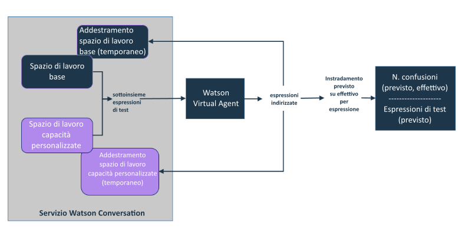

---

copyright:
  years: 2015, 2017
lastupdated: "2017-08-10"

---

{:shortdesc: .shortdesc}
{:new_window: target="_blank"}
{:tip: .tip}
{:pre: .pre}
{:codeblock: .codeblock}
{:screen: .screen}
{:javascript: .ph data-hd-programlang='javascript'}
{:java: .ph data-hd-programlang='java'}
{:python: .ph data-hd-programlang='python'}
{:swift: .ph data-hd-programlang='swift'}

# Aggiunta delle proprie capacità

{: #add-custom-capabilities}

Per espandere gli argomenti su cui l'agent virtuale può parlare con i clienti,
aggiungere le proprie capacità.
{: shortdesc}

## Prima di iniziare

Quando si utilizza uno spazio di lavoro per fornire un dialogo personalizzato per una
capacità base, è necessario solo fornire un dialogo nello spazio di lavoro. L'agent è già
stato addestrato a riconoscere le espressioni verbali che sono associate alle capacità base, quindi non è
necessario fornire gli intenti, le entità e i dati di addestramento. Quando si fornisce uno
spazio di lavoro che definisce le proprie capacità, è necessario fornire gli intenti e le
entità oltre al dialogo. È inoltre necessario fornire un numero elevato di espressioni di esempio
che il servizio può utilizzare per l'addestramento sugli intenti che si desidera supportare. Utilizzare
la documentazione, le demo e gli strumenti forniti con il
servizio {{site.data.keyword.IBM_notm}}
{{site.data.keyword.watson}} {{site.data.keyword.conversationshort}} per
creare uno spazio di lavoro con capacità personalizzate. Per ulteriori informazioni vedere la
[documentazione
di {{site.data.keyword.watson}} {{site.data.keyword.conversationshort}}
](https://console.bluemix.net/docs/services/conversation/index.html#about "Icona link esterno"){: new_window}.

### Informazioni su questa attività

È possibile creare solo uno spazio di lavoro per definire le capacità personalizzate. Ogni
intento che viene aggiunto e addestrato nello spazio di lavoro sarà reso disponibile come capacità personalizzata
quando si collega lo spazio di lavoro all'agent. Lo spazio di lavoro deve contenere
tutte le capacità che si desidera aggiungere all'agent. Non aggiungere allo spazio di
lavoro intenti che non devono essere gestiti dall'agent.

### Procedura

1.  Dall'istanza del servizio {{site.data.keyword.conversationshort}}, creare uno
spazio di lavoro che definisca le capacità personalizzate. Vedere la
[documentazione
del servizio {{site.data.keyword.conversationshort}}
](https://console.bluemix.net/docs/services/conversation/configure-workspace.html#configuring-a-conversation-workspace "Icona link esterno"){: new_window}.

    Seguire queste linee guida:
    - Aggiungere una ramo per ogni capacità che si desidera supportare come nodo di
base (indicato come una *conversazione alternativa* nell'interfaccia
utente dello strumento {{site.data.keyword.conversationshort}}) nel dialogo. Ad esempio,
non definire un nodo di base nel dialogo che riconosce e risponde ai saluti dell'utente, e poi
aggiungere al di sotto nodi figlio corrispondenti ad altri intenti di capacità personalizzate.
    - Evitare di gestire le incongruenze di input dell'utente con loop ricorsivi. Creare
solo diramazioni di dialogo con una fine definitiva.
    - Non creare un intento personalizzato con lo stesso nome di un intento che viene
utilizzato da una capacità base. Per un elenco di nomi da evitare, vedere
[Nomi intento](intent_codenames.html).

1.  Collegare lo spazio di lavoro all'agent. Vedere
[Collegamento degli spazi di lavoro](link_workspace.html).
1.  Dalla pagina **Configure (Configura)**, aprire la scheda **Custom capabilities (Capacità personalizzate)**.
1.  Fare clic su **Add Capabilities (Aggiungi capacità)**.
1.  Selezionare lo spazio di lavoro collegato all'agent nel passo 2, e poi fare clic su **Select Workspace (Seleziona spazio di lavoro)**.

    Gli intenti definiti nello spazio di lavoro collegato sono ora elencati come
capacità abilitate.

    > **Nota:** non è possibile disabilitare singole capacità. Se si
desidera rimuovere una capacità personalizzata, è possibile eliminare l'intento dallo spazio
di lavoro nello strumento del servizio {{site.data.keyword.conversationshort}}.

    È possibile rimuovere tutte le capacità contemporaneamente facendo clic su **Remove Private Capabilities (Rimuovi capacità private)**. Rimuovendo
le capacità non viene eliminata l'associazione tra l'agent e lo spazio di lavoro in cui sono
state definite le capacità.

### Risultati

Dopo aver aggiunto le capacità personalizzate, ogni espressione verbale dell'utente
valutata da {{site.data.keyword.watson}} {{site.data.keyword.virtualagentshort}}
viene passata sia allo spazio di lavoro di base che allo spazio di lavoro delle
capacità personalizzate per la valutazione. La capacità che meglio corrisponde all'intento
dell'input dell'utente viene attivata e viene utilizzato il dialogo ad essa associato.

### Operazioni successive

Quando si aggiungono le proprie capacità, è possibile definirne facilmente una
simile nel comportamento a una capacità base esistente. {{site.data.keyword.virtualagentshort}}
effettua un'esecuzione di convalida iniziale per controllare le capacità che potrebbero sovrapporsi
e ne informa l'utente, in modo che sia possibile risolvere la sovrapposizione prima di
pubblicare l'agent.

## Risoluzione dei conflitti di convalida
{: #validate_custom_capabilities}

Evitare di definire capacità che siano così simili tra loro da essere in competizione per
rispondere a determinate domande dell'utente. Se sono state definite capacità simili, non è possibile
anticipare quale capacità fornirà effettivamente una risposta all'utente. Questa variazione nelle
risposte può essere percepita dagli utenti come un comportamento incoerente da parte dell'agent,
che potrebbe apparire agli utenti come un agent inefficiente.

### Informazioni su questa attività

L'esecuzione della convalida confronta le espressioni verbali di esempio dai dati di
addestramento con le capacità di ciascun tipo ricercando le duplicazioni. Viene preso un campione
casuale delle espressioni verbali da confrontare. Se si trovano conflitti potenziali, viene
indicata la probabilità (percentuale) di conflitto.

**Come viene calcolata la percentuale?** Il servizio conta il numero di
espressioni verbali indirizzate allo spazio di lavoro sbagliato, che rappresentano le confusioni. Se la
percentuale di confusione (il numero di confusioni diviso per il numero di espressioni verbali di test
per capacità) è maggiore del 20%, viene segnalato un conflitto e viene visualizzata la
percentuale di confusione.

### Procedura

Per risolvere i conflitti di convalida, completare i seguenti passi:

1.  Fare clic su **Resolve (Risolvi)** accanto al link di notifica del
conflitto per aprire il riquadro *Review and resolve conflicts (Esamina e risolvi i conflitti)* e visualizzare un elenco di conflitti.

   

1.  Risolvere ogni conflitto in uno dei seguenti modi:
    - **Disabilitare la capacità base**

        1.  Posizionare l'interruttore su **Off (Disattivato)** e poi
chiudere il riquadro *Review and resolve conflicts (Esamina e risolvi conflitti)*.
        1.  Fare clic su **Revalidate (Convalida di nuovo)**
.

    - **Disabilitare la capacità personalizzata**
        1.  Fare clic sul link **Conversation service workspace (Spazio di lavoro servizio Conversation)** per aprire lo spazio di lavoro che contiene le capacità
personalizzate nello strumento {{site.data.keyword.conversationshort}}.

        1.  Individuare l'intento nella pagina **Intents  (Intenti)**, espanderlo e
poi fare clic sull'icona **Delete intent (Elimina intento)** per eliminarlo dallo spazio di
lavoro. Vedere
[Eliminazione degli intenti](https://console.bluemix.net/docs/services/conversation/intents.html#delete_intents).
        1.  **Facoltativo**: generalmente, quando si elimina un intento,
vengono rimossi tutti i riferimenti ad esso dal dialogo corrispondente. Tuttavia, se è stato
generato un nodo di dialogo complesso per questa capacità personalizzata che si desidera continuare
ad utilizzare, non rimuoverlo direttamente dal dialogo. Configurare invece la capacità base
sovrapposta per utilizzarla come risposta di dialogo personalizzata. Vedere
[Configurazione delle capacità base](configure.html).
            1.  Aggiornare il trigger per il nodo di dialogo per utilizzare il nome
intento della capacità base come condizione.
            1.  È possibile effettuare una delle seguenti operazioni:
              - Se si sta utilizzando uno spazio di lavoro sia per le capacità
personalizzate che per i dialoghi personalizzati delle capacità base, spostare il nodo di dialogo
per questa capacità personalizzata in alto di una posizione per raggrupparlo con altri nodi di
dialogo di capacità base in uso. I dialoghi personalizzati per le capacità base devono essere
tenuti al livello più alto della struttura per assicurarsi che possano essere trovati dal bot.
              - Se si stanno utilizzando due spazi di lavoro separati, ricreare il nodo di
dialogo nello spazio di lavoro che definisce i dialoghi personalizzati. Dopo aver ricreato correttamente il
nodo di dialogo, è possibile rimuoverlo dallo spazio di lavoro delle capacità personalizzate.
        1.  Dopo aver effettuato le modifiche allo spazio di lavoro, automaticamente
viene eseguito un nuovo addestramento. Al completamento dell'addestramento,
tornare alla scheda **Custom Capabilities (Capacità personalizzate)** di
{{site.data.keyword.watson}}
{{site.data.keyword.virtualagentshort}}.
        1.  Fare clic su **Revalidate (Convalida di nuovo)** .

    - **Aggiornare i dati di addestramento per la capacità
personalizzata**

        Se la capacità personalizzata soddisfa un obiettivo del cliente simile ma con
chiare differenze rispetto alla capacità base, è possibile aggiornare i dati di addestramento per
la capacità personalizzata per accentuare le differenze tra le due.
         >Nota: non è possibile accedere allo
spazio di lavoro per la capacità base per aggiornare i relativi dati di addestramento; è possibile solo modificare lo spazio di lavoro per
la capacità personalizzata per apportare modifiche.

        Modificare lo spazio di lavoro che contiene la capacità personalizzata eseguendo
queste
operazioni.
        1.  Fare clic sul link **Conversation service workspace (Spazio
di lavoro servizio Conversation)** per aprire lo spazio di lavoro che contiene le capacità
personalizzate dallo strumento {{site.data.keyword.conversationshort}}.

        1.  Per ogni capacità personalizzata in conflitto, esaminare le espressioni verbali
campione dell'intento.
            - Se esistono espressioni verbali di esempio che sono chiaramente sovrapposte
con i tipi di espressioni verbali che dovrebbero essere indirizzati alla capacità base,
eliminarle. Per eseguire questa operazione, completare i passi seguenti:
              1.  Individuare l'intento nella pagina **Intents (Intenti)**. Espandere
l'intento per visualizzare l'elenco di espressioni verbali campione.
              1.  Selezionare la casella accanto a ogni espressione verbale che si sovrappone e poi fare clic su **Remove examples (Rimuovi esempi)**.

            - Aggiungere ulteriori espressioni verbali di esempio che rappresentano gli
obiettivi dell'utente che enfatizzano le caratteristiche della capacità personalizzata, rendendola
significativamente diversa rispetto alla capacità base. L'aggiunta di dati di
addestramento che accentuano la funzione univoca della capacità personalizzata consentono di
distinguerla dalla capacità base.

            - Aggiungere esempi opposti, che rappresentano i tipi di espressioni verbali che
esplicitamente non si vuole siano indirizzati alla capacità personalizzata. Per eseguire questa
operazione, completare i passi seguenti:
              1.  Nel riquadro **Try it out (Prova)**, aggiungere
espressioni verbali di test che rappresentano i tipi di obiettivi dell'utente distinti, che si
prevede siano indirizzati alla capacità base.
              1.  Se l'intento della capacità personalizzata viene identificato
come l'intento rilevato, fare clic sulla freccia verso il basso accanto al nome intento e
selezionare **Mark as irrelevant (Contrassegna come irrilevante)**.
              1.  Ripetere i precedenti due passi per il maggior numero di espressioni
verbali possibile.

        1.  Dopo aver effettuato le modifiche allo spazio di lavoro, automaticamente
viene eseguito un nuovo addestramento. Al completamento dell'addestramento, tornare alla scheda
**Custom Capabilities (Capacità personalizzate)** di
{{site.data.keyword.watson}} {{site.data.keyword.virtualagentshort}}.
        1.  Fare clic su **Revalidate (Convalida di nuovo)** .

    - **Non eseguire alcuna azione**

        Se l'attivazione di un comportamento variabile dell'agent è accettabile per alcune
capacità, è possibile lasciare il conflitto non risolto.
        >Nota: si continuerà a riceve una notifica del conflitto dopo ogni esecuzione della
convalida.

## Test delle capacità personalizzate

{: #test_custom_capabilities}

Dopo aver aggiunto le proprie capacità e aver risolto i conflitti di convalida, effettuare dei
test per assicurarsi che il comportamento delle capacità personalizzate sia quello previsto.

### Procedura

1.  Utilizzare il riquadro Preview (Anteprima) per porre domande o effettuare i tipi di richiesta che ci
si aspetta dai clienti.

    Sotto la risposta, viene visualizzata la capacità che è stata attivata per
soddisfare le richiesta. Se la capacità visualizzata non è quella prevista, effettuare modifiche
per correggere come vengono instradate le espressioni verbali verso le capacità. Per risolvere i
problemi, utilizzare le stesse tecniche documentate in precedenza per risolvere i conflitti di
convalida.

1.  Ripetere questo processo fino a quando l'agent non è configurato per gestire le capacità
personalizzate in modo opportuno.
