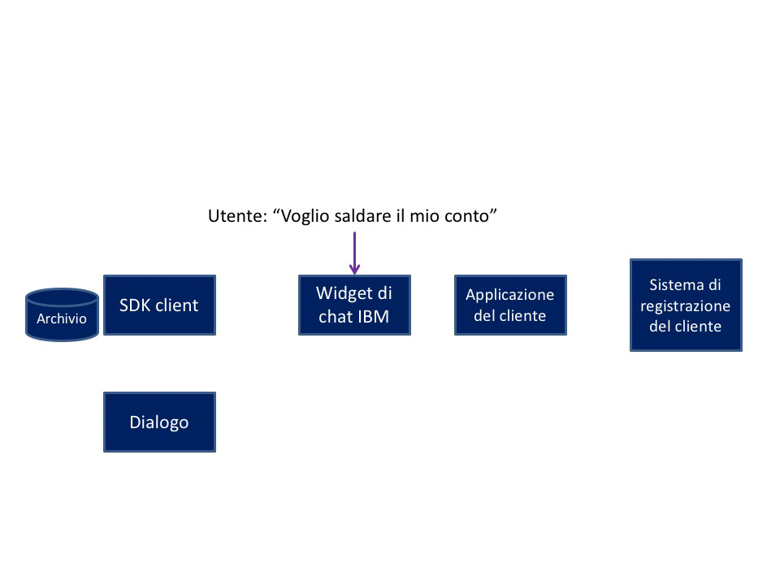

---

copyright:
  years: 2015, 2017
lastupdated: "2017-08-10"

---

{:shortdesc: .shortdesc}
{:new_window: target="_blank"}
{:tip: .tip}
{:pre: .pre}
{:codeblock: .codeblock}
{:screen: .screen}
{:javascript: .ph data-hd-programlang='javascript'}
{:java: .ph data-hd-programlang='java'}
{:python: .ph data-hd-programlang='python'}
{:swift: .ph data-hd-programlang='swift'}

# Flusso di conversazione Make a payment (Effettua un
pagamento)
{: #backend_payment_gif}

Informazioni su come avviene lo scambio di informazioni tra l'utente e l'agent virtuale
durante la conversazione incorporata fornita per l'intento Make a payment (Effettua un
pagamento).
{: shortdesc}

Il seguente grafico illustra il flusso di conversazione per un possibile percorso che può essere
seguito dalla conversazione incorporata fornita con l'applicazione per l'intento Make a
payment (Effettua un
pagamento).

**Attività correlate**:

[Dialoghi incorporati](configure.html#make-a-payment)
