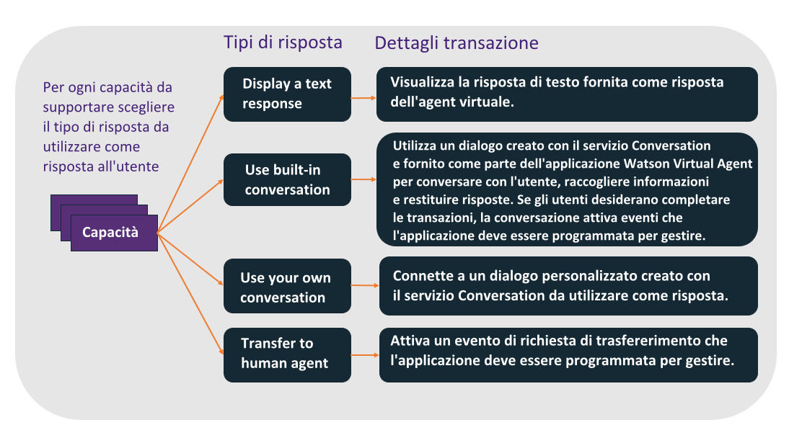

---

copyright:
  years: 2015, 2017
lastupdated: "2017-08-01"

---

{:shortdesc: .shortdesc}
{:new_window: target="_blank"}
{:tip: .tip}
{:pre: .pre}
{:codeblock: .codeblock}
{:screen: .screen}
{:javascript: .ph data-hd-programlang='javascript'}
{:java: .ph data-hd-programlang='java'}
{:python: .ph data-hd-programlang='python'}
{:swift: .ph data-hd-programlang='swift'}

# Configurazione delle capacità base
{: #configure}

Per configurare il bot, è necessario scegliere le capacità che si desidera utilizzare.
{: shortdesc}

## Informazioni su questa attività

Una *capacità* è l'abilità di un agent virtuale di
riconoscere e raggiungere uno specifico obiettivo del cliente. Ad esempio, la capacità
*Find nearest store* utilizza risorse pregenerate e
l'elaborazione del linguaggio naturale che può valutare le parole di un cliente, ad esempio
*Where are you located?* e riconoscere da esse l'obiettivo del cliente. Per
raggiungere tale obiettivo, si impegna in un dialogo con il cliente per individuare
la posizione del cliente e restituisce le informazioni sull'indirizzo del negozio più vicino
al cliente.

Il bot è addestrato a riconoscere e gestire una serie di capacità base che sono rilevanti per le interazioni del servizio clienti, inclusi richieste di fatturazione, pagamenti, informazioni sui negozi e richieste di parlare con un agent umano. Per un elenco, vedere [Capacità base](/docs/services/virtual-agent/intent_list.html). Se le capacità base non soddisfano un obiettivo comune che è specifico per i clienti, è possibile aggiungere le proprie capacità a quelle fornite. Ad esempio, se si è proprietari di una pasticceria, i clienti potrebbero chiedere spesso quali sono i gusti dei cupcake in vendita. È possibile aggiungere una capacità *Menu cupcake* per gestire queste domande. Per ulteriori informazioni, vedere [Aggiunta di proprie capacità](/docs/services/virtual-agent/personalize.html#add_custom_capabilities).

Per utilizzare una capacità base, specificare semplicemente il comportamento
desiderato dell'agent quando si applica questa capacità. Per alcune capacità, potrebbe
essere sufficiente emettere una risposta con testo pre-definito alla domanda dell'utente. Per
altre potrebbe essere necessario un flusso di conversazione complesso
per raccogliere le informazioni richieste per eseguire una transazione, in questo caso l'agent
raccoglie e passa le informazioni all'applicazione, che deve implementare i processi di business
richiesti.

Per impostazione predefinita, tutte le capacità base sono abilitate e hanno
risposte preconfezionate. È necessario prima decidere se disabilitare le capacità che non sono
necessarie per il proprio agent. Per le capacità che si desidera mantenere, è necessario
sostituire le risposte preconfezionate con risposte che corrispondono alle informazioni sul proprio
business.

## Procedura

Per configurare una capacità base, completare i seguenti passi:

1. Nella pagina **Configure** dello strumento di configurazione di
{{site.data.keyword.watson}} {{site.data.keyword.virtualagentshort}}, riesaminare
le capacità disponibili.
1. Per configurare una capacità, fare clic sul riquadro della capacità.
1. Decidere se si desidera che il bot supporti la capacità. Tutte le capacità sono
abilitate a meno che non vengano disattivate.

    Fare clic sull'interruttore nella parte superiore della pagina dei dettagli della
capacità per attivare o disattivare la capacità.

    In alternativa, per una capacità che non si intende supportare, ma che si pensa
potrebbe essere richiesta dal cliente, è possibile scegliere di mantenere abilitata la
capacità e di fornire un risposta con un testo che spiega che la capacità non è
supportata. Ad esempio, se non si offre un'assicurazione, invece di disabilitare la
capacità **Add insurance**, si potrebbe abilitarla. Come tipo di
risposta scegliere **Display a text response**. Nel
campo **Message** associato, aggiungere *Non offriamo
assicurazioni per i nostri prodotti*.

1. Per ogni capacità che si desidera supportare, decidere quale tipo di risposta
utilizzare. Le opzioni sono le seguenti:

    

    - Visualizzare un risposta testo (**Display a text response**)

        Per domande semplici, è possibile utilizzare lo strumento di configurazione per
        specificare una risposta con testo standard da visualizzare all'utente. Questo tipo di risposta è
        utile per le domande che hanno risposte semplici e non richiedono la raccolta di ulteriori informazioni o
        qualsiasi interazione con altri sistemi. Ad esempio, per un intento Method Of Payment Inquiry, si potrebbe specificare la risposta di testo `Accettiamo tutte le principali
        carte di credito`.

        Se si seleziona il tipo di risposta **Display a text
        response**, è necessario anche specificare il testo della risposta.

    - Utilizzare una conversazione incorporata (**Use built-in conversation**)

        Una serie di capacità sono distribuite con dialoghi pre-generati che
        raccolgono ulteriori informazioni o implementano gestioni complesse. Un *dialogo*
        fornisce la struttura per una conversazione con un utente. Per ulteriori informazioni sulle
        capacità che supportano questo tipo di risposta e sul flusso di conversazione implementato,
        vedere
        [Dialoghi incorporati](/docs/services/virtual-agent/configure.html#builtin_dialog_ovw).

        Se si seleziona il tipo di risposta **Use built-in
        conversation**, potrebbe essere anche necessario configurare
        ulteriori dati che il dialogo utilizza per presentare le scelte all'utente (ad esempio
        l'ubicazione dei negozi o i metodi di pagamento). In molti casi, l'applicazione deve essere in
        attesa di eventi che possono essere attivati dal dialogo e implementare azioni nei sistemi di
        registrazione. Per ulteriori dettagli, vedere
        [Implementazione della logica per il supporto della conversazione incorporata](/docs/services/virtual-agent/impl_intents.html#backend_transaction).

    - Utilizzare una propria conversazione (**Use your own conversation**)

        Se per una capacità è necessario implementare interazioni con il cliente
        complesse, è possibile generare un proprio dialogo che determina la conversazione dell'agent con il
        cliente. Questa opzione richiede altre operazioni che comprendono la creazione di un dialogo
        personalizzato con il servizio {{site.data.keyword.watson}}
        {{site.data.keyword.conversationshort}} e il collegamento del dialogo all'agent. Per
        ulteriori dettagli, vedere [Creazione di un dialogo personalizzato](/docs/services/virtual-agent/personalize.html#custom_dialog).

    - Trasferire a un agent umano (**Transfer to human agent**)

        Per qualsiasi capacità che non si desidera gestire con l'agent virtuale, è
        possibile specificare che deve essere attivato un evento che richiede un agent umano. L'applicazione
        può quindi rispondere a questo evento utilizzando i processi per avviare una sessione di chat
        con una persona rappresentante del servizio clienti.

        Se si seleziona il tipo di risposta **Transfer to human
        agent**, è possibile specificare un messaggio che fornisce il contesto per la
        richiesta del cliente da trasmettere anche all'agent umano.

## Dialoghi incorporati
{: #builtin_dialog_ovw}

Nelle sezioni seguenti sono descritte le capacità base
che i flussi di conversazioni incorporate sono addestrati a riconoscere e a cui reagire.

### Find nearest store - Trovare il negozio più vicino
{: #builtin_dialog_ovw__findNearestStore}

Il seguente diagramma mostra i nodi nella conversazione incorporata per la capacità *Find nearest store*. Lo
stesso flusso di dialogo è utilizzato per questa capacità e per la capacità *Store
location*.

L'unica ulteriore operazione richiesta è l'aggiunta dei dettagli sull'ubicazione per ogni
negozio. È possibile aggiungere i dettagli del negozio da una delle seguenti capacità a cui è
possibile accedere dalla pagina Configure:

- Find nearest store
- Store location

### Make a payment - Effettuare un pagamento

Il seguente diagramma mostra i nodi nella conversazione incorporata per la capacità *Make a payment*.

Fare clic [qui](/docs/services/virtual-agent/backend_payment_gif.html#backend_payment_gif) per visualizzare il flusso dell'input utente e delle risposte dell'agent virtuale nel sistema.

Per informazioni sulle ulteriori operazioni da eseguire per supportare completamente questa
capacità, vedere [Implementazione della logica per
il supporto della conversazione incorporata](/docs/services/virtual-agent/impl_intents.html#makeapayment).

### Store hours - Orari di apertura negozi

Il seguente diagramma mostra i nodi nella conversazione incorporata per la capacità *Store hours*.

Se si desidera fornire gli orari di apertura dei negozi, è necessario includere le
informazioni sugli orari di apertura quando si aggiungono le informazioni di ubicazione dei negozi
con le seguenti capacità:

- Find nearest store
- Store location

### Store location - Ubicazione dei negozi

Il seguente diagramma mostra i nodi nella conversazione incorporata per la capacità
*Store location*. Lo
stesso flusso di dialogo è utilizzato per questa capacità e per la capacità [Find nearest store](/docs/services/virtual-agent/configure.html#builtin_dialog_ovw__findNearestStore).

L'unica ulteriore operazione richiesta è l'aggiunta dei dettagli sull'ubicazione per ogni
negozio. È possibile aggiungere i dettagli del negozio da una delle seguenti capacità a cui è
possibile accedere dalla pagina Configure:

- Find nearest store
- Store location - Ubicazione dei negozi

### Store phone number - Numero di telefono dei negozi

Il seguente diagramma mostra i nodi nella conversazione incorporata per la capacità *Store phone number*.

Se si desidera fornire i numeri di telefono dei negozi, è necessario aggiungerli alle
definizioni di ubicazione dei negozi aggiunte con le seguenti capacità:

- Find nearest store
- Store location - Ubicazione dei negozi

### Update address - Aggiornare l'indirizzo

Il seguente diagramma mostra i nodi nella conversazione incorporata per la capacità *Update address*.

Per informazioni sulle ulteriori operazioni da eseguire per supportare completamente questa
capacità, vedere [Implementazione della logica per
il supporto della conversazione incorporata](/docs/services/virtual-agent/impl_intents.html#updateaddress).

### Update contact phone number - Aggiornare il numero di telefono di contatto

Il seguente diagramma mostra i nodi nella conversazione incorporata per la capacità *Update contact phone number*.

Per informazioni sulle ulteriori operazioni da eseguire per supportare completamente questa
capacità, vedere [Implementazione della logica per il
supporto della conversazione incorporata](/docs/services/virtual-agent/impl_intents.html#updatephone).

### Update email - Aggiornare l'email

Il seguente diagramma mostra i nodi nella conversazione incorporata per la capacità
*Update email*.

Per informazioni sulle ulteriori operazioni da eseguire per supportare completamente questa
capacità, vedere [Implementazione della logica per il
supporto della conversazione incorporata](/docs/services/virtual-agent/impl_intents.html#updateemail).

