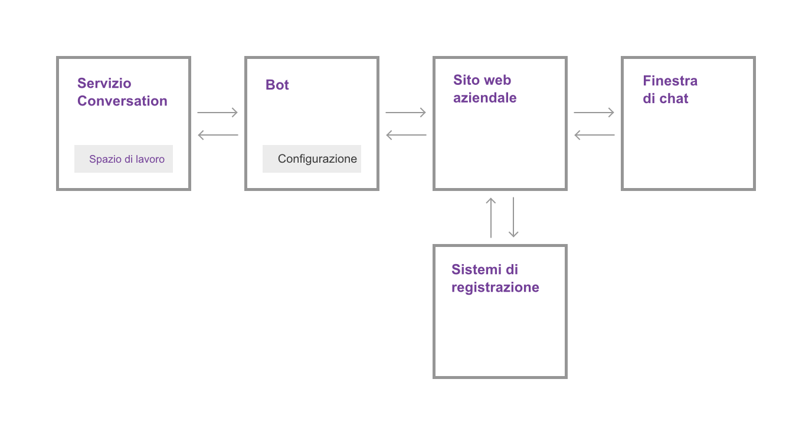

---

copyright:
  years: 2015, 2017
lastupdated: "2017-09-27"

---

{:shortdesc: .shortdesc}
{:new_window: target="_blank"}
{:tip: .tip}
{:pre: .pre}
{:codeblock: .codeblock}
{:screen: .screen}
{:javascript: .ph data-hd-programlang='javascript'}
{:java: .ph data-hd-programlang='java'}
{:python: .ph data-hd-programlang='python'}
{:swift: .ph data-hd-programlang='swift'}

# Funzionamento
{: #how-it-works}

{{site.data.keyword.IBM_notm}} {{site.data.keyword.watson}}
{{site.data.keyword.virtualagentshort}} aggiunge la potenza della conversazione cognitiva
all'equazione di soddisfazione del cliente. Utilizzare il bot di chat di
{{site.data.keyword.virtualagentshort}} come primo  punto di contatto per le domande e le
richieste degli utenti. Il bot può elaborare il linguaggio naturale per comprendere quello che i clienti
stanno chiedendo, e può classificare le esigenze dei clienti. In base alle necessità, può
rispondere e completare transazioni di business semplici o instradare le richieste più
complesse a una persona con esperienza in materia.

Scegliere quali obiettivi degli utenti devono essere gestiti dal bot selezionando le
capacità che si desidera attribuire al bot. Utilizzare lo strumento di configurazione fornito per
abilitare e personalizzare le capacità.
{: shortdesc}

## Capacità

Una *capacità* è l'abilità del bot di chat
{{site.data.keyword.virtualagentshort}} di riconoscere e
raggiungere uno specifico obiettivo del cliente. Ad esempio, la capacità **Find nearest
store (Trova il negozio più vicino)** utilizza le tecniche di elaborazione del linguaggio
naturale per valutare le
parole di un cliente, ad esempio *Dove siete?* e riconoscere da esse l'obiettivo del cliente. Per raggiungere tale obiettivo, si impegna in un dialogo con il cliente per individuare la
posizione attuale del cliente e restituisce le informazioni sull'indirizzo del negozio più vicino al
cliente.

Per ogni capacità, gli esperti di machine learning e linguistica di IBM hanno generato dati di
addestramento e li hanno utilizzati per addestrare  in modalità iterativa i classificatori di
machine-learning che possono riconoscere e rispondere
agli input degli utenti che corrispondono agli obiettivi soddisfatti da tale capacità.

Per rendere più semplice il processo di creazione del bot, IBM offre pacchetti di capacità
che racchiudono le capacità più comuni richieste per gli scenari di supporto generale del
cliente, oltre a pacchetti specializzati che soddisfano le più comuni esigenze del supporto per i
settori industriali chiave.

## Pacchetti di capacità

Un *pacchetto di capacità* raggruppa le capacità più importanti per il proprio
settore di attività. Con decine di migliaia di espressioni verbali di esempio e esempi opposti, il team IBM
ha disegnato i raggruppamenti di capacità che rispondono a obiettivi del cliente simili, ma che
possono coesistere senza competere tra loro per rispondere alle domande degli utenti.

La seguente tabella riepiloga i pacchetti offerti. Fare clic sul link
**dettagli**
per visualizzare un elenco di capacità e le relative descrizioni per ogni lingua supportata.

| Lingua   | Customer Service (General) | Energy  | Retail Banking | Telco | Assicurazione |
|----------|----------------------------|---------|----------------|-------|---------------|
| Inglese  | [dettagli](/docs/services/virtual-agent/capabilities_list_general_en.html)  | [dettagli](/docs/services/virtual-agent/capabilities_list_energy_en.html) | [dettagli](/docs/services/virtual-agent/capabilities_list_banking_en.html) | [dettagli](/docs/services/virtual-agent/capabilities_list_telco_en.html) | [dettagli](/docs/services/virtual-agent/capabilities_list_insurance_en.html) |
| Francese | [dettagli](/docs/services/virtual-agent/capabilities_list_general_fr.html) | [dettagli](/docs/services/virtual-agent/capabilities_list_energy_fr.html) | [dettagli](/docs/services/virtual-agent/capabilities_list_banking_fr.html) | [dettagli](/docs/services/virtual-agent/capabilities_list_telco_fr.html) | n/d* |
| Tedesco  | [dettagli](/docs/services/virtual-agent/capabilities_list_general_de.html) | [dettagli](/docs/services/virtual-agent/capabilities_list_energy_de.html) | [dettagli](/docs/services/virtual-agent/capabilities_list_banking_de.html) | [dettagli](/docs/services/virtual-agent/capabilities_list_telco_de.html) | n/d* |
| Italiano | [dettagli](/docs/services/virtual-agent/capabilities_list_general.html) | [dettagli](/docs/services/virtual-agent/capabilities_list_energy.html) | [dettagli](/docs/services/virtual-agent/capabilities_list_banking.html) | [dettagli](/docs/services/virtual-agent/capabilities_list_telco.html) | n/d* |
| Portoghese (brasiliano) | [dettagli](/docs/services/virtual-agent/capabilities_list_general_pt-br.html) | [dettagli](/docs/services/virtual-agent/capabilities_list_energy_pt-br.html) | [dettagli](/docs/services/virtual-agent/capabilities_list_banking_pt-br.html) | [dettagli](/docs/services/virtual-agent/capabilities_list_telco_pt-br.html) | n/d* |
| Spagnolo | [dettagli](/docs/services/virtual-agent/capabilities_list_general_es.html) | [dettagli](/docs/services/virtual-agent/capabilities_list_energy_es.html) | [dettagli](/docs/services/virtual-agent/capabilities_list_banking_es.html) | [dettagli](/docs/services/virtual-agent/capabilities_list_telco_es.html) | n/d* |

*n/d indica non disponibile adesso

Se le capacità base non soddisfano un obiettivo comune specifico dei propri clienti, è
possibile aggiungere le proprie capacità per integrare quelle fornite in un pacchetto. Ad esempio, se si è proprietari di una pasticceria, i clienti potrebbero chiedere spesso quali sono i gusti dei cupcake in vendita. È possibile aggiungere una capacità *Menu cupcake* per gestire queste domande. Per ulteriori informazioni, vedere [Aggiunta di proprie capacità](add-custom-capabilities.html).

### Differenze tra {{site.data.keyword.watson}} {{site.data.keyword.virtualagentshort}} e {{site.data.keyword.watson}} {{site.data.keyword.conversationshort}}

{{site.data.keyword.IBM_notm}} {{site.data.keyword.watson}}
{{site.data.keyword.conversationshort}} è il servizio fulcro delle funzionalità del
bot di chat. Contiene i classificatori di machine learning che possono comprendere il linguaggio
naturale e, per una determinata frase, rendersi conto del significato e assegnare una categoria in
base alle classi identificate come di interesse. IBM fornisce gli strumenti da utilizzare
per creare i dati di addestramento che istruiscono il classificatore di machine learning. Gli
strumenti inoltre consentono di creare il dialogo utilizzato dal bot per conversare con i clienti.

Gli strumenti di {{site.data.keyword.conversationshort}} sono intuitivi e progettati
in modo tale che chiunque, anche persone senza esperienza di sviluppo o di machine learning, possa
utilizzarli per creare un'applicazione guidata da chat. Tuttavia, è necessario del tempo per
creare i dati di addestramento e costruire un dialogo. A questo punto si inserisce {{site.data.keyword.watson}} {{site.data.keyword.virtualagentshort}}.

{{site.data.keyword.watson}} {{site.data.keyword.virtualagentshort}} utilizza
come base {{site.data.keyword.watson}} {{site.data.keyword.conversationshort}}. Ma
con {{site.data.keyword.virtualagentshort}}, si acquisisce il servizio bot stesso, inoltre
il bot è pre-addestrato: l'addestramento è stato eseguito da esperti e ricercatori in campo
linguistico e di machine learning. È possibile scegliere quali capacità si desidera abilitare. Ad
esempio, abilitare la capacità **Aggiorna indirizzo email** e immediatamente il
bot può comprendere e reagire a richieste relative alle modifiche di indirizzo email.

Lo strumento di configurazione di {{site.data.keyword.virtualagentshort}}
rende facile scegliere le capacità da abilitare e personalizzare il comportamento del bot quando
una capacità viene attivata durante un'interazione del cliente.

Viene fornita la possibilità di aggiungere sempre nuove personalizzazioni al bot,
perché in qualsiasi momento è possibile collegare uno spazio di lavoro del servizio
{{site.data.keyword.conversationshort}} al proprio agent per espandere immediatamente le
funzionalità.

## Panoramica dell'architettura 
{: #arch_overview}

Il diagramma seguente illustra l'architettura di una implementazione
di {{site.data.keyword.watson}} {{site.data.keyword.virtualagentshort}} tipica:

L'implementazione include i seguenti componenti principali:

- **Servizio {{site.data.keyword.conversationshort}}**

    Un'istanza del servizio {{site.data.keyword.watson}}
{{site.data.keyword.conversationshort}}. Il servizio
{{site.data.keyword.conversationshort}} fornisce le risorse per le capacità: intenti,
entità e flusso di dialogo, insieme all'elaborazione cognitiva sottostante che potenzia le capacità
del bot di chat. L'utente interagisce direttamente con il servizio {{site.data.keyword.conversationshort}}
solo quando desidera implementare un dialogo personalizzato o una capacità personalizzata.

    Per ulteriori informazioni su intenti e dialoghi, fare riferimento alla
[documentazione
del servizio {{site.data.keyword.conversationshort}}
](https://console.bluemix.net/docs/services/conversation/index.html#about "Icona link esterno"){: new_window}.

- **Bot**

    Un bot basato sul servizio {{site.data.keyword.conversationshort}}, che include
una serie di capacità. Il bot è addestrato a riconoscere le richieste degli utenti relative al
coinvolgimento dei clienti, ad esempio richieste di informazioni generali sull'azienda o
pagamento di una fattura. Lo strumento di configurazione del bot fornito consente di
configurare informazioni specifiche dell'azienda, che possono essere fornite in risposta a domande
dell'utente, e di configurare le risposte per ogni capacità.

- **Sito web aziendale**

    L'applicazione aziendale che si interfaccia con i clienti, che gestisce le
comunicazioni con il bot {{site.data.keyword.watson}}
{{site.data.keyword.virtualagentshort}} e con il proprio sistema di registrazione (ad
esempio database dei clienti o sistemi di fatturazione).

- **Finestra di chat**

    L'interfaccia di chat dell'agent virtuale, che i clienti utilizzano per conversare con il
bot. È possibile utilizzare il widget di chat fornito, con o senza personalizzazione, oppure è
possibile utilizzare il SDK client per implementare un proprio widget di chat.
