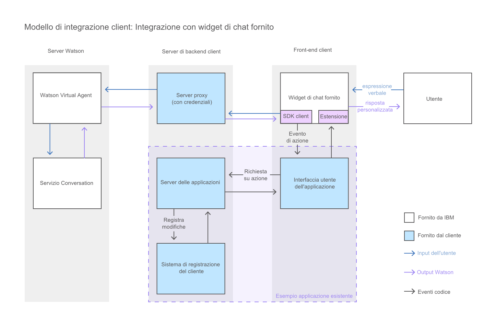

---

copyright:
  years: 2015, 2017
lastupdated: "2017-08-10"

---

{:shortdesc: .shortdesc}
{:new_window: target="_blank"}
{:tip: .tip}
{:pre: .pre}
{:codeblock: .codeblock}
{:screen: .screen}
{:javascript: .ph data-hd-programlang='javascript'}
{:java: .ph data-hd-programlang='java'}
{:python: .ph data-hd-programlang='python'}
{:swift: .ph data-hd-programlang='swift'}

# Aggiunta del widget di chat fornito alla propria UI 
{: #integrate_add-chat}

{{site.data.keyword.watson}} {{site.data.keyword.virtualagentshort}}
viene distribuito con un widget di chat che può essere utilizzato direttamente nella propria
interfaccia utente.
{: shortdesc}

Questo diagramma illustra il flusso della conversazione nel sistema quando si utilizza
il widget di chat fornito da {{site.data.keyword.IBM_notm}}.

1.  Per utilizzare il widget fornito, aprire il repository GitHub del
[widget
di chat di {{site.data.keyword.watson}}
{{site.data.keyword.virtualagentshort}}
](https://github.com/watson-virtual-agents/chat-widget "Icona link esterno"){: new_window} e completare i passi indicati nel file README.md.

    Il widget di chat fornito può esser esteso. Se contiene elementi che si desidera
modificare, è possibile personalizzarli. Ad esempio, per modificare un layout utilizzato dal widget
di chat fornito, è possibile scrivere un layout personalizzato che lo sostituisce. Vedere qui
l'esempio: [https://github.com/watson-virtual-agents/chat-widget/tree/1.2.12/examples/basic-custom-layout. ](https://github.com/watson-virtual-agents/chat-widget/tree/1.2.12/examples/basic-custom-layout "Icona link esterno"){: new_window} Tenere
presente che il layout potrebbe essere utilizzato da più di un intento.

1.  Per informazioni sulle operazioni da effettuare per supportare le transazioni del widget
di chat che possono essere richieste per le capacità che utilizzano la conversazione
incorporata, vedere [Implementazione della logica per il supporto della conversazione incorporata](impl_intents.html#backend_transaction).

Se l'estensione delle personalizzazioni che si desidera effettuare è così ampia che
risulta impossibile implementare le modifiche aggiornando il widget di chat fornito, è possibile
creare una propria interfaccia di chat. Vedere [Creazione di
una interfaccia di chat personalizzata](integrate_custom-chat.html).
