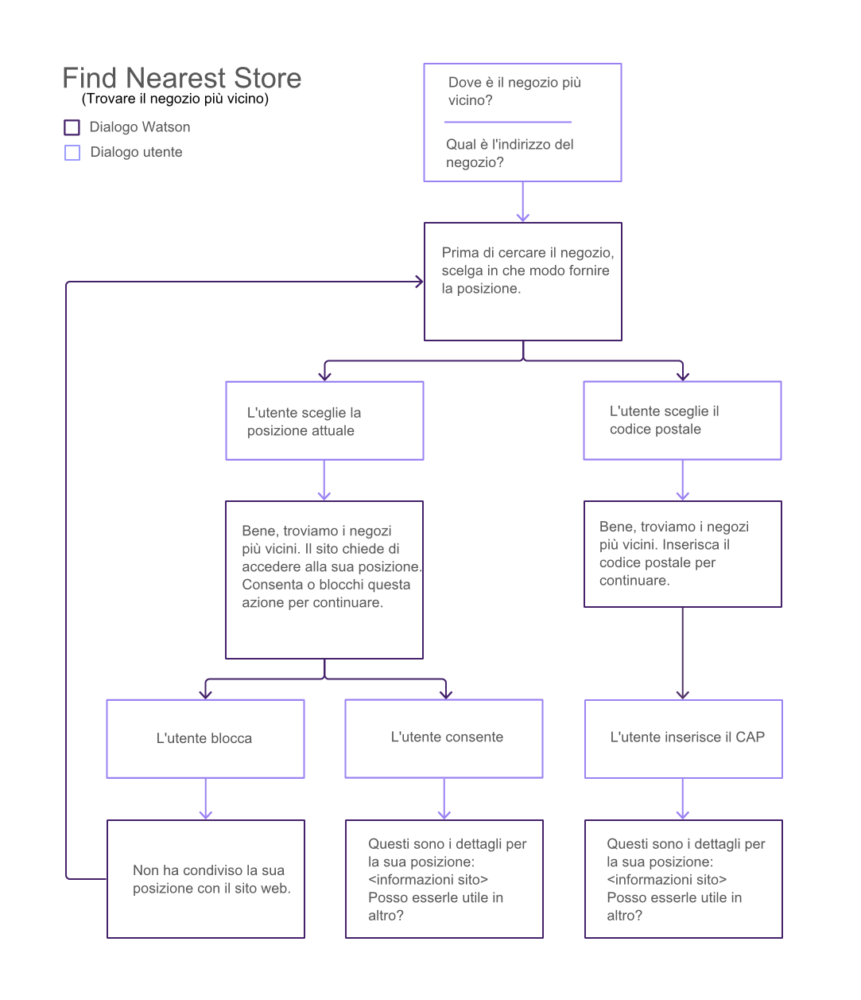
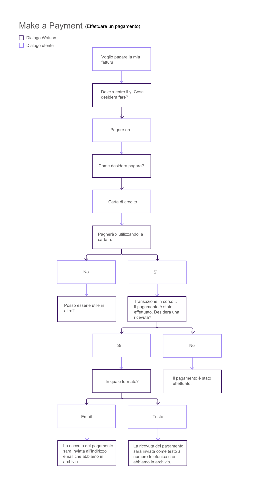
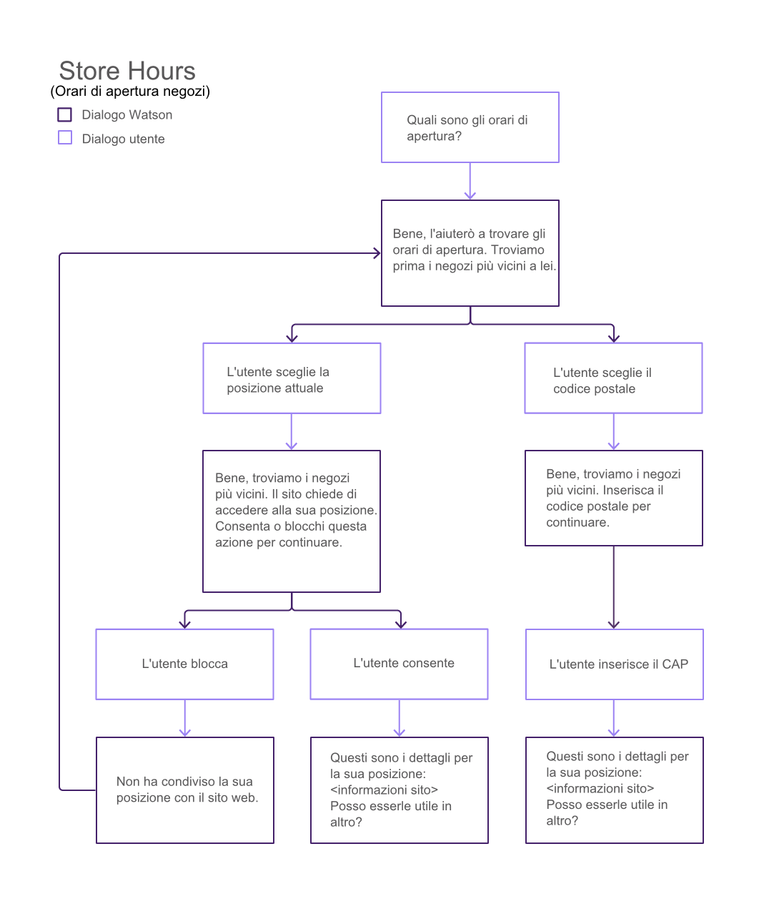
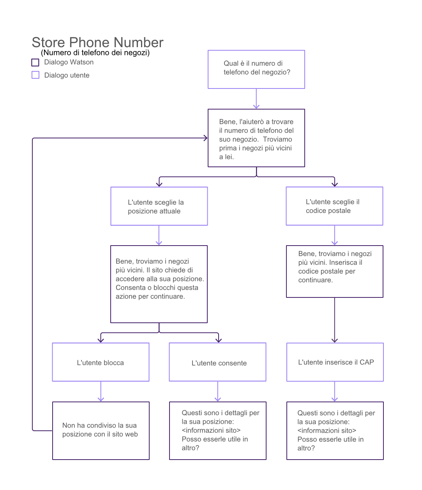
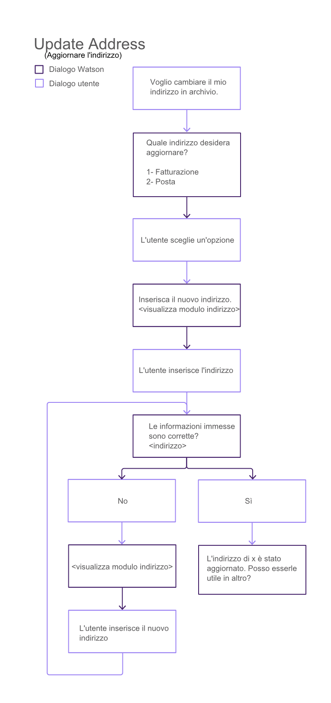
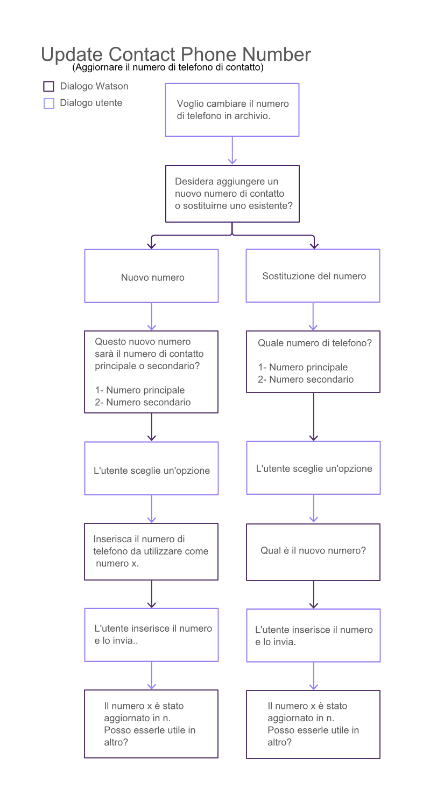
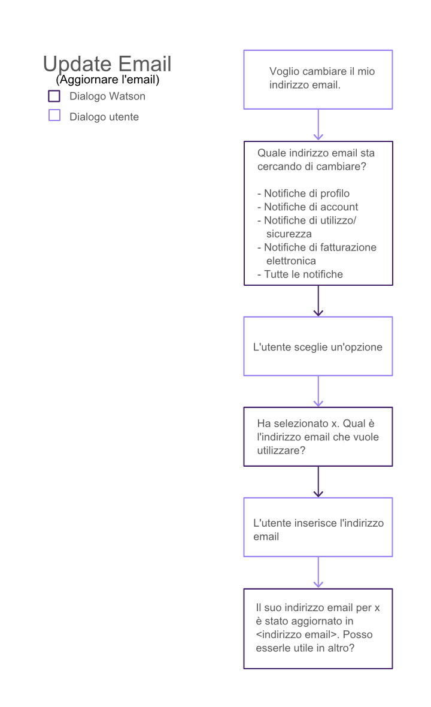

---

copyright:
  years: 2015, 2017
lastupdated: "2017-08-01"

---

{:shortdesc: .shortdesc}
{:new_window: target="_blank"}
{:tip: .tip}
{:pre: .pre}
{:codeblock: .codeblock}
{:screen: .screen}
{:javascript: .ph data-hd-programlang='javascript'}
{:java: .ph data-hd-programlang='java'}
{:python: .ph data-hd-programlang='python'}
{:swift: .ph data-hd-programlang='swift'}

# Personalizzazione delle risposte dell'agent
{: #integrate_backend}

Determinare in che modo si desidera che l'agent risponda ai clienti. È possibile utilizzare
la conversazione incorporata o fornire una conversazione personalizzata per fornire risposte
dell'agent specifiche per le proprie esigenze.
{: shortdesc}

[Utilizzo di una conversazione incorporata](/docs/services/virtual-agent/integrate_backend.html#use_builtin)

[Utilizzo di una propria conversazione](/docs/services/virtual-agent/integrate_backend.html#use_custom)

## Utilizzo di una conversazione incorporata
{: #use_builtin}

Per una serie di attività comuni, {{site.data.keyword.watson}}
{{site.data.keyword.virtualagentshort}} fornisce flussi di conversazioni incorporate che
possono essere utilizzati direttamente per semplificare il processo di acquisizione delle
informazioni dagli utenti allo scopo di eseguire un'attività.

### Dialoghi incorporati
{: #builtin_dialog_ovw}

Nella sezione seguente sono descritti gli intenti che i flussi di conversazioni
incorporate sono addestrati a riconoscere e a cui reagire.

#### Find nearest store - Trovare il negozio più vicino
{: #builtin_dialog_ovw__findNearestStore}

Il seguente diagramma mostra i nodi nella conversazione incorporata per l'intento *Find nearest store*. Lo
stesso flusso di dialogo è utilizzato per questo intento e per l'intento *Store location*.



L'unica ulteriore operazione richiesta è l'aggiunta dei dettagli sull'ubicazione per ogni
negozio. È possibile aggiungere i dettagli del negozio da uno dei seguenti intenti a cui è
possibile accedere dalla pagina Configure:

- Find nearest store
- Store location

#### Make a payment - Effettuare un pagamento

Il seguente diagramma mostra i nodi nella conversazione incorporata per l'intento
*Make a payment*.



Fare clic [qui](/docs/services/virtual-agent/backend_payment_gif.html) per visualizzare il flusso dell'input utente e delle risposte dell'agent virtuale nel sistema.

Per informazioni sulle ulteriori operazioni da eseguire per supportare completamente questo
intento, vedere [Implementazione della
logica per il supporto della conversazione incorporata](/docs/services/virtual-agent/integrate_backend.html#backend_transaction).

#### Store hours - Orari di apertura negozi

Il seguente diagramma mostra i nodi nella conversazione incorporata per l'intento *Store hours*.



Se si desidera fornire gli orari di apertura dei negozi, è necessario includere le
informazioni sugli orari di apertura quando si aggiungono le informazioni di ubicazione dei negozi
con i seguenti intenti:

- Find nearest store
- Store location

#### Store location - Ubicazione dei negozi

Fare riferimento al diagramma precedente per visualizzare i nodi nella conversazione
incorporata per l'intento *Store location*. Lo
stesso flusso di dialogo è utilizzato per questo intento e per l'intento [Find nearest store](/docs/services/virtual-agent/integrate_backend.html#builtin_dialog_ovw__findNearestStore).

L'unica ulteriore operazione richiesta è l'aggiunta dei dettagli sull'ubicazione per ogni
negozio. È possibile aggiungere i dettagli del negozio da uno dei seguenti intenti a cui è
possibile accedere dalla pagina Configure:

- Find nearest store
- Store location

#### Store phone number - Numero di telefono dei negozi

Il seguente diagramma mostra i nodi nella conversazione incorporata per l'intento *Store phone number*.



Se si desidera fornire i numeri di telefono dei negozi, è necessario aggiungerli alle
definizioni di ubicazione dei negozi aggiunte con i seguenti intenti:

- Find nearest store
- Store location

#### Update address - Aggiornare l'indirizzo

Il seguente diagramma mostra i nodi nella conversazione incorporata per l'intento
*Update address*.



Per informazioni sulle ulteriori operazioni da eseguire per supportare completamente questo
intento, vedere [Implementazione della
logica per il supporto della conversazione incorporata](/docs/services/virtual-agent/integrate_backend.html#backend_transaction).

#### Update contact phone number - Aggiornare il numero di telefono di contatto

Il seguente diagramma mostra i nodi nella conversazione incorporata per l'intento *Update contact phone number*.



Per informazioni sulle ulteriori operazioni da eseguire per supportare completamente questo
intento, vedere [Implementazione della
logica per il supporto della conversazione incorporata](/docs/services/virtual-agent/integrate_backend.html#backend_transaction).

#### Update email - Aggiornare l'email

Il seguente diagramma mostra i nodi nella conversazione incorporata per l'intento *Update email*.



Per informazioni sulle ulteriori operazioni da eseguire per supportare completamente questo
intento, vedere [Implementazione della
logica per il supporto della conversazione incorporata](/docs/services/virtual-agent/integrate_backend.html#backend_transaction).

### Implementazione della logica per il supporto della conversazione incorporata
{: #backend_transaction}

Informazioni sullo scambio di informazioni e il completamento dei processi di business che
sono trattati dal widget di chat fornito quando gli utenti interagiscono con gli intenti che sono
configurati per utilizzare una conversazione incorporata.

#### Informazioni su questa attività

Alcuni degli intenti configurati per utilizzare il tipo di risposta
conversazione incorporata, per impostazione predefinita possono occuparsi dei processi di business. 
L'applicazione deve essere in grado di registrare la transazione con i sistemi di backend di
registrazione.

- Se si implementa il widget di chat {{site.data.keyword.IBM_notm}} fornito, questo
riconosce gli eventi attivati da determinate risposte dell'utente. Tuttavia, ci sono ulteriori
operazioni da eseguire perché l'applicazione resti in attesa di questi eventi, in modo da poter
completare le transazioni attivate nei sistemi di backend.
- Se non si utilizza il widget di chat fornito, è necessario assicurarsi che l'interfaccia
utente personalizzata possa riconoscere gli eventi attivati dai flussi di conversazione incorporati
e li gestisca in modo appropriato.

Ad esempio, con l'intento **Update address**, un utente può
modificare l'indirizzo di fatturazione sul proprio account. È necessario scrivere un codice che
acquisisce il nuovo indirizzo dall'agent virtuale e aggiorna l'account dell'utente nel sistema di
registrazione con le nuove informazioni.

È importante notare che lo scopo di un dialogo è solo di raccogliere le informazioni
dall'utente. Le informazioni fornite dall'utente sono memorizzate in due modi:

- Le informazioni che non contengono dati sensibili o personali sono memorizzate nel
contesto del dialogo, che è un oggetto dati disponibile per il bot e per l'applicazione.
- Le informazioni che contengono dati sensibili o personali (ad esempio numeri di carta di
credito) sono memorizzate in variabili private, che sono disponibili solo per l'applicazione e non
sono passate al bot.

#### Procedura

Per implementare completamente le transazioni di business attivate dagli intenti con
risposte di conversazioni incorporate per il widget di chat {{site.data.keyword.IBM_notm}}, completare i seguenti passi:

1. Aggiungere la logica all'applicazione che acquisisce le informazioni del profilo per
l'utente corrente dal sistema di backend per mostrarle nella finestra di chat prima di modificare
le informazioni. Ad esempio, mostra agli utenti il saldo prima del pagamento.

    Utilizzare l'azione `getUserProfileVariables`. Questa azione
acquisisce le variabili e le imposta nel profilo.

    ```
    IBMChat.subscribe('action:getUserProfileVariables', function(data) {
     var variables = data.message.action.args.variables; // specify the variables you want to get in this array
       for (var i = 0; i < variables.length; i++) {
           var value = something(variables[i])
           /*do something to get the value of variables[i]. might be an ajax call or getting
           data from local cookies. Depends on where you stored the information.*/
           window.IBMChat.profile.set(variables[i], value);
       }
       IBMChat.sendSilently('success'); // or cancel or failure
    });
    ```
    {: screen}

    Questo esempio utilizza una chiamata REST per ottenere informazioni sul saldo di una
fattura e la data di scadenza.

    ```
    var xmlHttp = new XMLHttpRequest();
      xmlHttp.onreadystatechange = function() {
        if (xmlHttp.readyState == 4 && xmlHttp.status == 200)
          callback(xmlHttp.responseText);
      }
      xmlHttp.open("GET", url, true);
      xmlHttp.send(null);
    }
    /* Get information from the backend database and add it
    into the profile with IBMChat.profile.set(). */
    IBMChat.subscribe('action:getUserProfileVariables', function(data) {
     /*
     data = {
       message: {
          text: ['some text'],
                action: {
                     name: 'getUserProfileVariables',
                     args: {
                         variables: [
                    "bill_amount",
                    "payment_due_date"
                ]
                     }
                }
       }
    
     }
     */
    
     httpGetAsync('http://yourdomain.com/userprofile', function(user) {
       /* The record on the backend system might return information like this.
       user = {
         "bill_amount": 42.01,
         "payment_due_date": "11/24/2008"
       }
       */
       var variables = data.message.action.args.variables;
       for (var i = 0; i < variables.length; i++) {
         var value = user[variables[i]]);
         window.IBMChat.profile.set(variables[i], value);
       /* Now the chat widget can use the values it retrieved from the backend service. */
       }
       IBMChat.sendSilently('success'); // or cancel or failure
     });
    });
    ```
    {: screen}

1. Aggiungere la logica all'applicazione che prima attende l'azione che avvia il processo di
business, e poi esegue il processo di business.

    Per un elenco delle azioni associate a intenti che hanno tipi di risposta con
conversazione incorporata, vedere
[https://github.com/watson-virtual-agents/virtual-agent-dialog/blob/master/dialog-contract.md#action ](https://github.com/watson-virtual-agents/virtual-agent-dialog/blob/master/dialog-contract.md#action){: new_window}.
    - **Make a payment - Effettuare un pagamento** {: #makeapayment}

        Effettuare le seguenti operazioni per implementare il codice che supporta questa
transazione.
        1. L'applicazione deve richiamare il saldo corrente dell'utente e la data di
scadenza dal sistema di backend. Utilizzare il metodo
`action:getUserProfileVariables` per acquisire e impostare le variabili
`bill_amount` e `payment_due_date` nell'archivio dei profili.
        1. L'applicazione deve restare in attesa dell'evento `payBill` e
definire la logica da eseguire quando l'evento viene attivato.
        1. L'applicazione deve anche restare in attesa dell'evento
`sendPaymentReceipt` e definire la logica da eseguire quando l'evento viene
attivato.

    - **Update address - Aggiornare l'indirizzo**
{: #updateaddress}

        1. Il widget di chat utilizza un layout modulo per chiedere informazioni sul nuovo
indirizzo dell'utente e le archivia nel profilo automaticamente. Vengono archiviate queste
variabili di profilo:

            ```
            user_street_address1
            user_street_address2
            user_locality
            user_state_or_province
            user_zipcode
            ```
            {: screen}

        1. L'applicazione deve restare in attesa dell'evento
`updateAddress`.

            ```
            IBMChat.subscribe('action:updateAddress', function(data) {<your-code>}
            ```
            {: screen}

            Definire una funzione che acquisisce ed invia il nuovo indirizzo e tipo di
indirizzo (`address_type`) al sistema di backend quando viene attivata l'azione
`updateAddress`.

            Per raccogliere dati con molti valori, ad esempio un indirizzo postale, è
possibile utilizzare il layout modulo che viene generato nel widget di chat. Gli utenti immettono i
valori in più campi, e quindi inoltrano il modulo completo. Ad esempio, per inviare il nuovo
indirizzo al sito tramite una chiamata REST POST, è possibile utilizzare una logica simile alla
seguente.

            ```
            /* When a user enters information into a form, it is automatically added
            to the user profile. So a typical flow would be to include a form layout in the
            chat window, and then call this action after the form is submitted */
            IBMChat.subscribe('action:updateAddress', function(data) {
              var record = {
                "first_name": IBMChat.profile.get('first_name'),
                "last_name": IBMChat.profile.get('last_name'),
                "user_street_address1": IBMChat.profile.get('user_street_address1'),
                "user_street_address2": IBMChat.profile.get('user_street_address2'),
                "user_locality": IBMChat.profile.get('user_locality'),
                "user_state_or_province": IBMChat.profile.get('user_state_or_province'),
                "user_zipcode": IBMChat.profile.get('user_zipcode')
              };
              httpPostAsync('/updateRecord/', record, function(err, response) {
                if (err) IBMChat.receive('There was an error updating the address.');
              });
            });
            ```
            {: screen}

            Per ulteriori informazioni sui layout incorporati, vedere
[https://github.com/watson-virtual-agents/virtual-agent-dialog/blob/master/dialog-contract.md#layout ](https://github.com/watson-virtual-agents/virtual-agent-dialog/blob/master/dialog-contract.md#layout){: new_window}.

    - **Update contact phone number - Aggiornare il numero di telefono di
contatto** {: #updatephone}

        1. Il widget di chat utilizza un layout modulo per chiedere il nuovo numero di
telefono dell'utente e lo archivia nel profilo automaticamente. Vengono archiviate queste variabili
di profilo:

            ```
            user_phone_number
            phone_number_type
            ```
            {: screen}

        1. L'applicazione deve restare in attesa dell'evento
`updatePhoneNumber` e definire la logica per acquisire e inviare il nuovo numero
di telefono e tipo al sistema di backend quando l'evento viene attivato.

    - **Update email - Aggiornare l'email**
{: #updateemail}

        1. Il widget di chat utilizza un layout modulo per chiedere il nuovo indirizzo email
dell'utente e lo archivia nel profilo automaticamente. Vengono archiviate queste variabili di
profilo:

            ```
            user_email_address
            email_type
            ```
            {: screen}

        1. L'applicazione deve restare in attesa dell'evento `updateEmail`
e definire la logica per acquisire e inviare il nuovo indirizzo email al sistema di backend quando
l'evento viene attivato. Inoltre invia informazioni sui tipi di notifica per i quali utilizzare il
nuovo indirizzo (`email_type`).

## Utilizzo di una propria conversazione
{: #use_custom}

Per ogni intento, è possibile scegliere di utilizzare le proprie conversazioni
per interagire con l'utente e soddisfare l'intento.

### Creazione di un dialogo personalizzato
{: #custom_dialog}

Se uno degli intenti supportati richiede la gestione di un dialogo personalizzato, è possibile utilizzare il servizio {{site.data.keyword.IBM_notm}} {{site.data.keyword.watson}} {{site.data.keyword.conversationshort}} per creare il dialogo e poi collegarlo all'agent virtuale.

#### Informazioni su questa attività

Il servizio {{site.data.keyword.watson}}
{{site.data.keyword.conversationshort}} è un insieme di strumenti e API che possono essere
utilizzati per creare applicazioni che utilizzano le interfacce del linguaggio naturale per
automatizzare le interazioni con i clienti. {{site.data.keyword.watson}}
{{site.data.keyword.virtualagentshort}} utilizza il servizio
{{site.data.keyword.conversationshort}} per definire gli intenti addestrati e il flusso
di dialogo utilizzato dal bot. Se il dialogo fornito non offre la flessibilità necessaria o non
gestisce attualmente l'intento che è necessario supportare, è  possibile creare un proprio dialogo
utilizzando gli strumenti del servizio {{site.data.keyword.conversationshort}}.

> **Nota:** solo gli intenti per i quali è stato selezionato il tipo di
risposta **Use your own conversation** sono elaborati dal dialogo.
Per compatibilità con l'agent virtuale, qualsiasi dialogo creato deve essere conforme alle
linee guida di progettazione indicate in
[https://github.com/watson-virtual-agents/virtual-agent-dialog/blob/master/dialog-contract.md ](https://github.com/watson-virtual-agents/virtual-agent-dialog/blob/master/dialog-contract.md){: new_window}. Queste linee guida specificano come il dialogo
interagisce con l'interfaccia di chat dell'agent virtuale, compreso come visualizzare le richieste
agli utenti e dove archiviare le informazioni fornite dagli utenti in modo che possano essere
accessibili dall'interfaccia della finestra di chat.

Il repository di {{site.data.keyword.virtualagentshort}}
{{site.data.keyword.dialogshort}} fornisce anche esempi che illustrano il funzionamento
delle interazioni di dialogo. È possibile utilizzare un esempio come modello per il proprio
dialogo. Vedere il
[file
JSON dei flussi di dialogo di esempio ](https://github.com/watson-virtual-agents/virtual-agent-dialog/blob/master/sample_dialog_flows.json){: new_window}.

#### Procedura

Per creare un dialogo personalizzato:

1. Se non si è già registrati, registrarsi al servizio {{site.data.keyword.watson}} {{site.data.keyword.conversationshort}}. Per ulteriori informazioni, consultare la documentazione relativa alle [operazioni preliminari del servizio {{site.data.keyword.conversationshort}} ](http://www.ibm.com/watson/developercloud/doc/conversation/getting-started.html){: new_window}.
1. Creare uno spazio di lavoro per contenere il dialogo. Per informazioni sugli spazi di lavoro, consultare la documentazione relativa alla [ creazione di uno spazio di lavoro del servizio {{site.data.keyword.conversationshort}} ](http://www.ibm.com/watson/developercloud/doc/conversation/create-workspace.html){: new_window}.
1. Andare alla scheda {{site.data.keyword.dialogshort}}. Non è necessario creare
intenti o entità. 
1. Creare un nodo di dialogo che rileva un intento per il quale è stato selezionato il tipo
di risposta **Use your own conversation**. Ad esempio, per l'intento "Add
insurance", il dialogo dovrebbe eseguire il test per #Service_Management-Add_Insurance. Per
rilevare il nome codice degli intenti, vedere [Nomi codice di
intenti](/docs/services/virtual-agent/intent_codenames.html).
1. Aggiungere i nodi necessari per creare il flusso di dialogo richiesto. Assicurarsi che il dialogo sia conforme alle linee
guida di progettazione del dialogo di {{site.data.keyword.virtualagentshort}} disponibili
all'indirizzo [https://github.com/watson-virtual-agents/virtual-agent-dialog/blob/master/dialog-contract.md ](https://github.com/watson-virtual-agents/virtual-agent-dialog/blob/master/dialog-contract.md){: new_window}.

#### Operazioni successive

Se il dialogo personalizzato supporta interazioni utente o transazioni che non possono
essere gestite con la personalizzazione dell'interfaccia di chat fornita, è possibile anche fornire
un'interfaccia di chat personalizzata. Per ulteriori dettagli, vedere
[Creazione di una interfaccia di chat personalizzata](/docs/services/virtual-agent/integrate.html#custom_chat).

