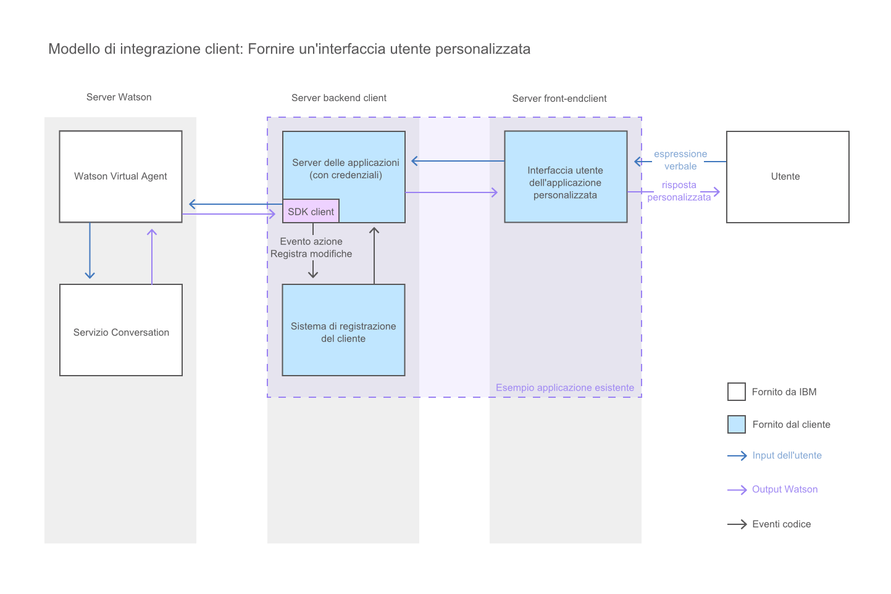

---

copyright:
  years: 2015, 2017
lastupdated: "2017-08-10"

---

{:shortdesc: .shortdesc}
{:new_window: target="_blank"}
{:tip: .tip}
{:pre: .pre}
{:codeblock: .codeblock}
{:screen: .screen}
{:javascript: .ph data-hd-programlang='javascript'}
{:java: .ph data-hd-programlang='java'}
{:python: .ph data-hd-programlang='python'}
{:swift: .ph data-hd-programlang='swift'}

# Creazione di una interfaccia di chat personalizzata 
{: #integrate_custom-chat}

Se il widget di chat fornito non soddisfa le proprie esigenze, è possibile sviluppare la
propria interfaccia di chat JavaScript per consentire agli utenti di interagire con l'agent virtuale. In
questo modo si ha il controllo completo su layout, aspetto e comportamento dell'interfaccia di chat.
{: shortdesc}

Questo diagramma illustra il flusso della conversazione nel sistema quando si fornisce
un'interfaccia di chat personalizzata.

Per sviluppare un'interfaccia di chat personalizzata con JavaScript, utilizzare le seguenti
risorse:

- **SDK client {{site.data.keyword.watson}} {{site.data.keyword.virtualagentshort}}**

    Un SDK JavaScript per lo sviluppo di applicazioni che interagiscono con
{{site.data.keyword.watson}} {{site.data.keyword.virtualagentshort}}. Il SDK client
utilizza un host [GitHub
](https://github.com/watson-virtual-agents/client-sdk "Icona link esterno"){: new_window}.

- **API Explorer**

    Un portale che fornisce accesso alle API REST di {{site.data.keyword.watson}}
{{site.data.keyword.virtualagentshort}} su {{site.data.keyword.IBM_notm}} {{site.data.keyword.Bluemix_notm}}. È
possibile accedere alle API di {{site.data.keyword.watson}}
{{site.data.keyword.virtualagentshort}} da [{{site.data.keyword.IBM_notm}} developerWorks API Explorer ](https://developer.ibm.com/api/view/id-339:title-Watson_Virtual_Agent "Icona link esterno"){: new_window}.
