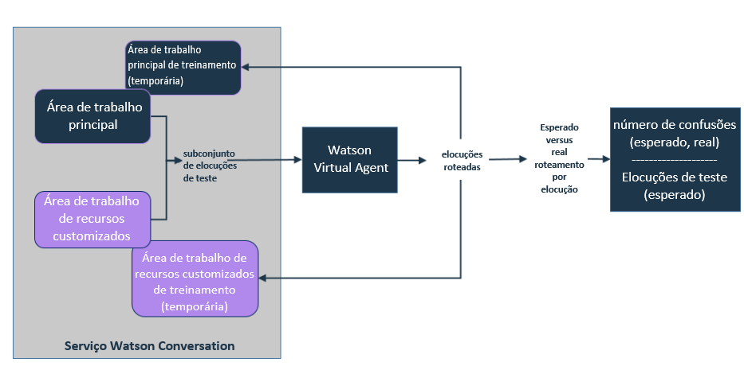

---

copyright:
  years: 2015, 2017
lastupdated: "2017-08-10"

---

{:shortdesc: .shortdesc}
{:new_window: target="_blank"}
{:tip: .tip}
{:pre: .pre}
{:codeblock: .codeblock}
{:screen: .screen}
{:javascript: .ph data-hd-programlang='javascript'}
{:java: .ph data-hd-programlang='java'}
{:python: .ph data-hd-programlang='python'}
{:swift: .ph data-hd-programlang='swift'}

# Incluindo os seus próprios recursos 
{: #add-custom-capabilities}

Para expandir sobre o que o agente virtual pode discutir com os seus clientes, inclua os seus próprios recursos.
{: shortdesc}

## Antes de começar

Quando você usa uma área de trabalho para fornecer um diálogo customizado para um recurso principal, apenas é necessário fornecer um diálogo na área de
trabalho. O agente já foi treinado para reconhecer elocuções que mapeiam para os recursos principais; portanto, não é necessário fornecer as intenções, as
entidades e os dados de treinamento. Quando você fornece uma área de trabalho que define os seus próprios recursos, deve-se fornecer as intenções e as entidades, além
do diálogo. Deve-se também fornecer um grande número de elocuções de amostra que o serviço pode usar para treinar as intenções que você deseja suportar. Use a
documentação, as demos e as ferramentas que são fornecidas com o serviço do {{site.data.keyword.IBM_notm}} {{site.data.keyword.watson}}
{{site.data.keyword.conversationshort}} para construir uma área de trabalho com recursos customizados. Consulte a documentação do [{{site.data.keyword.watson}} {{site.data.keyword.conversationshort}} ](https://console.bluemix.net/docs/services/conversation/index.html#about "Ícone de link externo"){: new_window} para obter informações adicionais.

### Sobre essa Tarefa

É possível criar apenas uma área de trabalho para definir recursos customizados. Cada intenção que for incluída e treinada na área de trabalho será disponibilizada como um recurso customizado ao vincular a área de trabalho ao agente. A área de trabalho deve conter todos os recursos que você deseja incluir em seu agente. Não
inclua intenções na área de trabalho que você não deseja que o seu agente possa manipular.

### Procedimento

1.  Na sua instância de serviço do {{site.data.keyword.conversationshort}}, crie uma área de trabalho que defina os seus recursos customizados. Consulte a documentação de serviço do [{{site.data.keyword.conversationshort}} ](https://console.bluemix.net/docs/services/conversation/configure-workspace.html#configuring-a-conversation-workspace "External link icon"){: new_window}.

    Siga estas diretrizes:
    - Inclua uma ramificação para cada recurso que você deseja suportar como um nó base (que é referido como uma *conversa alternativa*
na interface com o usuário de ferramenta do {{site.data.keyword.conversationshort}}) no diálogo. Por exemplo, não defina um nó base na sua caixa de diálogo
que reconhece e responde às saudações do usuário e, em seguida, inclua os nós-filhos que correspondem a outras intenções de recurso customizado abaixo dela.
    - Evite manipular incompatibilidades de entrada do usuário com loops recursivos. Crie apenas mudanças de diálogo que tenham um término definitivo.
    - Não crie uma intenção customizada com o mesmo nome que uma intenção que é usada por um recurso principal. Consulte
[Nomes de intenção](intent_codenames.html) para obter uma lista de nomes a serem evitados.

1.  Vincule a área de trabalho ao agente. Consulte [Vinculando as áreas de trabalho](link_workspace.html)
1.  Na página **Configure (Configurar)**, abra a guia **Custom Capabilities (Recursos Customizados)**.
1.  Clique em **Add Capabilities (Incluir Recursos)**.
1.  Selecione a área de trabalho que você vinculou ao agente na Etapa 2 e, em seguida, clique em **Select Workspace (Selecionar Área de Trabalho)**.

    As intenções que são definidas na área de trabalho vinculada agora são listadas como recursos ativados.

    > **Nota:** Não é possível desativar recursos individuais. Se você desejar remover um recurso customizado, será possível excluir a intenção da
área de trabalho na ferramenta de serviço do {{site.data.keyword.conversationshort}}.

    É possível remover todos os recursos de uma só vez clicando em **Remove Private Capabilities (Remover Recursos Privados)**. Remover os recursos não exclui a
associação entre o agente e a área de trabalho na qual os recursos estão definidos.

### Resultados

Após você incluir recursos customizados, cada elocução de usuário que é avaliada pelo {{site.data.keyword.watson}}
{{site.data.keyword.virtualagentshort}} é transmitida para ambos, a área de trabalho principal e a sua área de trabalho de recursos customizados, para
avaliação. O recurso que melhor corresponde à intenção de entrada do usuário é acionado e o diálogo associado a ela é usado.

### O que fazer em seguida

Ao incluir os seus próprios recursos, é possível facilmente definir um que seja semelhante em comportamento a um recurso principal existente. O {{site.data.keyword.virtualagentshort}} faz uma execução de validação inicial para verificar recursos que podem ser sobrepostos e informa sobre eles para que seja possível resolvê-los antes da publicação do agente.

## Resolvendo conflitos de validação
{: #validate_custom_capabilities}

Evite definir recursos que são tão semelhantes entre si porque eles competem para responder a determinadas consultas do usuário. Se fizer isso, não poderá prever qual recurso finalmente irá fornecer uma resposta aos usuários. Essa variação em respostas pode ser percebida por usuários como um comportamento inconsistente na parte do agente, o que pode ser confuso ou fazer parecer aos usuários que o agente não está funcionando corretamente.

### Sobre essa Tarefa

A execução de validação compara elocuções de exemplo dos dados de treinamento para recursos de cada tipo para procurar duplicação. Ela obtém uma amostra aleatória das elocuções para comparação. Se localizar possíveis conflitos, ela indicará a probabilidade (como uma porcentagem) de que as duas entrarão em conflito.

**Como é a porcentagem derivada?** O serviço conta o número de elocuções que são roteadas para a área de trabalho errada, que são as confusões. Se a proporção de confusão (o número de confusões dividido pelo número de elocuções de teste por recurso) for maior que 20%, o conflito será relatado e a proporção de confusão será exibida.

### Procedimento

Para resolver conflitos de validação, conclua as seguintes etapas:

1.  Clique em **Resolve (Resolver)** próximo ao link de notificação de conflito para abrir a área de janela *Review and resolve conflicts (Revisar e resolver conflitos)* e ver uma lista de conflitos.

   

1.  Direcione cada conflito de uma das seguintes formas:
    - **Desative o recurso principal**

        1.  Alterne o comutador para **Off (Desligado)** e, em seguida, feche a área de janela *Review and resolve conflicts (Revisar e resolver conflitos)*.
        1.  Clique em **Revalidate (Validar novamente)** .

    - **Desative o recurso customizado**
        1.  Clique no link **Conversation service workspace (Área de trabalho do serviço Conversação)** para abrir a área de trabalho que contém os recursos customizados na ferramenta {{site.data.keyword.conversationshort}}.

        1.  Localize a intenção na página **Intents (Intenções)**, expanda-a e, em seguida, clique no ícone **Delete intent (Excluir intenção)** para excluí-la da área de trabalho. Consulte [Excluindo intentos](https://console.bluemix.net/docs/services/conversation/intents.html#delete_intents).
        1.  **Opcional**: Normalmente, ao excluir uma intenção, você remove toda a menção dela do diálogo correspondente. No entanto, se você construiu um nó de diálogo complexo para este recurso customizado que deseja continuar usando, não remova-o do diálogo imediatamente. Em vez disso, configure o recurso principal de sobreposição para usá-lo como uma resposta de diálogo customizado. (Consulte [Configurando recursos principais](configure.html).)
            1.  Atualize o acionador para o nó de diálogo para usar o nome de intenção de recurso principal como a condição.
            1.  É possível executar uma das seguintes ações:
              - Se estiver usando uma área de trabalho para recursos customizados e diálogos customizados para recursos principais, mova o nó de diálogo para este recurso customizado para cima na colocação para ser agrupado com quaisquer outros nós de diálogo de recurso principal que estão sendo usados. Os diálogos customizados para recursos principais são mantidos na parte superior da árvore para assegurar que possam ser localizados pelo robô.
              - Se estiver usando duas áreas de trabalho separadas, recrie o nó de diálogo na área de trabalho que define seus diálogos customizados. Após recriar o nó de diálogo com sucesso, é possível removê-lo de sua área de trabalho de recursos customizados.
        1.  Após você fazer mudanças na área de trabalho, ela será automaticamente treinada. Quando o treinamento estiver concluído, retorne à guia **Custom Capabilities (Recursos Customizados)** do {{site.data.keyword.watson}} {{site.data.keyword.virtualagentshort}}.
        1.  Clique em **Revalidate (Validar novamente)** .

    - **Atualizar os dados de treinamento para o recurso customizado**

        Se o recurso customizado direcionar um objetivo de cliente semelhante mas com claras diferenças do recurso principal, será possível atualizar os dados de treinamento para o recurso customizado para acentuar as diferenças entre os dois.
         >Nota: Não é possível acessar a área de trabalho para o recurso principal para atualizar seus dados de treinamento; é possível editar a área de trabalho somente para o recurso customizado para afetar mudanças.

        Edite a área de trabalho que contém o recurso customizado seguindo essas etapas.
        1.  Clique no link **Conversation service workspace (Área de trabalho do serviço Conversation)** para abrir a área de trabalho que contém seus recursos customizados da ferramenta {{site.data.keyword.conversationshort}}.

        1.  Para cada recurso customizado conflitante, revise as elocuções de amostra de intenção.
            - Se houver elocuções de exemplo que se sobrepõem claramente com os tipos de elocuções do usuário que o recurso principal foi designado para direcionar, exclua-as. Para fazer isso, complete as seguintes etapas:
              1.  Localize a intenção na página **Intents (Intenções)**. Expanda a intenção para ver a lista de elocuções de amostra.
              1.  Selecione a caixa próxima a cada declaração de amostra de sobreposição e, em seguida, clique em **Remove examples (Remover exemplos)**.

            - Inclua mais elocuções de exemplo que representam objetivos do usuário que enfatizam os aspectos do recurso customizado que o tornam notavelmente diferente do recurso principal. A inclusão de dados de treinamento que acentua a função exclusiva do recurso customizado ajuda a distingui-lo do recurso principal.

            - Inclua exemplos do contador que representam os tipos de elocuções que você explicitamente não deseja que sejam direcionadas pelo recurso customizado. Para fazer isso, complete as seguintes etapas:
              1.  Na área de janela **Try it out (Experimentar)**, inclua elocuções de teste que representam os tipos de objetivos do usuário distintos que o recurso principal foi designado para direcionar.
              1.  Quando a intenção do recurso customizado é identificada como a intenção detectada, clique na seta para baixo próxima ao nome da intenção e selecione **Mark as irrelevant (Marcar como irrelevante)**.
              1.  Repita as duas etapas anteriores para quantas elocuções forem possíveis.

        1.  Após você fazer mudanças na área de trabalho, ela será automaticamente treinada. Quando o treinamento estiver concluído, retorne à guia **Custom Capabilities (Recursos Customizados)** do {{site.data.keyword.watson}} {{site.data.keyword.virtualagentshort}}.
        1.  Clique em **Revalidate (Validar novamente)** .

    - **Não executar nenhuma ação**

        Se o acionamento do comportamento do agente variável for aceitável para alguns recursos, será possível deixar o conflito não resolvido.
        >Nota: Você continuará a ser notificado sobre o conflito após cada execução de validação.

## Testando recursos customizados 
{: #test_custom_capabilities}

Depois de incluir seus próprios recursos e de resolver conflitos de validação, faça algum teste para assegurar que os recursos customizados se comportem conforme o esperado.

### Procedimento

1.  Use a área de janela de Visualização para fazer perguntas ou fazer os tipos de solicitações que você espera que os seus clientes façam.

    Abaixo da resposta, o recurso que foi acionado para direcionar a solicitação é exibido. Se o recurso que é exibido não for o que você espera, será possível fazer mudanças para corrigir como a elocução está sendo roteada para os recursos. Para corrigir problemas, use as mesmas técnicas que as documentadas anteriormente para resolver conflitos de validação.

1.  Repita esse processo até que o agente esteja configurado para manipular seus recursos customizados adequadamente.
