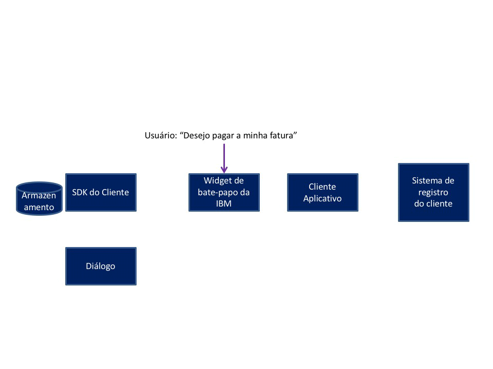

---

copyright:
  years: 2015, 2017
lastupdated: "2017-08-10"

---

{:shortdesc: .shortdesc}
{:new_window: target="_blank"}
{:tip: .tip}
{:pre: .pre}
{:codeblock: .codeblock}
{:screen: .screen}
{:javascript: .ph data-hd-programlang='javascript'}
{:java: .ph data-hd-programlang='java'}
{:python: .ph data-hd-programlang='python'}
{:swift: .ph data-hd-programlang='swift'}

# Faça um fluxo de conversa de pagamento 
{: #backend_payment_gif}

Saiba mais sobre como as informações são trocadas entre o usuário e o agente virtual durante a conversa integrada que é fornecida para a intenção Fazer um
pagamento.
{: shortdesc}

O gráfico a seguir ilustra o fluxo de conversa para um caminho possível que a conversa integrada fornecida com o aplicativo para a intenção Fazer um
pagamento pode tomar.

**Tarefas relacionadas**:

[Diálogos integrados](configure.html#make-a-payment)
