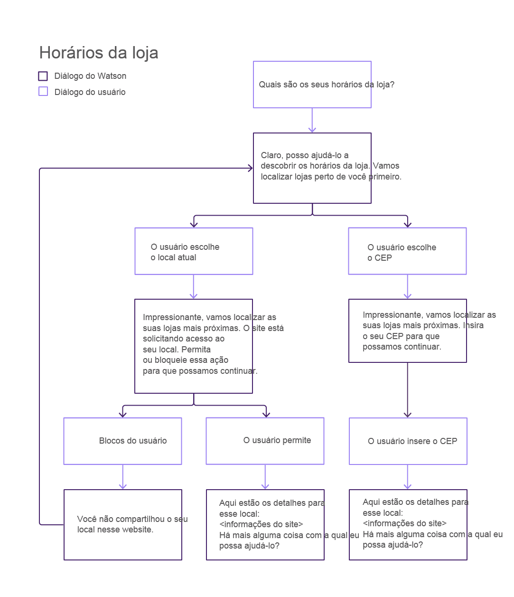
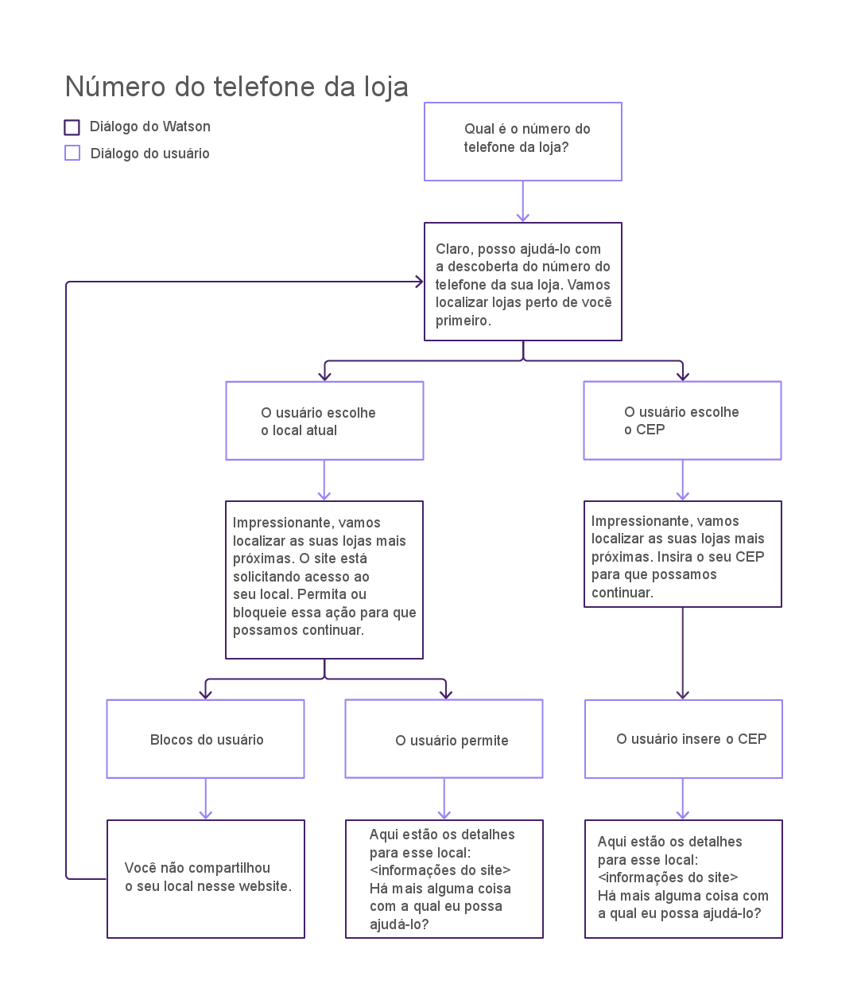
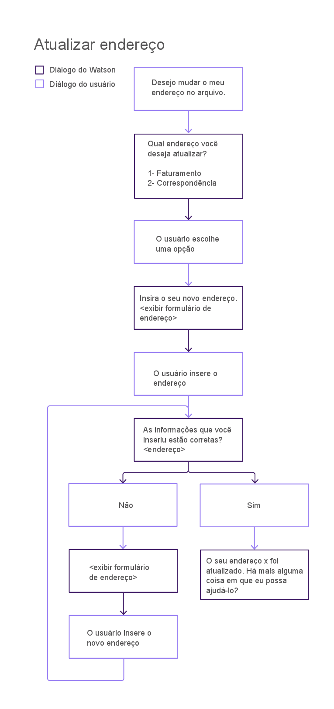
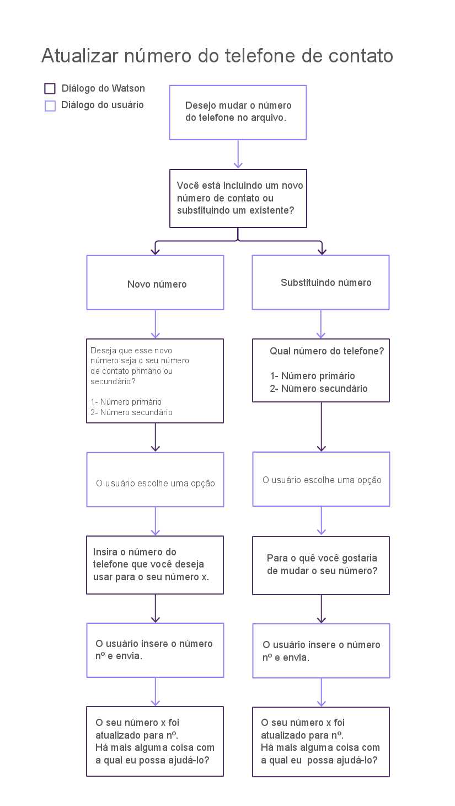
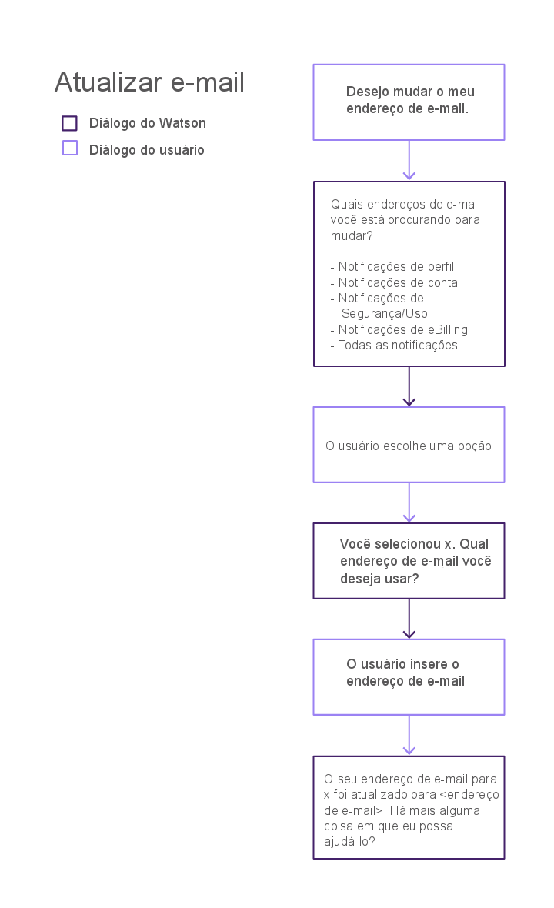

---

copyright:
  years: 2015, 2017
lastupdated: "2017-08-01"

---

{:shortdesc: .shortdesc}
{:new_window: target="_blank"}
{:tip: .tip}
{:pre: .pre}
{:codeblock: .codeblock}
{:screen: .screen}
{:javascript: .ph data-hd-programlang='javascript'}
{:java: .ph data-hd-programlang='java'}
{:python: .ph data-hd-programlang='python'}
{:swift: .ph data-hd-programlang='swift'}

# Configurando os recursos principais
{: #configure}

Para configurar o robô, deve-se escolher os recursos que você deseja que ele tenha.
{: shortdesc}

## Sobre essa Tarefa

Um *recurso* é a capacidade de seu agente virtual de reconhecer e satisfazer um objetivo específico do cliente. Por exemplo, o recurso *Localizar a loja mais próxima* usa artefatos pré-construídos e processamento de linguagem natural que pode avaliar uma elocução de cliente, como *Onde você está localizado?* e reconhecer a partir dela o objetivo do cliente. Para satisfazer esse objetivo, ele se envolve em um diálogo com o cliente para descobrir o local do cliente e retorna as informações de endereço para a loja mais próxima do cliente.

O robô é treinado para reconhecer e manipular um conjunto de recursos principais que são relevantes para as interações de atendimento ao cliente, incluindo consultas de faturamento, pagamentos, informações da loja e solicitações para falar com um agente humano. Consulte [Recursos principais](/docs/services/virtual-agent/intent_list.html) para obter uma lista. Se os recursos principais não abordarem um objetivo comum que seja específico para os seus clientes, então, será possível incluir os seus próprios recursos nesses que forem fornecidos. Por exemplo, se você tiver uma padaria, os seus clientes poderão perguntar, muitas vezes, sobre os sabores de cupcake que você oferece. É possível incluir um recurso do *menu Cupcake* para lidar com essas perguntas. Consulte [Incluindo os seus próprios recursos](/docs/services/virtual-agent/personalize.html#add_custom_capabilities) para obter mais informações.

Para usar um recurso principal, basta especificar como você deseja que o agente se comporte ao implementar o recurso. Para alguns recursos, retornar uma
resposta de texto predefinida para uma consulta de usuário pode ser suficiente. Outros podem requerer um fluxo de conversa complexo para reunir informações que são
necessárias para executar uma transação, caso em que o agente coleta e transmite informações ao seu aplicativo, que deve implementar os processos de negócios
necessários.

Por padrão, todos os recursos principais são ativados e têm respostas predeterminadas. Deve-se, primeiramente, decidir se será desativado qualquer recurso
não necessário para o seu agente. Para recursos que você deseja manter, deve-se substituir as respostas predeterminadas por respostas que reflitam as informações
sobre os seus negócios.

## Procedimento

Para configurar um recurso principal, conclua as etapas a seguir:

1. Na página **Configurar** da ferramenta de configuração do {{site.data.keyword.watson}}
{{site.data.keyword.virtualagentshort}}, revise os recursos disponíveis.
1. Para configurar um recurso, clique no azulejo de recurso.
1. Decida se você deseja que o seu robô suporte o recurso. Todos os recursos são ativados, a menos que você os desligue.

    Clique no comutador na parte superior da página de detalhes do recurso para ligar ou desligar o recurso.

    Como alternativa, para um recurso que você não tem intenção de suportar, mas que suspeita que um cliente possa perguntar a respeito, será possível manter
o recurso ativado e fornecer uma resposta de texto para ele que explique que você não o suporta. Por exemplo, se você não oferecer seguro, em vez de desativar o
recurso **Incluir seguro**, você poderia ativá-lo. Para um tipo de resposta, escolha **Exibir uma resposta de texto**. No campo da **Mensagem** associado, inclua *Nós não oferecemos seguro para os nossos produtos*.

1. Para cada recurso que você deseja suportar, decida que tipo de resposta que quer usar. Estas são as opções:

    

    - **Exibir uma resposta de texto**

        Para consultas simples, é possível usar a ferramenta de configuração para especificar uma resposta textual padrão a ser exibida para o
        usuário. Esse tipo de resposta será útil para consultas que tiverem respostas simples e que não requererem a reunião de informações adicionais ou qualquer interação
        com outros sistemas. Por exemplo, para a intenção Consulta de Método de pagamento, é possível especificar a resposta de texto `We accept all major credit
        cards`.

        Se você seleciona o tipo de resposta **Exibir uma resposta de texto**, deve-se também especificar o texto da resposta.

    - **Usar conversa integrada**

        Um conjunto de recursos é fornecido com diálogos pré-construídos que coletam informações adicionais ou implementam manipulação complexa. Um
        *diálogo* fornece a estrutura para uma conversa com o usuário. Consulte [Diálogos integrados](/docs/services/virtual-agent/configure.html#builtin_dialog_ovw) para saber
        mais sobre quais recursos suportam esse tipo de resposta e como a conversa flui quando implementada.

        Se você selecionar o tipo de resposta **Usar conversa integrada**, também poderá precisar configurar dados adicionais que o diálogo
        usa para apresentar opções para o usuário (como locais de loja ou métodos de pagamento). Em muitos casos, o seu aplicativo deve atender aos eventos que podem ser
        acionados pelo diálogo e implementar ações em seus sistemas de registro. Consulte
        [Implementando a lógica para suportar a conversa integrada](/docs/services/virtual-agent/impl_intents.html#backend_transaction) para obter mais detalhes.

    - **Usar a sua própria conversa**

        Se você precisar implementar interações complexas de cliente para um recurso, será possível construir o seu próprio diálogo que molde a conversa do
        agente com o cliente. Esta opção requer etapas adicionais que envolvem a construção de um diálogo customizado com o serviço do {{site.data.keyword.watson}}
        {{site.data.keyword.conversationshort}} e a sua vinculação com o agente. Consulte [Construindo um diálogo
        customizado](/docs/services/virtual-agent/personalize.html#custom_dialog) para obter mais detalhes.

    - **Transferir para agente humano**

        Para qualquer recurso com o qual você não deseja lidar usando o agente virtual, será possível especificar que você deseja que seja acionado um evento
        que solicite um agente humano. O seu aplicativo poderá então responder a esse evento usando os seus processos para iniciar uma sessão de bate-papo com um responsável
        humano pelo atendimento ao cliente.

        Se você selecionar o tipo de resposta **Transferir para agente humano**, será possível especificar uma mensagem que forneça
        o contexto para a solicitação do cliente ser transmitida para o agente humano também.

## Diálogos integrados
{: #builtin_dialog_ovw}

As seções a seguir descrevem os recursos principais que os fluxos de conversa integrada são treinados para reconhecer e reagir a eles.

### Localizar a loja mais próxima
{: #builtin_dialog_ovw__findNearestStore}

O diagrama a seguir mostra os nós na conversa integrada para o recurso *Localizar a loja mais próxima*. O mesmo fluxo de diálogo é
usado para esse recurso e o recurso *Local da loja*.

A única etapa adicional requerida por você é incluir os detalhes do local da loja para cada loja. É possível incluir os detalhes da loja por meio de um dos
recursos a seguir que pode ser acessado por meio da página Configurar:

- Localizar a loja mais próxima
- Local da loja

### Fazer um pagamento

O diagrama a seguir mostra os nós na conversa integrada para o recurso *Fazer um pagamento*.

Clique [aqui](/docs/services/virtual-agent/backend_payment_gif.html#backend_payment_gif) para ver como a entrada do usuário e as respostas do agente virtual fluem através
do sistema.

Consulte [Implementando a lógica para suportar a conversa integrada](/docs/services/virtual-agent/impl_intents.html#makeapayment) para obter informações sobre as etapas
adicionais que deve-se executar para suportar totalmente este recurso.

### Horários de Funcionamento

O diagrama a seguir mostra os nós na conversa integrada para o recurso *Horários da loja*.

Se você deseja fornecer os horários da loja, então, deve-se incluir as informações de horário comercial ao incluir as informações do local da loja por meio
dos recursos a seguir:

- Localizar a loja mais próxima
- Local da loja

### Local da loja

Consulte o diagrama acima para ver os nós na conversa integrada para o recurso *Local da loja*. O mesmo fluxo de diálogo é
usado para esse recurso e o recurso [Localizar a loja mais próxima](/docs/services/virtual-agent/configure.html#builtin_dialog_ovw__findNearestStore).

A única etapa adicional requerida por você é incluir os detalhes do local da loja para cada loja. É possível incluir os detalhes da loja por meio de um dos
recursos a seguir que pode ser acessado por meio da página Configurar:

- Localizar a loja mais próxima
- Local da loja

### Número do telefone da loja

O diagrama a seguir mostra os nós na conversa integrada para o recurso *Número do telefone da loja*.

Se você deseja fornecer números do telefone da loja, então, deve-se inclui-los nas definições de local da loja que você inclui por meio
dos recursos a seguir:

- Localizar a loja mais próxima
- Local da loja

### Atualizar endereço

O diagrama a seguir mostra os nós na conversa integrada para o recurso *Atualizar endereço*.

Consulte [Implementando a lógica para suportar a conversa integrada](/docs/services/virtual-agent/impl_intents.html#updateaddress) para obter informações sobre as etapas
adicionais que deve-se executar para suportar totalmente este recurso.

### Atualizar o número do telefone de contato

O diagrama a seguir mostra os nós na conversa integrada para o recurso *Atualizar o número do telefone de contato*.

Consulte [Implementando a lógica para suportar a conversa integrada](/docs/services/virtual-agent/impl_intents.html#updatephone) para obter informações sobre as etapas
adicionais que deve-se executar para suportar totalmente este recurso.

### Atualizar e-mail

O diagrama a seguir mostra os nós na conversa integrada para o recurso *Atualizar e-mail*.

Consulte [Implementando a lógica para suportar a conversa integrada](/docs/services/virtual-agent/impl_intents.html#updateemail) para obter informações sobre as etapas
adicionais que deve-se executar para suportar totalmente este recurso.

