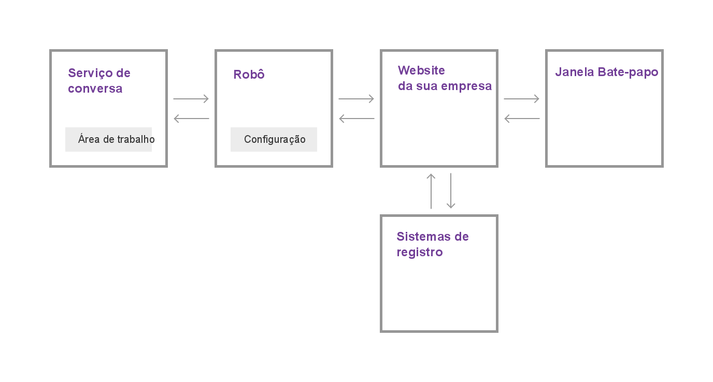

---

copyright:
  years: 2015, 2017
lastupdated: "2017-08-10"

---

{:shortdesc: .shortdesc}
{:new_window: target="_blank"}
{:tip: .tip}
{:pre: .pre}
{:codeblock: .codeblock}
{:screen: .screen}
{:javascript: .ph data-hd-programlang='javascript'}
{:java: .ph data-hd-programlang='java'}
{:python: .ph data-hd-programlang='python'}
{:swift: .ph data-hd-programlang='swift'}

# Como funciona
{: #how-it-works}

O {{site.data.keyword.IBM_notm}} {{site.data.keyword.watson}} {{site.data.keyword.virtualagentshort}} inclui a força da conversa cognitiva na equação de satisfação do cliente. Faça do robô de bate-papo do {{site.data.keyword.virtualagentshort}} o primeiro ponto de contato para perguntas e solicitações do usuário. O robô pode processar a língua natural para entender sobre o que os clientes estão perguntando e pode classificar a necessidade do cliente. Dependendo da necessidade, ele pode responder e concluir transações de negócios simples, ou rotear solicitações mais complicadas para uma pessoa com conhecimento no assunto.

Você escolhe quais objetivos do usuário deseja que o robô manipule, selecionando os recursos que deseja que o robô tenha. Use a ferramenta de configuração fornecida para ativar e customizar recursos.
{: shortdesc}

## Recursos

Um *recurso* é a capacidade de seu robô de bate-papo do {{site.data.keyword.virtualagentshort}} reconhecer e satisfazer um objetivo do cliente específico. Por exemplo, o recurso **Encontrar a loja mais próxima** usa técnicas de processamento de linguagem natural para avaliar uma elocução do cliente, como *Qual a sua localização?* e reconhecer a partir dela o objetivo do cliente. Para satisfazer esse objetivo, ele participa de um diálogo com o cliente para descobrir a localização atual do cliente e retorna informações de endereço para a loja mais próxima do cliente.

Para cada recurso, especialistas em aprendizado de máquina e em linguística na IBM criaram dados de treinamento e os usaram para treinar interativamente os classificadores de aprendizado de máquina que podem reconhecer e responder a qualquer entrada do usuário que corresponde ao objetivo satisfeito por esse recurso.

Para facilitar o processo de construção do robô, a IBM oferece pacotes de recursos que reúnem os recursos mais comumente solicitados para cenários gerais de suporte ao cliente, além de pacotes especializados que direcionam as necessidades de suporte mais comuns necessárias para os principais segmentos de mercado.

## Pacotes de Recursos

Um *pacote de recursos* agrupa os recursos mais importantes de seu segmento de mercado para você. Com dezenas de milhares de elocuções de exemplo e exemplos de contadores, a equipe IBM projetou agrupamentos de recursos que direcionam objetivos do cliente semelhantes, mas que podem coexistir continuamente sem competir entre si para responder a consultas do usuário.

A tabela a seguir resume os pacotes que são oferecidos. Clique nos links de **detalhes** para ver uma lista de recursos e descrições para cada idioma suportado.

| Idioma | Atendimento ao Cliente (Geral) | Energia  | Transações Bancárias de Varejo | mais inteligentes   |
|----------|----------------------------|---------|----------------|---------|
| Inglês  | [detalhes](capabilities_list_general.html)   | [detalhes](capabilities_list_energy.html) | [detalhes](capabilities_list_banking.html)        | [detalhes](capabilities_list_telco.html) |
| Francês   | [detalhes](capabilities_list_general_fr.html)   | n/d     | n/d            | [detalhes](capabilities_list_telco_fr.html) |
| Alemanha   | [detalhes](capabilities_list_general_de.html) | n/d     | n/d            | [detalhes](capabilities_list_telco_de.html) |
| Italiano | [detalhes](capabilities_list_general_it.html) | n/d | n/d | [detalhes](capabilities_list_telco_it.html) |
| Português (do Brasil) | [detalhes](capabilities_list_general_pt-br.html)   | n/d     | n/d            | [detalhes](capabilities_list_telco_pt-br.html) |
| Espanha | [detalhes](capabilities_list_general_es.html)   | n/d     | n/d            | [detalhes](capabilities_list_telco_es.html) |

*n/a significa não disponível agora.

Se os recursos principais não direcionarem um objetivo comum de seus clientes, é possível incluir seus próprios recursos para complementar os fornecidos em um pacote. Por exemplo, se você tiver uma padaria, os seus clientes poderão perguntar, muitas vezes, sobre os sabores de cupcake que você oferece. É possível incluir um recurso do *menu Cupcake* para lidar com essas perguntas. Consulte [Incluindo os seus próprios recursos](add-custom-capabilities.html) para obter mais informações.

### Como o {{site.data.keyword.watson}} {{site.data.keyword.virtualagentshort}} difere do {{site.data.keyword.watson}} {{site.data.keyword.conversationshort}}

{{site.data.keyword.IBM_notm}} {{site.data.keyword.watson}} {{site.data.keyword.conversationshort}} é o serviço no centro da funcionalidade do robô de bate-papo. Ele contém classificadores de aprendizado de máquina que podem entender a língua natural e, dada uma frase ou sentença, perceber seu significado e categorizá-lo de acordo com classes que foram identificadas como sendo de seu interesse. A IBM fornece o conjunto de ferramentas que pode ser usado para criar os dados de treinamento que ensinam o classificador de aprendizado de máquina. O conjunto de ferramentas também permite criar o diálogo que seu robô usa para conversar com seus clientes.

O conjunto de ferramentas do {{site.data.keyword.conversationshort}} é intuitivo e projetado de forma que qualquer pessoa, mesmo as que não têm conhecimento em desenvolvimento ou aprendizado de máquina possam usá-lo para construir um poderoso aplicativo orientado a bate-papo. No entanto, leva tempo para criar os dados de treinamento e construir um diálogo. É onde entra.{{site.data.keyword.virtualagentshort}}  {{site.data.keyword.watson}}

{{site.data.keyword.watson}} {{site.data.keyword.virtualagentshort}} é construído no {{site.data.keyword.watson}} {{site.data.keyword.conversationshort}}. Mas com o {{site.data.keyword.virtualagentshort}}, você mesmo obtém o serviço do robô, além disso, o robô é treinado previamente - seu treinamento executado por especialistas e pesquisadores nos campos de aprendizado de máquina e linguística. Você apenas escolhe quais recursos deseja ativar. Por exemplo, ative o recurso **Atualizar endereço de e-mail** e, assim, seu robô pode entender e reagir a solicitações relacionadas a mudanças no endereço de e-mail.

A ferramenta de configuração do {{site.data.keyword.virtualagentshort}} facilita escolher os recursos para ativar e customizar como o robô se comporta quando um recurso é acionado durante uma interação do cliente.

Você sempre tem a flexibilidade para incluir mais e mais customização no robô porque é possível - a qualquer momento - vincular uma área de trabalho de serviço do {{site.data.keyword.conversationshort}} a seu agente para expandir suas capacidades imediatamente.

## Visão geral arquitetural 
{: #arch_overview}

O diagrama a seguir ilustra a arquitetura de uma implementação típica do {{site.data.keyword.watson}} {{site.data.keyword.virtualagentshort}}:

A implementação inclui os componentes principais a seguir:

- Serviço do **{{site.data.keyword.conversationshort}}**

    Uma instância do serviço do {{site.data.keyword.watson}} {{site.data.keyword.conversationshort}}. O serviço do
{{site.data.keyword.conversationshort}} fornece os artefatos para recursos: as intenções, as entidades e o fluxo de diálogo, juntamente com o processamento
cognitivo subjacente que alimenta os recursos do robô de bate-papo. Você interage diretamente com o serviço {{site.data.keyword.conversationshort}} quando deseja implementar somente um diálogo customizado ou recurso customizado.

    Para obter mais informações sobre intenções e diálogos, consulte a  documentação de serviço do [{{site.data.keyword.conversationshort}} ](https://console.bluemix.net/docs/services/conversation/index.html#about "External link icon"){: new_window}.

- **Robô**

    Um robô construído no serviço do {{site.data.keyword.conversationshort}}, incluindo um conjunto de recursos. O robô é treinado para reconhecer
consultas de usuário relacionadas à participação do cliente, como solicitações para informações básicas da empresa e pagamento de conta. A ferramenta de configuração
de robô permite configurar informações específicas da empresa que podem ser fornecidas em resposta para consultas de usuário e para configurar a resposta para cada
recurso.

- **O website de sua empresa**

    O seu aplicativo de negócios voltado para o cliente, que manipula a comunicação com o robô do {{site.data.keyword.watson}}
{{site.data.keyword.virtualagentshort}} e com os seus sistemas de registro (como bancos de dados de clientes ou sistemas de faturamento).

- **Janela Bate-papo**

    A interface de bate-papo do agente virtual, que os clientes usam para se comunicarem com o robô. É possível usar o widget de bate-papo fornecido, com ou
sem customização ou é possível usar o SDK do cliente para implementar o seu próprio widget de bate-papo.
