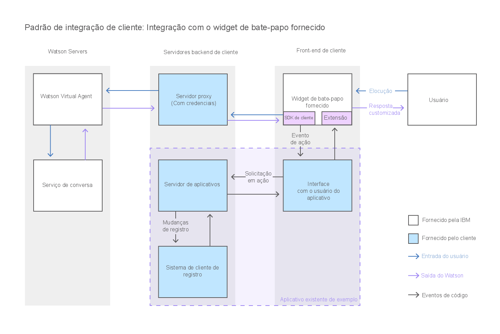

---

copyright:
  years: 2015, 2017
lastupdated: "2017-08-10"

---

{:shortdesc: .shortdesc}
{:new_window: target="_blank"}
{:tip: .tip}
{:pre: .pre}
{:codeblock: .codeblock}
{:screen: .screen}
{:javascript: .ph data-hd-programlang='javascript'}
{:java: .ph data-hd-programlang='java'}
{:python: .ph data-hd-programlang='python'}
{:swift: .ph data-hd-programlang='swift'}

# Incluindo o widget de bate-papo fornecido em sua UI 
{: #integrate_add-chat}

O {{site.data.keyword.watson}} {{site.data.keyword.virtualagentshort}} é fornecido com um widget de bate-papo que pode ser usado no estado em
que se encontra em sua interface com o usuário.
{: shortdesc}

Esse diagrama ilustra como a conversa flui através do sistema quando você usa o widget de bate-papo que é fornecido pela {{site.data.keyword.IBM_notm}}.

1.  Para usar o widget fornecido, abra o repositório GitHub do [{{site.data.keyword.watson}} {{site.data.keyword.virtualagentshort}} Widget de bate-papo ](https://github.com/watson-virtual-agents/chat-widget "Ícone de link externo"){: new_window} e conclua as etapas no arquivo `README.md`. 

    O widget de bate-papo fornecido é extensível. Se ele contiver elementos que você deseja mudar, será possível customizá-los. Por exemplo, para mudar um
layout que é usado pelo widget de bate-papo fornecido, é possível escrever um layout customizado que o substitui. Consulte o exemplo aqui: [https://github.com/watson-virtual-agents/chat-widget/tree/1.2.12/examples/basic-custom-layout. ](https://github.com/watson-virtual-agents/chat-widget/tree/1.2.12/examples/basic-custom-layout "Ícone de link externo"){: new_window} Tenha em mente que o layout pode ser usado por mais de uma intenção.

1.  Para obter informações sobre as etapas que deve-se tomar para suportar transações de widget de bate-papo que podem ocorrer para recursos que usam a
conversa integrada, veja [Implementando a lógica para suportar conversa integrada](impl_intents.html#backend_transaction).

Se a extensão de customizações que você deseja fazer for tão difundida que é impossível implementar as suas mudanças fazendo atualizações no widget de bate-papo
fornecido, então, será possível criar a sua própria interface de bate-papo. Consulte [Construindo um bate-papo da interface customizada](integrate_custom-chat.html).
