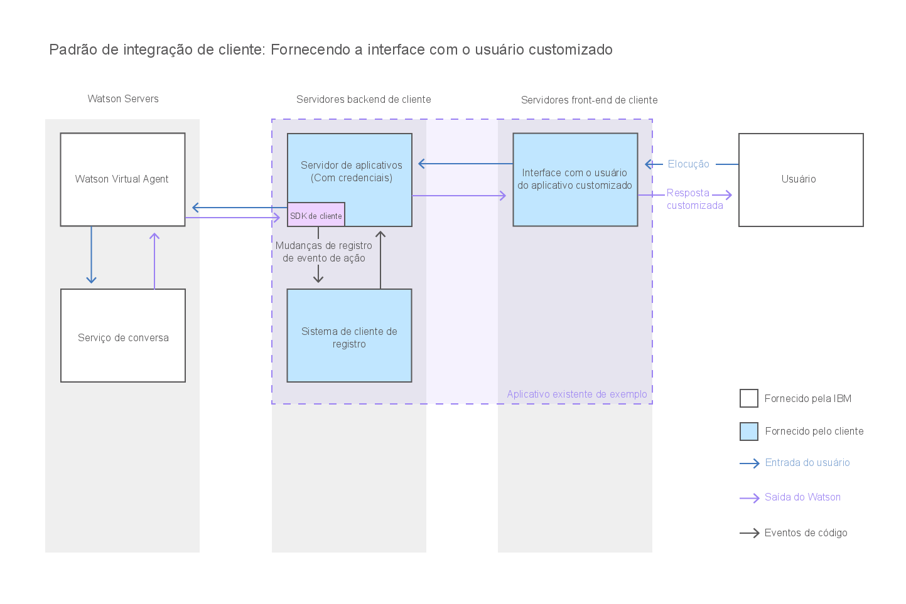

---

copyright:
  years: 2015, 2017
lastupdated: "2017-08-10"

---

{:shortdesc: .shortdesc}
{:new_window: target="_blank"}
{:tip: .tip}
{:pre: .pre}
{:codeblock: .codeblock}
{:screen: .screen}
{:javascript: .ph data-hd-programlang='javascript'}
{:java: .ph data-hd-programlang='java'}
{:python: .ph data-hd-programlang='python'}
{:swift: .ph data-hd-programlang='swift'}

# Construindo uma interface de bate-papo customizada 
{: #integrate_custom-chat}

Se o widget de bate-papo fornecido não atender às suas necessidades, será possível desenvolver a sua própria interface de bate-papo do JavaScript para permitir
que os seus usuários interajam com o agente virtual. Isso lhe dá controle completo sobre o layout, a aparência e o comportamento da interface de bate-papo.
{: shortdesc}

Esse diagrama ilustra como a conversa flui através do sistema quando você fornece uma interface de bate-papo customizada.

Para desenvolver uma interface de bate-papo customizada com o JavaScript, use os recursos a seguir:

- **{{site.data.keyword.watson}} {{site.data.keyword.virtualagentshort}}SDK de cliente**

    Um SDK do JavaScript para desenvolver aplicativos que interagem com o {{site.data.keyword.watson}}
{{site.data.keyword.virtualagentshort}}. O SDK do Cliente é hospedado no [GitHub ](https://github.com/watson-virtual-agents/client-sdk "Ícone de link externo"){: new_window}.

- **Explorer de API**

    Um portal que fornece acesso às APIs de REST do {{site.data.keyword.watson}} {{site.data.keyword.virtualagentshort}} no
{{site.data.keyword.IBM_notm}} {{site.data.keyword.Bluemix_notm}}. É possível acessar APIs do {{site.data.keyword.watson}} {{site.data.keyword.virtualagentshort}} no [{{site.data.keyword.IBM_notm}} developerWorks API Explorer ](https://developer.ibm.com/api/view/id-339:title-Watson_Virtual_Agent "Ícone de link externo"){: new_window}.
